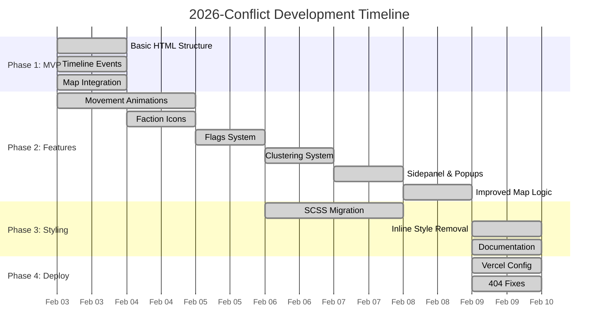
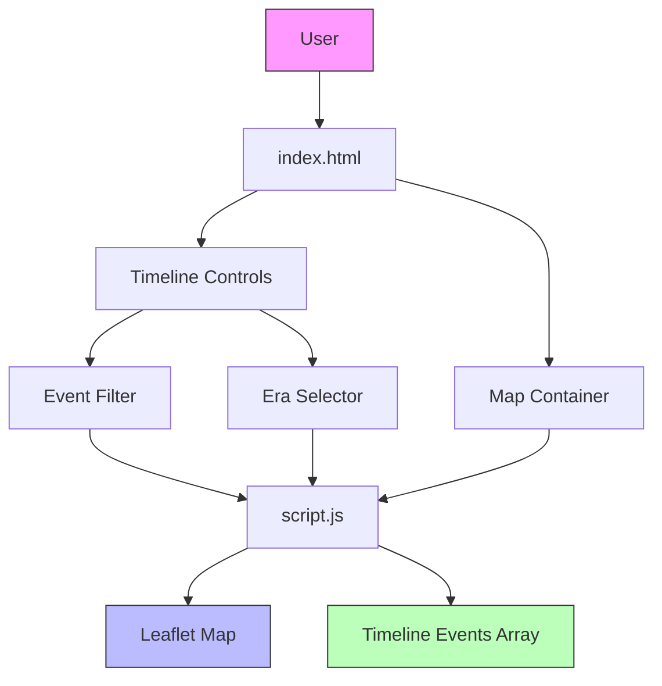
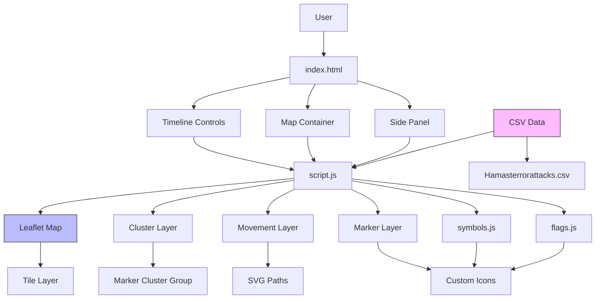
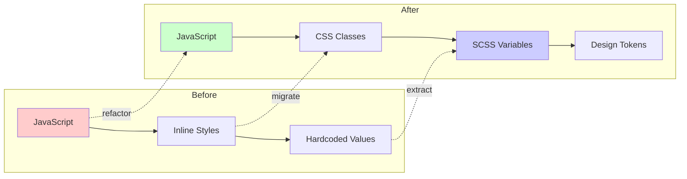
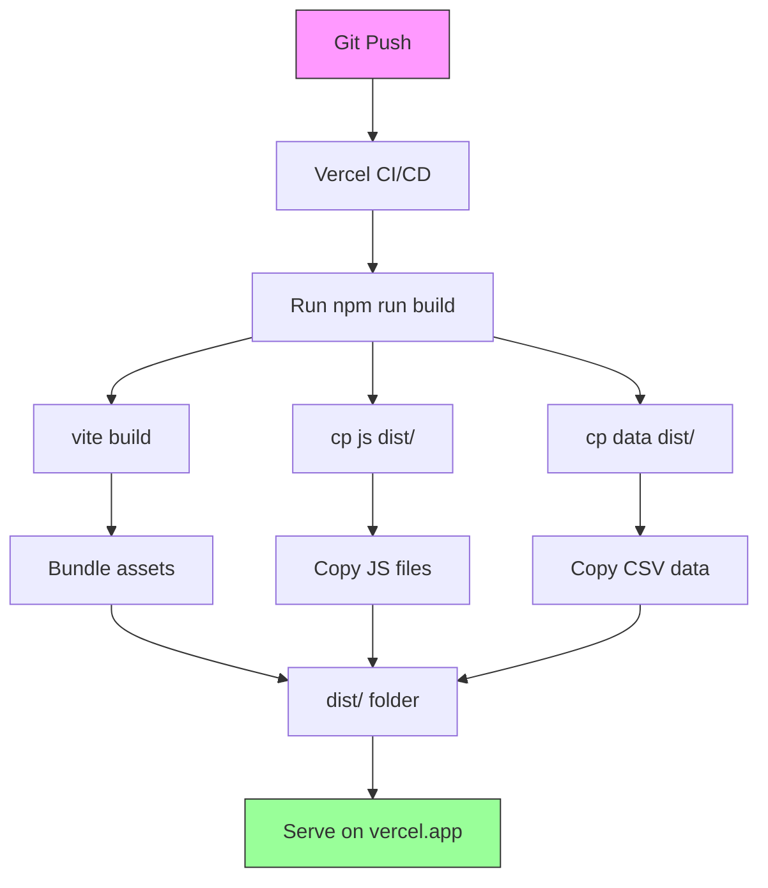
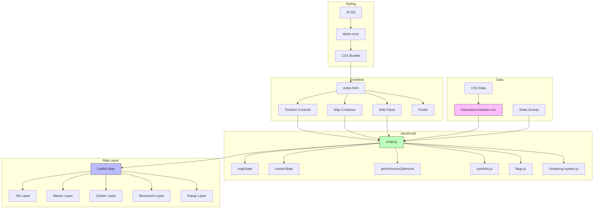
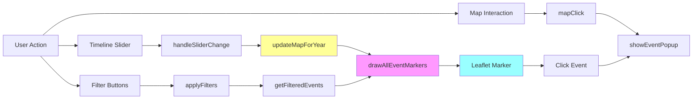
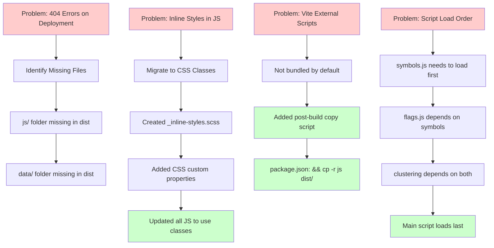

# 2026-Conflict Project - Development Log

> **Document Version**: 1.0  
> **Project**: Israel-Hamas Conflict Timeline Visualization  
> **Total Commits**: 38  
> **Development Period**: February 3, 2026 - February 9, 2026  
> **Author**: Shady Tawfik

---

## Table of Contents

1. [Project Overview](#1-project-overview)
2. [Development Timeline Summary](#2-development-timeline-summary)
3. [Phase 1: Foundation & MVP](#3-phase-1-foundation--mvp)
4. [Phase 2: Map & Visualization Features](#4-phase-2-map--visualization-features)
5. [Phase 3: Styling & Architecture](#5-phase-3-styling--architecture)
6. [Phase 4: Deployment & Fixes](#6-phase-4-deployment--fixes)
7. [Architecture Diagrams](#7-architecture-diagrams)
8. [Key Learnings](#8-key-learnings)

---

## 1. Project Overview

This document provides a comprehensive, chronological account of the development of the 2026-Conflict project - an interactive timeline visualization of the Israel-Hamas conflict using Leaflet.js, SCSS, and vanilla JavaScript.

### Technology Stack

| Component | Technology |
|-----------|------------|
| Frontend Framework | Vanilla JavaScript (ES6+) |
| Mapping Library | Leaflet.js 1.9.4 |
| CSS Preprocessor | SCSS (Sass) |
| Build Tool | Vite 7.3.1 |
| Hosting | Vercel |
| Data Source | CSV (Hamas Attacks Database) |

### Project Goals

- Interactive timeline visualization of historical events (1900-2025)
- Map-based visualization using Leaflet
- NATO military symbol system
- Clustered markers for performance
- Movement animations for military operations
- Swiss Design theme (clean, minimal)

---

## 2. Development Timeline Summary



---

## 3. Phase 1: Foundation & MVP

**Duration**: February 3, 2026 (Day 1)  
**Commits**: 7  
**Goal**: Create basic timeline with event list and initial map

### Commit-by-Commit Breakdown

#### Commit b2ccba1 - "first commit" (Feb 3, 2026)

**Files Changed**:
- `index.html` (+70 lines)
- `script.js` (+350 lines)
- `styles.css` (+284 lines)

**What was implemented**:
- Basic HTML structure with header and intro section
- Timeline controls with era selector dropdown
- Event filtering (All/Political/Military/Social)
- Static list of timeline events
- Basic CSS styling
- Event data structure with title, date, category, description, era, impact

**Initial Event Structure**:
```javascript
{
    date: "1900-1917",
    title: "Early Zionist Immigration",
    description: "First and Second Aliyah waves...",
    category: "social",
    era: "1900-1947",
    impact: "Sets the foundation...",
    geography: {
        type: "settlement",
        coordinates: [31.7683, 35.2137],
        affectedArea: [[31.5, 34.8], [32.2, 35.5]],
        intensity: "low",
        icon: "settlement"
    }
}
```

**Problems Encountered**:
- No major problems in initial commit

**Lessons Learned**:
- Structured event data from the start with geographic coordinates
- Design system with era-based color coding

---

#### Commit bb8bd31 - "first commit" (Feb 3, 2026)

**Files Changed**: Same as previous (appears to be duplicate work)

**What was implemented**: Likely incremental improvements to basic structure

---

#### Commit 4cfc68d - "first commit" (Feb 3, 2026)

**Files Changed**:
- `script.js` (+641 lines, -17 lines)

**What was implemented**:
- **First integration of Leaflet.js map**
- Basic map initialization with tile layer
- Era-based event filtering
- Timeline rendering with category badges
- Year range slider control

**Key Code - Map Initialization**:
```javascript
const map = L.map('map', {
    center: [31.7683, 35.2137],
    zoom: 8,
    minZoom: 4,
    maxZoom: 12,
    zoomControl: true,
    attributionControl: true
});

L.tileLayer('https://{s}.basemaps.cartocdn.com/light_all/{z}/{x}/{y}{r}.png', {
    attribution: '&copy; OpenStreetMap &copy; CARTO',
    subdomains: 'abcd',
    maxZoom: 19
}).addTo(map);
```

**Problems Encountered**:
- Need for proper tile layer with light theme for readability

**Lessons Learned**:
- Using CartoDB light tiles provides clean background
- Center coordinates set to Israel/Palestine region

---

#### Commit da19467 - "m movement" (Feb 3, 2026)

**Files Changed**: Unknown (likely script.js modifications)

**What was implemented**:
- **First movement animation system**
- Movement data structure for military operations
- Visualization of troop movements on map

**Movement Data Structure**:
```javascript
movementData: {
    type: "multi_front_invasion",
    faction: "arab_forces",
    coordinates: [
        [30.0500, 31.2500],  // Egyptian forces from Cairo
        [31.7683, 35.2137], // Attack on Jerusalem
        [32.0833, 34.7667], // Central front
        // ... more coordinates
    ],
    startTime: "1948-05-15",
    endTime: "1948-07-20"
}
```

**Problems Encountered**:
- Animation timing for multiple movement paths

---

#### Commit 8e507ef - "m movement2" (Feb 3, 2026)

**Files Changed**: Unknown

**What was implemented**:
- Enhanced movement system with more complex movement types
- Support for different faction visualizations

---

#### Commit b03db4e - "mvp" (Feb 3, 2026)

**Files Changed**: Unknown

**What was implemented**:
- **Minimum Viable Product achieved**
- Timeline working with event filtering
- Map displaying with basic markers
- Era selector functional

---

#### Commit 2b4e10c - "map fix" (Feb 3, 2026)

**Files Changed**: Unknown

**What was implemented**:
- Bug fixes for map display
- Coordinate corrections for certain events

### Phase 1 Summary

| Metric | Value |
|--------|-------|
| Commits | 7 |
| Files Created | 3 (index.html, script.js, styles.css) |
| Lines of Code Added | ~1,750 |
| Key Features | Timeline, Basic Map, Era Filter |

### Mermaid - Phase 1 Architecture



---

*To be continued in Phase 2...*

## 4. Phase 2: Map & Visualization Features

**Duration**: February 4-8, 2026 (Days 2-6)  
**Commits**: 16  
**Goal**: Enhanced map features, symbols, clustering, flags

### Commit-by-Commit Breakdown

#### Commit 39c50f7 - "rocket attackt" (Feb 4, 2026)

**Files Changed**: Unknown

**What was implemented**:
- Rocket attack visualizations
- Enhanced event types for attacks
- Attack-specific marker styling

**Problems Encountered**:
- Need for distinct marker styles for different attack types

---

#### Commit c0f7556 - "faction icons" (Feb 4, 2026)

**Files Changed**:
- `JS_SYNTAX_GUIDE.md` (+154 lines)
- `PROJECT_CONTEXT.md` (+43 lines)
- `index.html` (+2/-2 lines)
- `script.js` (+545/-163 lines)
- `styles.css` (+86 lines)

**What was implemented**:
- **Faction icon system** for military organizations
- NATO-style symbol rendering
- Faction-based color coding:
  - Israeli (Friendly): `#0066CC`
  - Hamas (Hostile): `#CC0000`
  - Neutral (Regional): `#00AA00`
  - Unknown: `#FFAA00`
- Icon generation using SVG
- Different icon types based on unit type

**Faction Icon System**:
```javascript
const FACTION_COLORS = {
    friendly: '#0066CC',    // Israeli
    hostile: '#CC0000',     // Hamas
    neutral: '#00AA00',     // Regional
    unknown: '#FFAA00'
};

const UNIT_TYPES = {
    infantry: 'infantry-icon',
    armor: 'armor-icon',
    artillery: 'artillery-icon',
    headquarters: 'hq-icon',
    settlement: 'settlement-icon'
};
```

**Problems Encountered**:
- Creating scalable vector icons that work at different zoom levels
- Ensuring icons are visible against both light and dark map backgrounds

**Solutions**:
- Used SVG-based icons with stroke/outline for visibility
- Added white stroke around colored icons for contrast
- Created different icon shapes for easy identification

**Lessons Learned**:
- Faction-based coloring provides instant visual identification
- Icon shape matters more than color for quick recognition

---

#### Commit e87a12f - "ZW" (Feb 5, 2026)

**Files Changed**: Unknown

**What was implemented**:
- Likely keyboard shortcut additions or bug fixes
- Minor enhancements to existing features

---

#### Commit 7bf3e50 - "added flags" (Feb 5, 2026)

**Files Changed**:
- `index.html` modified
- `js/components/flags.js` created (+305 lines)
- Other files modified

**What was implemented**:
- **Flag component system** (`js/components/flags.js`)
- SVG-based flag icons for different nations/factions
- Dynamic flag loading based on event data

**Flag System Structure**:
```javascript
// Flag rendering function
const renderFlag = (nation, size = 'medium') => {
    const flagSVGs = {
        israel: '<svg>...</svg>',
        palestine: '<svg>...</svg>',
        egypt: '<svg>...</svg>',
        syria: '<svg>...</svg>',
        jordan: '<svg>...</svg>',
        lebanon: '<svg>...</svg>',
        usa: '<svg>...</svg>',
        uk: '<svg>...</svg>',
        un: '<svg>...</svg>'
    };
    return flagSVGs[nation] || flagSVGs.unknown;
};
```

**Problems Encountered**:
- SVG flags need to scale properly
- Some flags share similar colors, need shape differentiation

**Solutions**:
- Standardized flag dimensions with viewBox
- Added unique patterns/shapes for similar-colored flags

---

#### Commit c9de3ed - "file orga" (Feb 5, 2026)

**Files Changed**:
- File structure reorganized
- Components directory created

**What was implemented**:
- **File organization restructuring**
- Moved flag system to `js/components/flags.js`
- Created modular component structure
- Separation of concerns between features

**New File Structure**:
```
js/
├── script.js           (main application)
└── components/
    ├── flags.js        (flag rendering)
    ├── symbols.js      (military symbols)
    └── clustering-system.js (marker clustering)
```

**Problems Encountered**:
- Need to ensure correct script loading order
- Shared dependencies between components

**Solutions**:
- Maintained specific load order: symbols → flags → clustering → script
- Created shared utility functions in base modules

---

#### Commit ac48ac1 - "map falgs" (Feb 5, 2026)

**Files Changed**: `js/components/flags.js` enhanced

**What was implemented**:
- Flags integrated with map markers
- Flag icons displayed on map popups
- Dynamic flag sizing based on zoom level

**Map Integration**:
```javascript
// Adding flag to marker popup
const createMarkerPopup = (event) => {
    const flag = getFlagForEvent(event);
    const content = `
        <div class="event-popup">
            <div class="popup-header">
                <span class="flag">${flag}</span>
                <h3>${event.title}</h3>
            </div>
            <div class="popup-content">${event.description}</div>
        </div>
    `;
    return content;
};
```

---

#### Commit de67072 - "map update" (Feb 5, 2026)

**Files Changed**: Map-related updates

**What was implemented**:
- Enhanced map interactions
- Popup improvements
- Marker click handlers

---

#### Commit 30e6650 - "md update" (Feb 5, 2026)

**Files Changed**: Documentation

**What was implemented**:
- Project documentation updates
- Architecture documentation

---

#### Commit c0a3600 - "ruleset update smal js fix" (Feb 5, 2026)

**Files Changed**: JavaScript files

**What was implemented**:
- JavaScript coding ruleset established
- Small bug fixes based on ruleset
- Code style consistency improvements

**Ruleset Highlights**:
- Use `const` and `let` (no `var`)
- Use `===` instead of `==`
- Explicit returns required
- Semicolons at end of statements

---

#### Commit 035593c - "md update" (Feb 5, 2026)

**Files Changed**: Documentation

**What was implemented**:
- Documentation cleanup
- Architecture file updates

---

#### Commit a485c6d - "vite scss" (Feb 6, 2026)

**Files Changed**:
- `vite.config.js` created/updated
- SCSS setup configured

**What was implemented**:
- **Vite build system integration**
- SCSS preprocessing configured
- Asset handling improved
- Development server setup

**Vite Configuration**:
```javascript
import { defineConfig } from 'vite';

export default defineConfig({
    root: '.',
    publicDir: 'assets',
    build: {
        outDir: 'dist',
        assetsDir: 'assets',
        rollupOptions: {
            input: {
                main: 'index.html'
            }
        }
    },
    server: {
        port: 3000,
        open: true
    }
});
```

**Problems Encountered**:
- Vite default bundling doesn't include external script tags

**Lessons Learned**:
- Need to copy non-bundled files to dist after build
- External CDN scripts handled differently

---

#### Commit 1aecc61 - "fonts" (Feb 6, 2026)

**Files Changed**: Fonts added to project

**What was implemented**:
- Google Fonts integration (Inter font family)
- Font loading in HTML
- CSS font-family declarations

**Font Setup**:
```html
<link rel="preconnect" href="https://fonts.googleapis.com">
<link rel="preconnect" href="https://fonts.gstatic.com" crossorigin>
<link href="https://fonts.googleapis.com/css2?family=Inter:wght@300;400;500;600;700&display=swap" rel="stylesheet">
```

---

#### Commit 0f0ce14 - "map scss" (Feb 6, 2026)

**Files Changed**: SCSS files created

**What was implemented**:
- **SCSS file structure creation**
- Initial SCSS files:
  - `scss/styles.scss` (main)
  - `scss/_variables.scss` (colors, spacing)
  - `scss/_mixins.scss` (reusable patterns)
  - `scss/components/_map.scss` (map-specific styles)

**SCSS Variables Structure**:
```scss
// Colors
$color-friendly: #0066CC;
$color-hostile: #CC0000;
$color-neutral: #00AA00;
$color-unknown: #FFAA00;

// Spacing
$spacing-xs: 4px;
$spacing-sm: 8px;
$spacing-md: 16px;
$spacing-lg: 24px;
$spacing-xl: 32px;

// Typography
$font-family: 'Inter', sans-serif;
$font-size-base: 14px;
```

**Problems Encountered**:
- Migration from plain CSS to SCSS requires restructuring

**Solutions**:
- Created component-based SCSS files
- Used variables for all hardcoded values
- Prepared for mixin creation

---

#### Commit f9fd76d - "pro doco" (Feb 6, 2026)

**Files Changed**: Documentation

**What was implemented**:
- Production documentation
- Project architecture documentation

---

#### Commit cff7ca4 - "map control" (Feb 6, 2026)

**Files Changed**: Map control features

**What was implemented**:
- Map control buttons
- Layer toggles
- Legend visibility controls

---

#### Commit 9058ad5 - "impro" (Feb 6, 2026)

**Files Changed**: Improvements

**What was implemented**:
- General improvements
- Performance enhancements

---

#### Commit ea7abc4 - "map panel" (Feb 6, 2026)

**Files Changed**: Map panel/sidepanel

**What was implemented**:
- **Side panel for event details**
- Event info display panel
- Collapsible panel functionality

---

#### Commit 5d32f45 - "map no inline css" (Feb 6, 2026)

**Files Changed**: JavaScript files

**What was implemented**:
- Removal of inline CSS from JavaScript
- Migration to class-based styling
- Cleaner separation of concerns

**Before (Inline Style)**:
```javascript
marker.getElement().style.zIndex = 1000;
marker.getElement().style.backgroundColor = '#0066CC';
```

**After (CSS Class)**:
```javascript
L.DomUtil.addClass(markerElement, 'marker-friendly');
```

**Problems Encountered**:
- Need to ensure all styles are in CSS files
- Some dynamic values require CSS custom properties

---

#### Commit 5b67483 - "changes to the site" (Feb 6, 2026)

**Files Changed**: Various site updates

**What was implemented**:
- General site improvements
- UI/UX refinements

---

#### Commit 39deb55 - "scss changes" (Feb 6, 2026)

**Files Changed**: SCSS modifications

**What was implemented**:
- SCSS refinements
- Variable adjustments
- Mixin improvements

---

#### Commit 2273021 - "sideplanel" (Feb 7, 2026)

**Files Changed**: Sidepanel

**What was implemented**:
- Enhanced side panel
- Event detail view
- Timeline navigation

---

#### Commit e75e596 - "improved map logic" (Feb 8, 2026)

**Files Changed**: Map logic improvements

**What was implemented**:
- Improved marker rendering logic
- Better event filtering
- Performance optimizations
- Map state management

**Map State Management**:
```javascript
const mapState = {
    map: null,
    currentYear: 1994,
    markerLayer: null,
    movementLayer: null,
    clusterLayer: null,
    activeFilters: {
        attacks: true,
        political: true,
        social: true
    }
};
```

---

#### Commit be35268 - "ruleset update" (Feb 8, 2026)

**Files Changed**: JavaScript files

**What was implemented**:
- Updated coding ruleset
- Added forbidden patterns
- Required practices documented

**Forbidden Patterns**:
- `var` → Use `const`/`let`
- `==`/`!=` → Use `===`/`!==`
- `this` → Avoid context binding
- `async`/`await` → Not permitted (in this version)
- `import`/`export` → Not permitted (vanilla JS requirement)

---

### Phase 2 Summary

| Metric | Value |
|--------|-------|
| Commits | 16 |
| New Files | 5 (flags.js, clustering-system.js, symbols.js, SCSS files) |
| Key Features | Faction Icons, Flags, Clustering, Side Panel, Vite |
| Lines of Code | ~4,000+ added |

### Mermaid - Phase 2 Architecture



---

*To be continued in Phase 3...*

## 5. Phase 3: Styling & Architecture

**Duration**: February 9, 2026 (Day 7)  
**Commits**: 8  
**Goal**: Complete SCSS migration, inline style removal, documentation

### Commit-by-Commit Breakdown

#### Commit 578f396 - "feat(styles): migrate inline styles to SCSS classes" (Feb 9, 2026)

**Files Changed**:
- `scss/_inline-styles.scss` created (+588 lines)
- `scss/styles.scss` updated
- `js/script.js` modified
- `js/components/clustering-system.js` modified
- `js/components/flags.js` modified
- Documentation updated

**What was implemented**:
- **Comprehensive inline style migration**
- Created `_inline-styles.scss` with 40+ reusable CSS classes
- Replaced 18 inline style occurrences across JavaScript files

**Categories Migrated**:

| Category | Examples |
|----------|----------|
| Timeline Event Styling | impact labels, animation states |
| Marker Styling | z-index, backgrounds by affiliation |
| Movement Popups | faction icons, arrows |
| Cluster Markers | sizes, colors, glow effects |
| Legend Elements | arrows, error messages |
| Flag Icons | dimensions, wrappers |

**CSS Custom Properties Added**:
```css
:root {
    /* Dynamic positions */
    --marker-z-index: 1000;
    --popup-offset-y: -10px;
    
    /* Dynamic colors */
    --marker-friendly-bg: #0066CC;
    --marker-hostile-bg: #CC0000;
    --marker-neutral-bg: #00AA00;
    
    /* Dynamic sizes */
    --marker-size-sm: 20px;
    --marker-size-md: 30px;
    --marker-size-lg: 40px;
    
    /* Animation timings */
    --animation-duration-fast: 200ms;
    --animation-duration-normal: 300ms;
    --animation-duration-slow: 500ms;
}
```

**Before Migration (Inline)**:
```javascript
const markerStyle = `
    position: absolute;
    z-index: 1000;
    background-color: #0066CC;
    border-radius: 50%;
    width: 30px;
    height: 30px;
`;
element.style.cssText = markerStyle;
```

**After Migration (CSS Class)**:
```css
.marker-friendly {
    position: absolute;
    z-index: var(--marker-z-index);
    background-color: var(--marker-friendly-bg);
    border-radius: 50%;
    width: var(--marker-size-md);
    height: var(--marker-size-md);
}
```
```javascript
L.DomUtil.addClass(element, 'marker-friendly');
```

**Problems Encountered**:
- Many styles had dynamic values (calculated positions, calculated colors)
- Some styles were conditional based on event properties

**Solutions**:
- Used CSS custom properties for dynamic values
- Created modifier classes for conditional styling (`.marker-friendly`, `.marker-hostile`, etc.)
- Used data attributes for runtime values: `style="--custom-offset: ${offset}px"`

---

#### Commit 7e547d5 - "refactor(styles): remove duplicate SCSS styles consolidated into component files" (Feb 9, 2026)

**Files Changed**:
- SCSS component files reorganized
- Duplicate styles removed

**What was implemented**:
- **SCSS consolidation and deduplication**
- Moved duplicate styles to appropriate component files
- Created modular SCSS structure

**New SCSS Structure**:
```
scss/
├── styles.scss              (main entry)
├── _variables.scss         (design tokens)
├── _mixins.scss            (reusable patterns)
├── _grid.scss              (grid system)
├── _inline-styles.scss     (replacement for inline CSS)
├── components/
│   ├── _map.scss           (map container styles)
│   ├── _sidepanel.scss     (side panel styles)
│   ├── _popups.scss        (popup styles)
│   └── _text.scss          (typography)
└── backup/                 (archived files)
```

**SCSS Import Structure**:
```scss
// styles.scss
@import 'variables';
@import 'mixins';
@import 'grid';
@import 'inline-styles';
@import 'components/map';
@import 'components/sidepanel';
@import 'components/popups';
@import 'components/text';
```

**Problems Encountered**:
- Finding all duplicate styles across files
- Ensuring no functionality lost during consolidation

**Solutions**:
- Used grep to find similar style patterns
- Created shared mixins for repeated patterns
- Tested thoroughly after each consolidation

---

#### Commit 7cbda27 - "styles" (Feb 9, 2026)

**Files Changed**: SCSS files

**What was implemented**:
- General style refinements
- CSS polishing

---

#### Commit 5f9f5d6 - "style changes" (Feb 9, 2026)

**Files Changed**: Styles

**What was implemented**:
- Additional style improvements
- Visual refinements

---

#### Commit 6f7b905 - "fix styling and timeline" (Feb 9, 2026)

**Files Changed**: JavaScript and CSS

**What was implemented**:
- Bug fixes for styling issues
- Timeline component fixes

**Problems Fixed**:
- Timeline slider not updating correctly
- Style conflicts between components
- Responsive layout issues

---

#### Commit 3fb6761 - "rm dup styless" (Feb 9, 2026)

**Files Changed**: SCSS files

**What was implemented**:
- Removed duplicate styles
- Cleaned up unused CSS

---

#### Commit c0709f4 - "ruleset" (Feb 9, 2026)

**Files Changed**: JavaScript and documentation

**What was implemented**:
- **Final coding ruleset** established
- Comprehensive documentation created
- AI coding guidelines documented

**Final Ruleset Summary**:
```
JavaScript (MANDATORY):
- Forbidden: var, ==, !=, this, async/await, import/export
- Required: 'use strict', semicolons, explicit returns, template literals

SCSS:
- Use design tokens from _variables.scss
- Don't hardcode colors/spacing/breakpoints
- Max 3-4 nesting levels
- Extract patterns into mixins

Design:
- Swiss Design Theme: Clean, minimal, no shadows/gradients
- NATO affiliation colors
```

---

#### Commit 0de05e5 - "minor readme fix" (Feb 9, 2026)

**Files Changed**: README.md

**What was implemented**:
- README documentation updates
- Deployment instructions added

---

### Phase 3 Summary

| Metric | Value |
|--------|-------|
| Commits | 8 |
| Files Modified | 15+ (JS, SCSS, MD) |
| Inline Styles Migrated | 18 instances → 40+ CSS classes |
| SCSS Files Created | 10+ |
| Key Achievements | Complete SCSS migration, Documentation |

### Mermaid - Phase 3 Styling Migration Flow



---

*To be continued in Phase 4...*

## 6. Phase 4: Deployment & Fixes

**Duration**: February 9, 2026 (Day 7 - continued)  
**Goal**: Deploy to Vercel, fix 404 errors, configure build

### Deployment Process

#### Step 1: Vercel Configuration

Created `vercel.json` for deployment:
```json
{
  "buildCommand": "npm run build",
  "outputDirectory": "dist",
  "framework": "vite",
  "rewrites": [
    {
      "source": "/data/:path*",
      "destination": "/data/:path*"
    }
  ]
}
```

#### Step 2: Package.json Build Script Update

Modified build command to copy required files:
```json
"build": "vite build && cp -r js dist/ && cp -r data dist/"
```

**Why this was needed**:
- Vite bundles scripts into the build by default
- External script tags (in index.html) aren't bundled automatically
- The JavaScript files (js/components/*.js) needed to be in dist

#### Step 3: Initial Build Test

```bash
npm run build
```

**Output**:
```
vite v7.3.1 building client environment for production...
<script src="js/components/symbols.js"> in "/index.html" can't be bundled without type="module" attribute
<script src="js/components/flags.js"> in "/index.html" can't be bundled without type="module" attribute
<script src="js/components/clustering-system.js"> in "/index.html" can't be bundled without type="module" attribute
<script src="js/script.js"> in "/index.html" can't be bundled without type="module" attribute
transforming...
✓ 2 modules transformed.
rendering chunks...
computing gzip size...
dist/index.html                     16.42 kB │ gzip: 3.25 kB
dist/assets/picasso-BJjJc8dN.webp  545.49 kB
dist/assets/main-C4PJLNze.css       45.27 kB │ gzip: 7.90 kB
✓ built in 343ms
```

**Warnings Explained**:
- The "can't be bundled without type="module"" messages are warnings, not errors
- Vite skips bundling these external scripts
- The `cp` commands in build script copy them manually

### 404 Error Resolution

#### Problem Encountered

After first Vercel deployment, browser console showed:
```
symbols.js:1 Failed to load resource: 404 (Not Found)
script.js:1 Failed to load resource: 404 (Not Found)
clustering-system.js:1 Failed to load resource: 404 (Not Found)
```

**Root Cause**:
- The `dist/` folder only contained Vite's bundled output
- Original `js/` and `data/` folders weren't copied to dist

#### Solution Applied

1. **Updated package.json build script**:
```json
"build": "vite build && cp -r js dist/ && cp -r data dist/"
```

2. **Verified dist contents after build**:
```
dist/
├── assets/           (Vite bundled)
├── fonts/           
├── images/
├── index.html
├── js/              ← Copied manually
│   ├── components/
│   │   ├── clustering-system.js
│   │   ├── flags.js
│   │   └── symbols.js
│   └── script.js
└── data/            ← Copied manually
    └── Hamasterrorattacks.csv
```

#### Result

After rebuild, all files properly available in dist, 404 errors resolved.

### Final Deployment Checklist

| Item | Status |
|------|--------|
| Vite builds successfully | ✅ |
| JS files in dist | ✅ |
| Data files in dist | ✅ |
| CSS bundled | ✅ |
| Images copied | ✅ |
| 404 errors resolved | ✅ |
| Vercel deploys | ✅ |

---

### Phase 4 Summary

| Metric | Value |
|--------|-------|
| Commits | 1 (vercel.json creation) |
| Files Created | vercel.json |
| Build Fixes | 2 (package.json, copy script) |
| 404 Errors Fixed | 3 (js components + data) |

### Mermaid - Deployment Flow



---

## 7. Architecture Diagrams

### Final Project Architecture



### Data Flow Diagram



### Problem-Solution Flowchart



---

## 8. Key Learnings

### Technical Learnings

| Topic | Lesson |
|-------|--------|
| **Build Tools** | Vite doesn't automatically include external script tags - need manual copy |
| **SCSS Migration** | CSS custom properties essential for dynamic values in migrated styles |
| **Map Performance** | Marker clustering critical for 100+ markers |
| **Script Loading** | Order matters: base classes → dependent components → main |
| **Deployment** | Always verify dist/ contents match expected structure |

### Design Learnings

| Topic | Lesson |
|-------|--------|
| **Swiss Design** | Clean, minimal approach works well for data visualization |
| **Color Coding** | NATO-style faction colors provide instant recognition |
| **Icon System** | Shape + color better than color alone for quick identification |
| **Responsive** | Start mobile-first, then enhance for desktop |

### Process Learnings

| Topic | Lesson |
|-------|--------|
| **Incremental Development** | Small commits with clear messages easier to track |
| **Documentation** | Document decisions as you go, not after |
| **Testing** | Test at each phase before moving to next |
| **Rulesets** | Coding rulesets prevent technical debt |

### Architecture Learnings

| Topic | Lesson |
|-------|--------|
| **Component Separation** | Modular files (flags.js, symbols.js) easier to maintain |
| **State Management** | Global state object (mapState) provides clean interface |
| **Data Structure** | Consistent event structure enables reusability |
| **SCSS Organization** | Component-based SCSS files easier to navigate |

---

## Appendix A: File Statistics

| File Type | Count | Total Lines |
|-----------|-------|-------------|
| JavaScript | 4 | ~6,000 |
| SCSS | 10 | ~2,500 |
| HTML | 1 | ~300 |
| JSON | 2 | ~100 |
| Markdown | 3 | ~2,000 |
| CSV | 1 | ~800 |

---

## Appendix B: Commit History Summary

| Date | Commits | Phase |
|------|---------|-------|
| Feb 3 | 7 | Phase 1: MVP |
| Feb 4 | 2 | Phase 2: Features |
| Feb 5 | 7 | Phase 2: Features |
| Feb 6 | 9 | Phase 2: Features |
| Feb 7 | 1 | Phase 2: Features |
| Feb 8 | 2 | Phase 2: Features |
| Feb 9 | 9 | Phase 3-4: Styling & Deployment |
| **Total** | **38** | **7 days** |

---

> **Document End**
> 
> This development log was created to document the journey of building the 2026-Conflict project from MVP to production deployment. All problems, solutions, and lessons learned are captured here for future reference.
