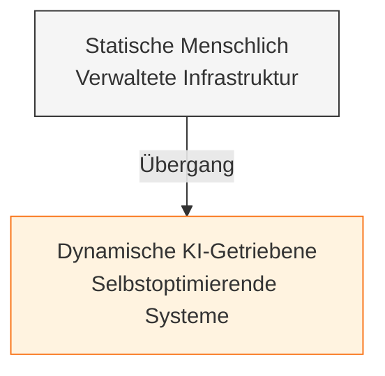
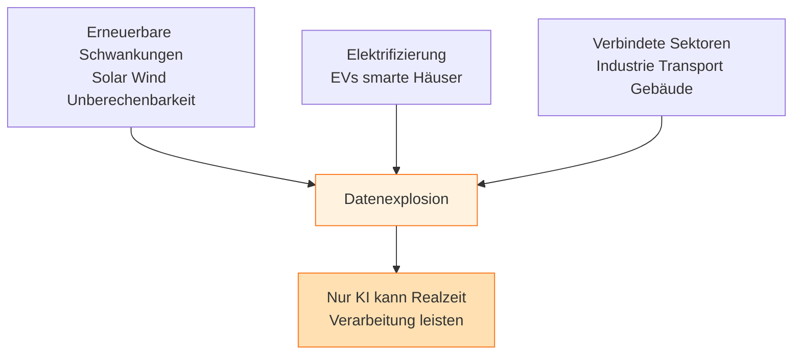
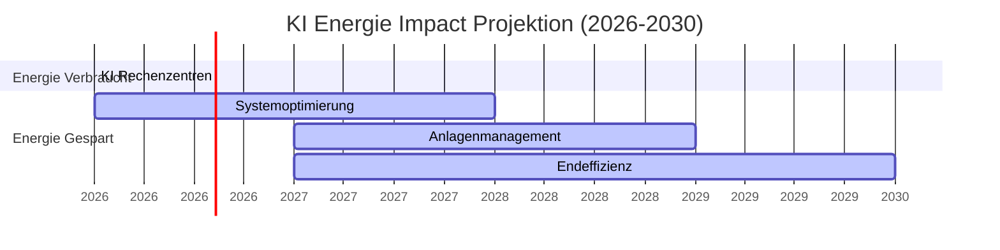

Ich beobachte, dass die Energiewirtschaft an einen Wendepunkt kommt. Die Nachfrage steigt weiter, aber gleichzeitig gibt es Druck, effizienter, nachhaltiger und widerstandsfähiger zu werden. Das System wird komplexer—und traditionelle Methoden reichen einfach nicht mehr aus.

Gleichzeitig ist KI nicht mehr zu ignorieren. Sie transformiert bereits Branchen durch Automatisierung, Datenanalyse und schnellere Entscheidungsfindung. Ja, sie verbraucht selbst Energie—besonders durch Rechenzentren—aber wenn ich das große Ganze betrachte, überwiegen die Vorteile.

Was mir auffällt, ist die Dimension: KI könnte bis zu 3.700 Terawattstunden Energie bis 2030 einsparen, was etwa dreimal so viel ist wie sie verbraucht. Das ist nicht marginal—das ist systemische Wirkung.

Wenn ich genauer hinschaue, sehe ich drei Hauptbereiche, in denen KI tatsächlich Energiesysteme verändert:

## 1. Systemoptimierung und Steuerung

KI kann massive Echtzeit-Datenströme aus Energienetzen verarbeiten. Das bedeutet, sie kann Probleme frühzeitig erkennen, Nachfrage vorhersagen und das System stabilisieren, bevor etwas schiefgeht.

Ich sehe bereits, wie Netzbetreiber KI zur Lastprognose nutzen, und auch Öl- und Gasunternehmen sie einsetzen, um Methanlecks zu erkennen oder Bohrgenauigkeit zu verbessern. Es werden im Grunde reaktive Systeme zu prädiktiven.

## 2. Anlagen-Lebenszyklusmanagement

Hier fungiert KI als strategisches Gehirn über den gesamten Lebenszyklus von Infrastruktur.

Mit Tools wie digitalen Zwillingen (virtuellen Replikaten echter Systeme) werden Szenarien simuliert, bevor Entscheidungen getroffen werden. Das reduziert Risiken und verbessert die Planung.

Operational hilft KI durch vorausschauende Wartung, Ausfälle zu verhindern. Anstatt auf Defekte zu reagieren, antizipiert das System sie.

## 3. Endeffizienz

Hier wirkt es sich direkt auf Verbraucher und Unternehmen aus.

Intelligente Gebäude, adaptive HLK-Systeme, optimierte Verkehrsströme—KI reduziert überallstill und leise Energieverschwendung. Sogar industrielle Prozesse werden effizienter, weil KI Ineffizienzen erkennt, die Menschen übersehen würden.

---

## Der Kompoundeffekt

Was mich am meisten interessiert, ist, dass diese Bereiche nicht isoliert funktionieren. Sie verstärken sich gegenseitig.

Zum Beispiel verbessert eine bessere Nachfrageprognose die Netzstabilität, hilft Gebäuden ihren Verbrauch zu optimieren und informiert Investitionsentscheidungen. Das erzeugt eine Rückkopplungsschleife—kleine Verbesserungen summieren sich zu massiven systemweiten Gewinnen.

Wegen dieses Kompoundeffekts ist das potenzielle Impact enorme:

- Bis zu **240 Milliarden Dollar** jährliche Kosteneinsparungen
- Rund **660 Megatonnen** CO₂-Emissionen pro Jahr vermieden

Aber ich sehe auch eine klare Anforderung: Das passiert nicht automatisch. Es erfordert Koordination über Branchen hinweg—Energieunternehmen, Tech-Firmen, Politikers und Finanzwelt.

Und es gibt eine weitere Ebene: Vertrauen.
Wenn KI in kritische Infrastruktur eingebettet wird, sind Transparenz und Verantwortlichkeit nicht optional—sie sind essentiell.

---

## Was tatsächlich passiert (einfache Erklärung)

Dieser Artikel geht nicht nur um Energie oder KI—es geht um ein Systemübergangsproblem:

**Kerndynamik:**
- Energiesysteme werden zu komplex für Menschen allein zu managen
- KI wird als Steuerungsschicht für diese Komplexität positioniert

---

## Die echte Verschiebung

Wir bewegen uns von:
- **Statische, menschenverwaltete Infrastruktur**

→ zu

- **Dynamische, selbstoptimierende Systeme angetrieben durch KI**

---

## Warum KI hier matters

Energiesysteme beinhalten jetzt:

- Erneuerbare Schwankungen (Solar/Wind Unberechenbarkeit)
- Elektrifizierung (EVs, smarte Häuser)
- Vernetzte Sektoren (Industrie, Transport, Gebäude)

Das erzeugt eine Datenexplosion, die nur KI in Echtzeit realistisch bewältigen kann.

---

## Die Energiebilanz

Der Schlüsselinsight: KI optimiert nicht nur eines—sie erzeugt kompounde Effizienzen über das gesamte System.

Deshalb:

**Die von KI eingesparte Energie wird projiziert, 3x höher zu sein als die sie verbraucht**

---

## Versteckte Implikation (Kritisch)

Es geht auch um Kontrolle und Infrastrukturmacht:

- Wer diese KI-Systeme baut und kontrolliert, beeinflusst die Energieverteilung
- Energie wird software-definiert

---

## Risikoebene

- Erhöhte Abhängigkeit von KI in kritischer Infrastruktur
- Bedarf für Governance, Ethik und Transparenz
- Potenzielle Zentralisierung von Kontrolle

---

## Quelle

Deloitte, "AI in Energy Systems: Interrelated Benefits Point to Vast Transformative Potential" von Andrew Swart, veröffentlicht am 23. März 2026 (Forbes BrandVoice / Bezahltes Programm).