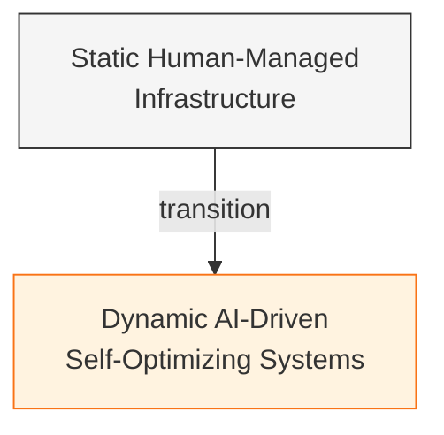
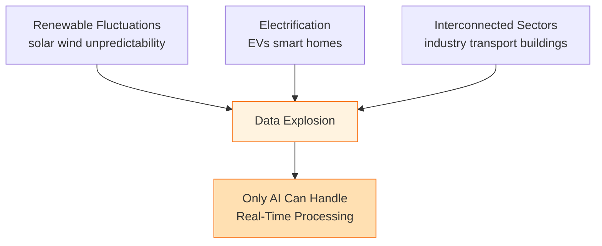
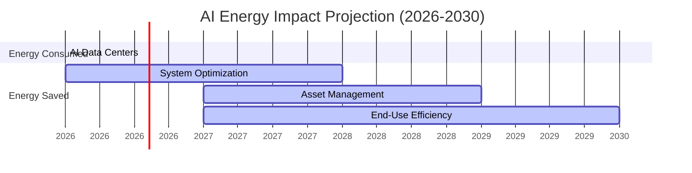

I'm noticing that the energy sector is hitting a breaking point. Demand keeps rising, but at the same time there's pressure to become more efficient, sustainable, and resilient. The system is getting more complex—and traditional methods just aren't enough anymore.

At the same time, AI is becoming impossible to ignore. It's already transforming industries through automation, data analysis, and faster decision-making. Yes, it consumes energy itself—especially through data centers—but when I look at the bigger picture, the benefits seem to outweigh the costs.

What stands out to me is the scale: AI could save up to 3,700 terawatt-hours of energy by 2030, which is about three times what it consumes. That's not marginal—that's system-level impact.

When I break it down, I see three main areas where AI is actually changing energy systems:

## 1. System Optimization and Control

AI can process massive real-time data streams from energy grids. That means it can detect problems early, predict demand, and stabilize the system before things go wrong.

I see this already happening—grid operators using AI to forecast loads, and even oil and gas companies using it to detect methane leaks or improve drilling precision. It's basically turning reactive systems into predictive ones.

## 2. Asset Lifecycle Management

Here, AI acts like a strategic brain across the entire lifespan of infrastructure.

With tools like digital twins (virtual replicas of real systems), it becomes possible to simulate scenarios before making decisions. That reduces risk and improves planning.

On the operational side, AI helps prevent failures through predictive maintenance. Instead of reacting to breakdowns, systems anticipate them.

## 3. End-Use Efficiency

This is where it directly affects consumers and businesses.

Smart buildings, adaptive HVAC systems, optimized traffic flows—AI is quietly reducing energy waste everywhere. Even industrial processes are becoming more efficient because AI identifies inefficiencies humans would miss.

---

## The Compounding Effect

What I find most interesting is that these areas don't work in isolation. They reinforce each other.

For example, better demand forecasting improves grid stability and helps buildings optimize their consumption and informs investment decisions. This creates a feedback loop—small improvements compound into massive system-wide gains.

Because of this compounding effect, the potential impact is huge:

- Up to **$240 billion** in annual cost savings
- Around **660 megatons** of CO₂ emissions avoided per year

But I also see a clear requirement: this doesn't happen automatically. It needs coordination across industries—energy companies, tech firms, policymakers, and finance.

And there's another layer: trust.
If AI becomes embedded in critical infrastructure, transparency and accountability aren't optional—they're essential.

---

## What's Actually Going On (Simple Explanation)

This article is not just about energy or AI—it's about a system transition problem:

**Core dynamic:**
- Energy systems are becoming too complex for humans alone to manage
- AI is being positioned as the control layer for that complexity

---

## The Real Shift

We are moving from:
- **Static, human-managed infrastructure**

→ to

- **Dynamic, self-optimizing systems driven by AI**

---

## Why AI Matters Here

Energy systems now involve:

- Renewable fluctuations (solar/wind unpredictability)
- Electrification (EVs, smart homes)
- Interconnected sectors (industry, transport, buildings)

This creates a data explosion that only AI can realistically handle in real time.

---

## The Energy Balance

The key insight: AI doesn't just optimize one thing—it creates compounding efficiencies across the entire system.

That's why:

**The energy saved by AI is projected to be 3x higher than the energy it consumes**

---

## Hidden Implication (Critical)

This is also about control and infrastructure power:

- Whoever builds and controls these AI systems influences energy distribution
- Energy becomes software-defined

---

## Risk Layer

- Increased dependence on AI in critical infrastructure
- Need for governance, ethics, and transparency
- Potential centralization of control

---

## Source

Deloitte, "AI in Energy Systems: Interrelated Benefits Point to Vast Transformative Potential" by Andrew Swart, published March 23, 2026 (Forbes BrandVoice / Paid Program).