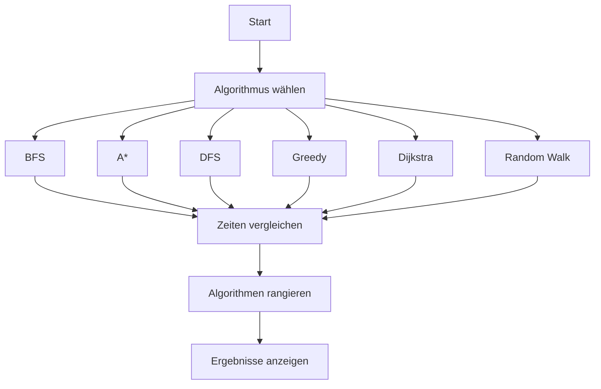
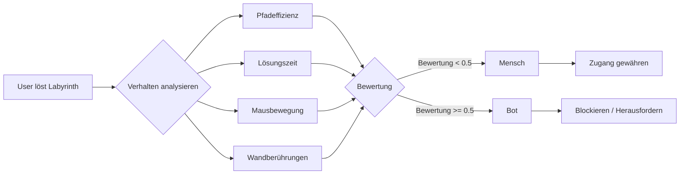
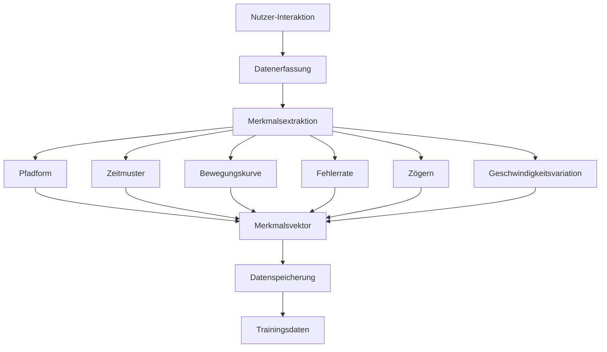
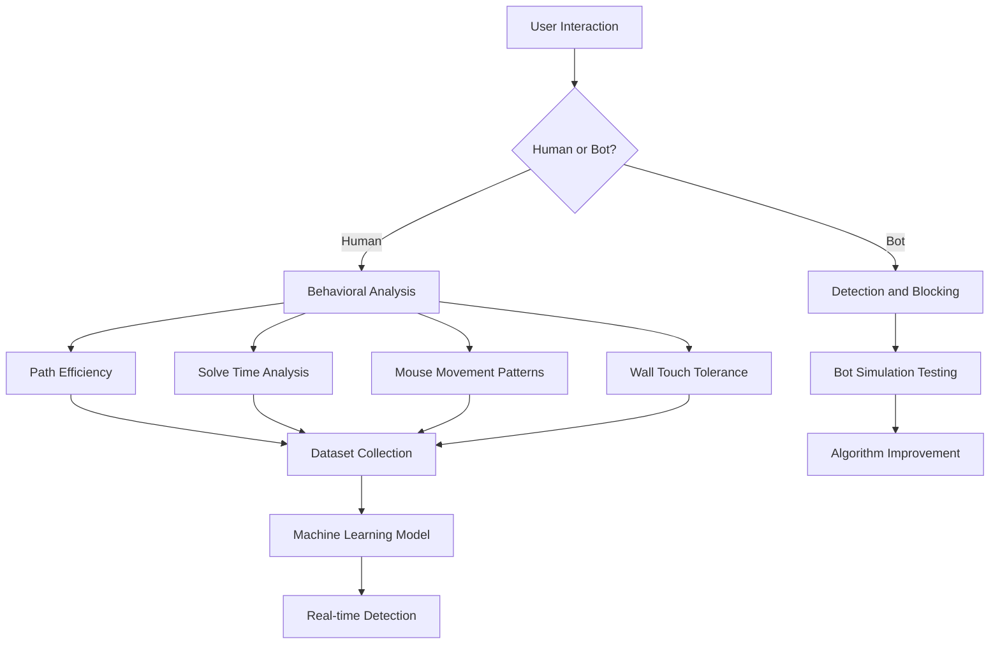

Das Internet wird von immer raffinierteren KI-Systemen bedroht, die traditionelle CAPTCHA-Systeme umgehen können. Das Behavioral Maze CAPTCHA Projekt repräsentiert einen revolutionären Ansatz zur Bot-Erkennung, der menschliche Verhaltensanalyse und Pfadfindungsalgorithmen nutzt, um die sicherste Anti-Bot-Lösung zu entwickeln.

## Das Problem mit traditionellen CAPTCHAs

Traditionelle CAPTCHA-Systeme wie reCAPTCHA nutzen Bilderkennung oder Text-Herausforderungen, die KI-Systeme letztendlich lernen können zu lösen. Mit fortschreitender KI werden diese Systeme zunehmend anfällig für Bot-Angriffe, was zu Spam, gefälschten Konten und kompromittierten Online-Diensten führt.

## Die Lösung: Behavioral Maze CAPTCHA

Dieses Projekt führt ein neues Paradigma im CAPTCHA-Design ein, das auf menschlicher Verhaltensanalyse statt Bild Erkennungs-Herausforderungen basiert.

### Datensatzsammlung für menschliche Pfade

Das Projekt baut den größten Datensatz für menschliches Labyrinth-Lösungsverhalten auf:

- **Echtzeit-Datenerfassung**: Jede menschliche Interaktion mit dem CAPTCHA-System wird erfasst
- **Verhaltensanalyse**: Verfolgung von Lösungszeiten, Pfadeffizienz, Mausbewegungsmustern und Wandberührungs-Häufigkeiten
- **Menschliche Variabilität**: Erfassung von natürlicher Zögern, variierenden Geschwindigkeiten und gelegentlichen Fehlern, die Menschen von KI unterscheiden

### Vielschichtiger Ansatz

Das Projekt operiert auf mehreren Ebenen:

1. **Datensammlung**: Aufbau des umfassendsten menschlichen Pfaddatensatzes
2. **Algorithmus-Entwicklung**: Erstellung sophistizierter Bot-Erkennungssysteme  
3. **KI-Sicherheit**: Entwicklung von CAPTCHA-Systemen, die gegen KI-Bedrohungen schützen

## Technische Architektur

Das System nutzt fortschrittliche Pfadfindungsalgorithmen und Verhaltensanalyse:

### Algorithmus-Vergleichssystem

- **9 verschiedene Pfadfindungsalgorithmen** (BFS, A*, DFS, Greedy, Dijkstra, Random Walk)
- **Echtzeit-Leistungsvergleich**
- **Lösungszeit-Ranking** (schnellste Algorithmen zuerst)

### Verhaltens-Erkennungsfunktionen

1. **Pfadeffizienzanalyse**: Menschliche Pfade sind natürlich weniger effizient als optimale KI-Lösungen
2. **Lösungszeitmuster**: Realistische menschliche Lösungszeiten (8-20 Sekunden)
3. **Mausbewegungsverfolgung**: Menschliche Cursor-Verhaltenserkennung
4. **Wandtoleranz**: Natürliche Wandberührungsmuster (max. 3 Berührungen pro 10 Schritte)

## Warum dieser Ansatz überlegen ist

### Datensatzvorteile

Das System sammelt den größten Datensatz für menschliches Pfadzeichnungsverhalten:

1. **Umfassende Abdeckung**: 20+ Verhaltensmerkmale pro Interaktion erfasst
2. **Echtwelt-Validierung**: Daten von echten menschlichen Nutzern, nicht synthetische Muster  
3. **Wachsender Datensatz**: Jede Interaktion trägt zum größten menschlichen Verhaltensdatensatz bei

### KI-Sicherheitsfunktionen

1. **Adaptive Bot-Erkennung**: Systeme entwickeln sich, um immer raffiniertere KI zu erkennen
2. **Menschliche Bot-Nachahmung**: Erstellung von Bots, die menschliches Verhalten nachahmen, um Systemstärke zu testen
3. **Echtzeitanalyse**: Erkennung erfolgt während des CAPTCHA-Prozesses, nicht danach

## Projektauswirkungen

### KI-Sicherheitsinitiative

Dieses Projekt repräsentiert einen kritischen Schritt zum Schutz des Internets vor KI-Bedrohungen:

- **Bot-Erkennung**: Verhindert automatisierten Spam und gefälschte Kontenerstellung
- **Inhaltsschutz**: Schützt Websites vor KI-generierter Inhaltsmanipulation  
- **Echtzeit-Verteidigung**: Bietet sofortigen Schutz gegen Bot-Angriffe

### Forschung-Anwendungen

Der Verhaltensdatensatz hat signifikanten Forschungswert:

1. **Mensch-Computer-Interaktion**: Verstehen, wie Menschen natürlich Probleme lösen
2. **KI-Verhaltensmodellierung**: Erstellung realistischer menschlicher KI-Systeme  
3. **Verhaltenspsychologie**: Studium von Entscheidungsmustern beim Lösen von Labyrinthen

## Implementierungs-Architektur

## Zukünftige Entwicklungen

1. **Erweiterte Verhaltensmodelle**: Sophistiziertere Analyse menschlicher Verhaltensmuster
2. **Plattformübergreifende Integration**: Erweiterung auf Web-, Mobil- und Desktop-Anwendungen  
3. **Community-Datensatzwachstum**: Mehr Nutzer zur Datensatz-Beitrags ermutigen
4. **Fortgeschrittene KI-Erkennung**: Evolvierende Systeme, die neue Klassen von KI-Bedrohungen erkennen

## Technische Implementierung

Das System nutzt:

- **Flask Backend**: Robuste Server-Architektur mit SQLite-Datenbank
- **JavaScript Canvas**: Echtzeit interaktive CAPTCHA-Oberfläche  
- **Python Pfadfindung**: Implementierung von 9 verschiedenen Pfadfindungsalgorithmen
- **Verhaltensanalyse**: Umfassende Analyse menschlicher Interaktionsmuster

## Live-Demo

Hier ist der interaktive Maze CAPTCHA in Aktion:

<video controls width="100%" src="/images/captcha/1.mp4"></video>

## Labyrinth-Beispiele

## Fazit

Das Behavioral Maze CAPTCHA System repräsentiert einen fundamentalen Wandel in der Art, wie wir Bot-Erkennung angehen. Durch Fokus auf menschliche Verhaltensmuster und Sammlung des größten Datensatzes für menschliches Labyrinth-Lösungsverhalten schafft dieses System eine robuste Verteidigung gegen KI-Bedrohungen und trägt gleichzeitig wertvolle Forschung zur Mensch-Computer-Interaktion bei.

Dieses Projekt zeigt, dass die effektivsten Anti-Bot-Lösungen aus dem Verstehen kommen, was Menschen menschlich macht – nicht nur was Bots können können. Wie KI-Systeme immer fortschrittlicher werden, sind Projekte wie dieses essentiell für die Aufrechterhaltung eines sicheren und authentischen Internets.

---

*Das Behavioral Maze CAPTCHA Projekt geht nicht nur darum, bessere CAPTCHAs zu erstellen – es geht um den Aufbau eines KI-sicheren Internets, in dem menschliche Verhaltensmuster der Schlüssel zum Schutz von Online-Systemen vor künstlicher Intelligenz sind.*