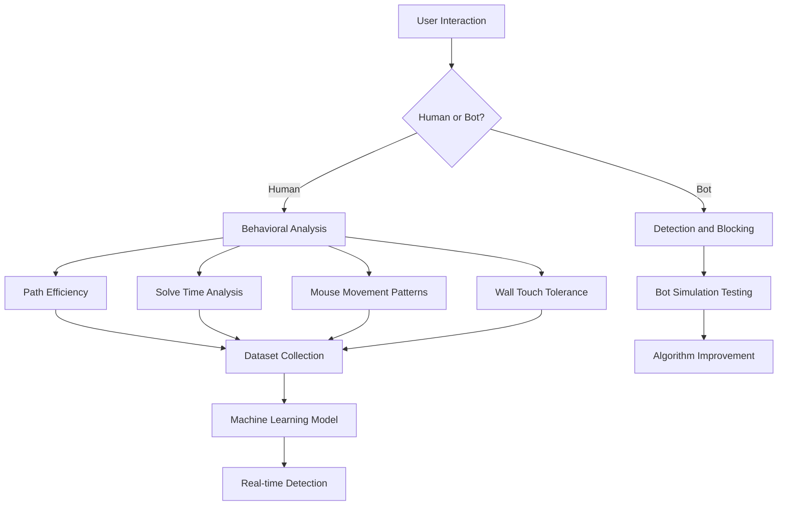

The internet is under threat from increasingly sophisticated AI systems that can bypass traditional CAPTCHA systems. The Behavioral Maze CAPTCHA project represents a revolutionary approach to bot detection that leverages human behavioral analysis and pathfinding algorithms to create the most secure anti-bot solution yet.

## The Problem with Traditional CAPTCHAs

Traditional CAPTCHA systems like reCAPTCHA use image recognition or text challenges that AI systems can eventually learn to solve. As AI becomes more advanced, these systems become increasingly vulnerable to bot attacks, leading to spam, fake accounts, and compromised online services.

## The Solution: Behavioral Maze CAPTCHA

This project introduces a new paradigm in CAPTCHA design that focuses on human behavioral analysis rather than image recognition challenges.

### Human Path Dataset Collection

The project is building the largest dataset of human maze-solving behavior in existence:

- **Real-time Data Collection**: Every human interaction with the CAPTCHA system is captured
- **Behavioral Analysis**: Tracking solve times, path efficiency, mouse movement patterns, and wall touch frequencies
- **Human Variability**: Capturing the natural hesitation, varied speeds, and occasional mistakes that distinguish human from AI behavior

### Multifaceted Approach

The project operates on multiple levels:

1. **Data Collection**: Building the most comprehensive human path dataset
2. **Algorithm Development**: Creating sophisticated bot detection systems  
3. **AI Safety**: Developing CAPTCHA systems that protect against AI threats

## Technical Architecture

The system uses advanced pathfinding algorithms and behavioral analysis:

### Algorithm Comparison System

- **9 Different Pathfinding Algorithms** (BFS, A*, DFS, Greedy, Dijkstra, Random Walk)
- **Real-time Performance Comparison**
- **Solve Time Ranking** (fastest algorithms first)

### Behavioral Detection Features

1. **Path Efficiency Analysis**: Human paths are naturally less efficient than optimal AI solutions
2. **Solve Time Patterns**: Realistic human solve times (8-20 seconds)
3. **Mouse Movement Tracking**: Human-like cursor behavior detection
4. **Wall Tolerance**: Natural wall touch patterns (max 3 touches per 10 steps)

## Why This Approach is Superior

### Dataset Advantages

The system collects the biggest dataset of human path drawing behavior:

1. **Comprehensive Coverage**: 20+ behavioral features captured per interaction
2. **Real-World Validation**: Data from actual human users, not synthetic patterns  
3. **Growing Dataset**: Each interaction contributes to the largest human behavior dataset

### AI Safety Features

1. **Adaptive Bot Detection**: Systems evolve to detect increasingly sophisticated AI
2. **Human-Mimic Bot Development**: Creating bots that mimic human behavior to test system strength
3. **Real-time Analysis**: Detection happens during the CAPTCHA process, not after

## Project Impact

### AI Safety Initiative

This project represents a critical step toward protecting the internet from AI threats:

- **Bot Detection**: Prevents automated spam and fake account creation
- **Content Protection**: Protects websites from AI-generated content manipulation  
- **Real-time Defense**: Provides instant protection against bot attacks

### Research Applications

The behavioral dataset has significant research value:

1. **Human-Computer Interaction**: Understanding how humans naturally solve problems
2. **AI Behavior Modeling**: Creating more realistic human-like AI systems  
3. **Behavioral Psychology**: Studying decision-making patterns in maze-solving

## Implementation Architecture

## Future Developments

1. **Enhanced Behavioral Models**: More sophisticated analysis of human behavior patterns
2. **Cross-Platform Integration**: Extension to web, mobile, and desktop applications  
3. **Community Dataset Growth**: Encouraging more users to contribute to the dataset
4. **Advanced AI Detection**: Evolving systems that can detect new classes of AI threats

## Technical Implementation

The system uses:

- **Flask Backend**: Robust server architecture with SQLite database
- **JavaScript Canvas**: Real-time interactive CAPTCHA interface  
- **Python Pathfinding**: Implementation of 9 different pathfinding algorithms
- **Behavioral Analytics**: Comprehensive analysis of human interaction patterns

## Live Demo

Here is the interactive maze CAPTCHA in action:

<video controls width="100%" src="/images/captcha/1.mp4"></video>

## Maze Examples

## Conclusion

The Behavioral Maze CAPTCHA system represents a fundamental shift in how we approach bot detection. By focusing on human behavioral patterns and collecting the largest dataset of human maze-solving behavior, this system creates a robust defense against AI threats while contributing to valuable research in human-computer interaction.

This project demonstrates that the most effective anti-bot solutions come from understanding what makes humans human—not just what bots can do. As AI systems become more advanced, projects like this one are essential for maintaining a safe and authentic internet.

---

*The Behavioral Maze CAPTCHA project is not just about creating better CAPTCHAs—it's about building an AI-safe internet where human behavior patterns are the key to protecting online systems from artificial intelligence threats.*