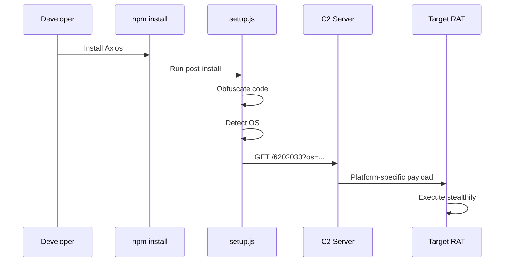
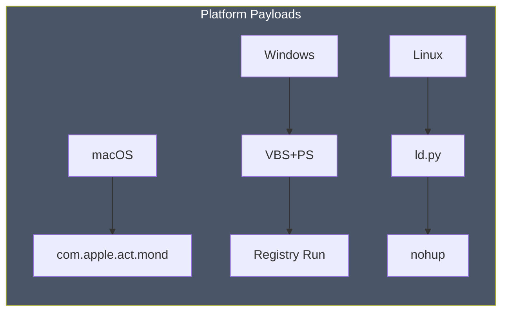
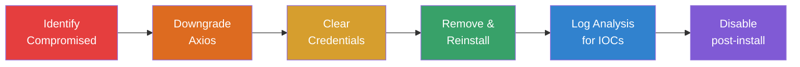
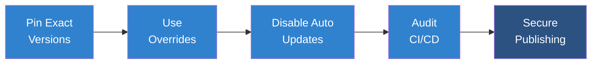

# npm Supply Chain Attack: Axios Compromise

On March 31, 2026, **two compromised versions** of the widely used JavaScript HTTP client Axios were published to npm. The affected releases (`1.14.1` and `0.30.4`), part of a library with **over 70 million weekly downloads**, contained a malicious dependency designed to retrieve payloads from attacker-controlled command-and-control (C2) infrastructure. Microsoft Threat Intelligence attributed this campaign to **Sapphire Sleet**, a North Korean state-sponsored threat actor.

Once a connection to the C2 server was established, a second-stage remote access trojan (RAT) was automatically deployed. The payload varied by operating system, targeting macOS, Windows, and Linux environments. This attack follows a growing pattern of supply chain compromises in which attackers poison trusted open-source packages to achieve widespread downstream impact.

## Attack mechanism

The malicious Axios versions introduced a hidden dependency, `plain-crypto-js@4.2.1`, which executed automatically during installation via a post-install script. Importantly, Axios itself remained functionally unchanged—allowing normal application behavior while malicious code executed silently during npm install or update processes, including within CI/CD pipelines.

```mermaid
---
config:
  layout: landscape
---
flowchart LR
    A[Developer] --> B[npm install]
    B --> C[Axios<br/>1.14.1/0.30.4]
    C --> D[plain-crypto-js<br/>@4.2.1]
    D --> E[post-install<br/>script]
    E --> F[Malicious<br/>Code]
    
    style F fill:#ff6b6b,color:#fff
```

The injected dependency was staged carefully:

- A benign version (`4.2.0`) established credibility.
- A follow-up version (`4.2.1`) introduced malicious install-time execution.
- Axios releases were then modified only at the manifest level to include this dependency.

This technique enabled silent code execution at install time without altering application logic, significantly reducing detection likelihood.

## Execution flow

During installation:

1. The malicious dependency executes setup.js.
2. Obfuscated code reconstructs runtime instructions.
3. The script identifies the host OS.
4. A request is sent to the attacker-controlled domain:
   - hxxp://sfrclak[.]com:8000/6202033
5. A platform-specific RAT is downloaded and executed.



Each OS receives a tailored payload via the same endpoint, differentiated only by POST parameters.

## Platform-specific behavior

- **macOS**: Downloads a native binary (/Library/Caches/com.apple.act.mond) via AppleScript and executes it in the background.
- **Windows**: Deploys a multi-stage chain using VBScript and PowerShell, achieving persistence via registry run keys and disguised executables.
- **Linux**: Downloads a Python-based RAT (/tmp/ld.py) and runs it using nohup for background execution.



After execution, the installer removes traces of the initial loader and restores a clean-looking package manifest to evade forensic detection.

## Capabilities of the RAT

The deployed malware functions as a covert remote management tool. It:

- Collects system and hardware data
- Establishes persistence mechanisms
- Communicates with the C2 server via encoded HTTP requests
- Executes arbitrary commands
- Transfers additional payloads
- Minimizes detection through in-memory execution and obfuscation

## Attribution: Sapphire Sleet

**Sapphire Sleet** has been active since at least 2020 and primarily targets financial and cryptocurrency sectors. The group is known for social engineering campaigns, often impersonating legitimate services to deliver malware. Their objective is typically financial gain through theft of cryptocurrency assets and related intellectual property.

## Mitigation

Users who installed affected versions should act immediately:

- Downgrade Axios to `1.14.0` or `0.30.3`
- Rotate all credentials and secrets
- Remove compromised installations and reinstall clean dependencies
- Inspect systems and logs for indicators such as:
  - plain-crypto-js
  - Connections to sfrclak[.]com
  - Clear npm cache and disable post-install scripts where possible



## Prevention recommendations

To reduce future risk:

- Pin exact dependency versions (avoid `^` or `~`)
- Use dependency overrides to enforce safe versions
- Disable automatic dependency updates for critical packages
- Audit CI/CD pipelines for unexpected installs
- Adopt secure publishing methods (e.g., OIDC-based trusted publishing)


