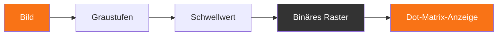
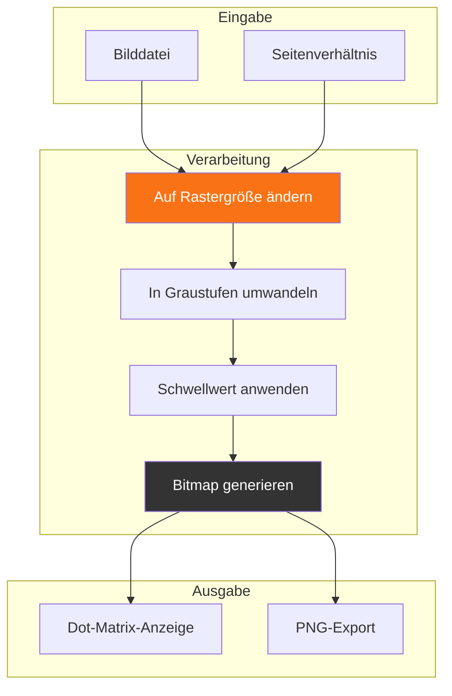
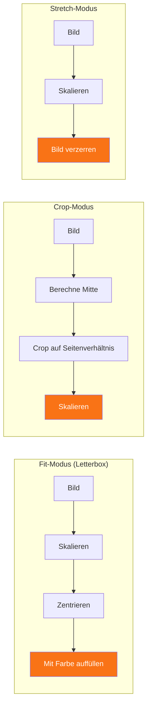
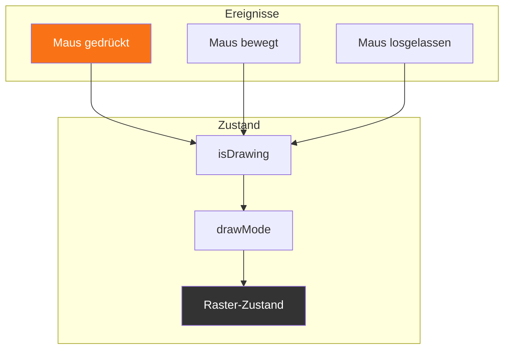
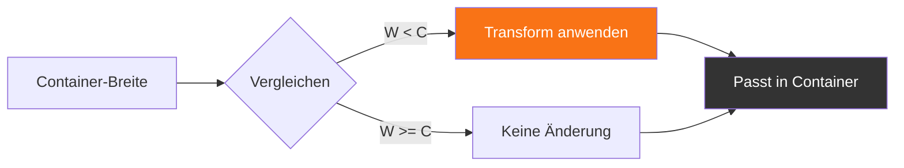

## Einführung

Dot-Matrix-Anzeigen sind überall – von altmodischen LED-Boards bis hin zu modernen Kunstinstallationen. In diesem Beitrag zeige ich, wie man einen Dot-Matrix-Playground erstellt, der Bilder in Pixelraster konvertiert, verschiedene Seitenverhältnisse handhabt und einen interaktiven Editor bietet.

---

## Kernkonzept

Eine Dot-Matrix ist im Wesentlichen ein Raster von Lichtern, wobei jede Position an oder aus sein kann. Die Herausforderung ist, ein Bild (mit potenziell Millionen von Farben) in diese binäre Darstellung umzuwandeln.



---

## Bildverarbeitungs-Pipeline

Die Konvertierung erfolgt in mehreren Stufen:



### Graustufen-Konvertierung

Wir verwenden die Luminosity-Methode, um RGB in Graustufen umzuwandeln:

```typescript
function calculateBrightness(r: number, g: number, b: number): number {
  return (0.299 * r + 0.587 * g + 0.114 * b) / 255;
}
```

Die Gewichte (0.299, 0.587, 0.114) approximieren, wie das menschliche Sehen Farbhelligkeit wahrnimmt.

---

## Seitenverhältnisse handhaben

Einer der kniffligsten Teile ist die Handhabung von Bildern, die nicht dem Zielraster-Seitenverhältnis entsprechen:



---

## Den interaktiven Editor bauen

Der Editor ermöglicht es Benutzern, direkt auf dem Raster zu zeichnen:



### Hauptfunktionen

- **Klick**: Einzelner Punkt umschalten
- **Ziehen**: Mehrere Punkte zeichnen
- **Rechtsklick-Ziehen**: Punkte löschen
- **Export**: C-Array oder PNG generieren

---

## Responsive Anzeige

Für große Raster skalieren wir die Anzeige, um in den Container zu passen:



---

## Ergebnisse

Der Playground unterstützt:

- Rastergrößen von 8×8 bis 128×128
- Mehrere Fit-Modi (fit, crop, stretch)
- Einstellbare Schwellwerte für binäre Konvertierung
- Interaktives Zeichnen mit Echtzeit-Feedback
- PNG-Export für Integration mit Hardware

---

## Fazit

Das Erstellen eines Dot-Matrix-Generators beinhaltet interessante Herausforderungen rund um Bildverarbeitung, responsives Design und Benutzerinteraktion. Das Wichtigste ist, flexible Kontrollen zu bieten, während eine saubere, benutzerfreundliche Oberfläche beibehalten wird.

Die vollständige Implementierung ist im Dot-Matrix-Playground auf dieser Seite verfügbar. Laden Sie verschiedene Bilder hoch, passen Sie den Schwellwert an und wechseln Sie zwischen den Fit-Modi, um zu sehen, wie die Konvertierung funktioniert!