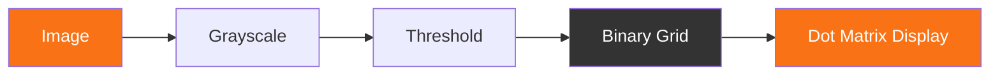
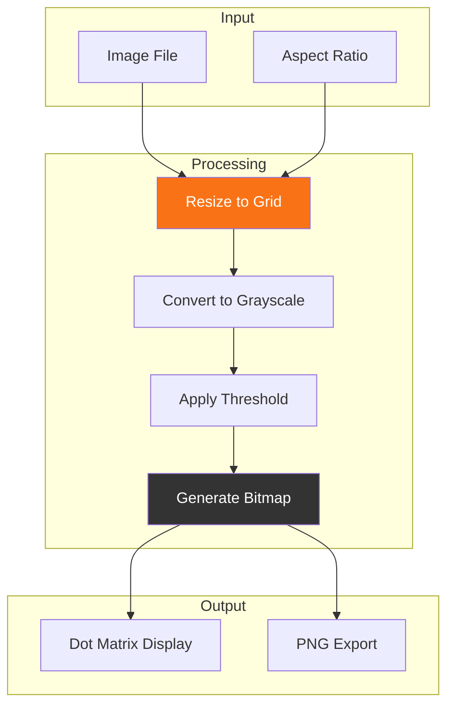
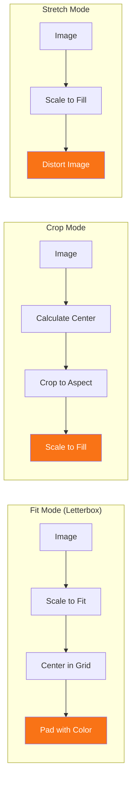
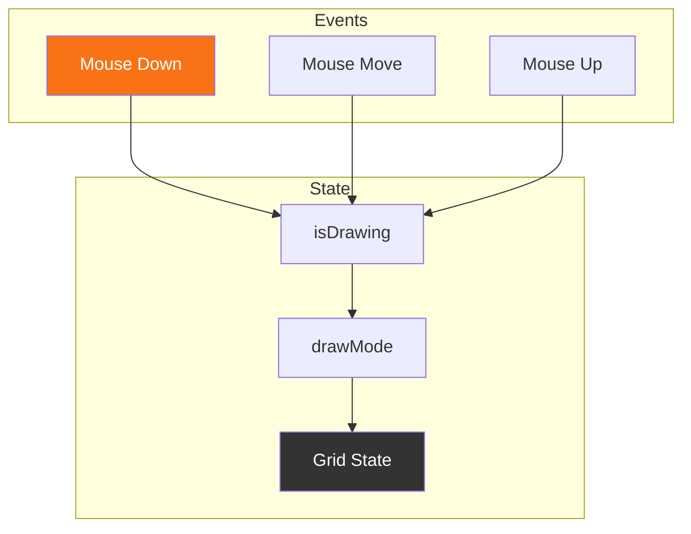
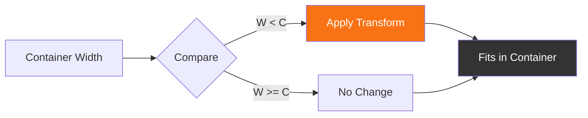

## Introduction

Dot matrix displays are everywhere—from old-school LED boards to modern art installations. In this post, I'll walk you through building a dot matrix playground that converts images to pixel grids, handles different aspect ratios, and provides an interactive editor.

---

## Core Concept

A dot matrix is essentially a grid of lights where each position can be on or off. The challenge is converting an image (with potentially millions of colors) into this binary representation.



---

## Image Processing Pipeline

The conversion happens in several stages:



### Grayscale Conversion

We use the luminosity method to convert RGB to grayscale:

```typescript
function calculateBrightness(r: number, g: number, b: number): number {
  return (0.299 * r + 0.587 * g + 0.114 * b) / 255;
}
```

The weights (0.299, 0.587, 0.114) approximate how human vision perceives color brightness.

---

## Handling Aspect Ratios

One of the trickiest parts is handling images that don't match the target grid aspect ratio:



### Implementation

```typescript
if (fitMode === 'fit') {
  const imgAspect = img.width / img.height;
  const gridAspect = gridSize / gridSize;
  
  if (imgAspect > gridAspect) {
    drawH = gridSize;
    drawW = img.width * (gridSize / img.height);
  } else {
    drawW = gridSize;
    drawH = img.height * (gridSize / img.width);
  }
  
  const offsetX = (gridSize - drawW) / 2;
  const offsetY = (gridSize - drawH) / 2;
  
  ctx.drawImage(img, offsetX, offsetY, drawW, drawH);
}
```

---

## Building the Interactive Editor

The editor allows users to draw directly on the grid using click and drag:



### Key Features

- **Click**: Toggle single dot
- **Drag**: Paint multiple dots
- **Right-click drag**: Erase dots
- **Export**: Generate C array or PNG

---

## Responsive Display

For large grids, we scale the display to fit the container:



---

## Results

The playground supports:

- Grid sizes from 8×8 to 128×128
- Multiple fit modes (fit, crop, stretch)
- Adjustable threshold for binary conversion
- Interactive drawing with real-time feedback
- PNG export for integration with hardware


---

## Conclusion

Building a dot matrix generator involves interesting challenges around image processing, responsive design, and user interaction. The key is providing flexible controls while maintaining a clean, usable interface.

The complete implementation is available in the dot matrix playground on this site. Try uploading different images, adjusting the threshold, and switching between fit modes to see how the conversion works!