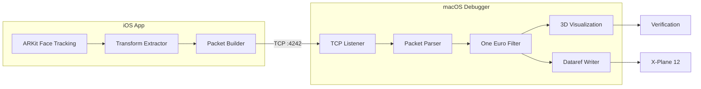
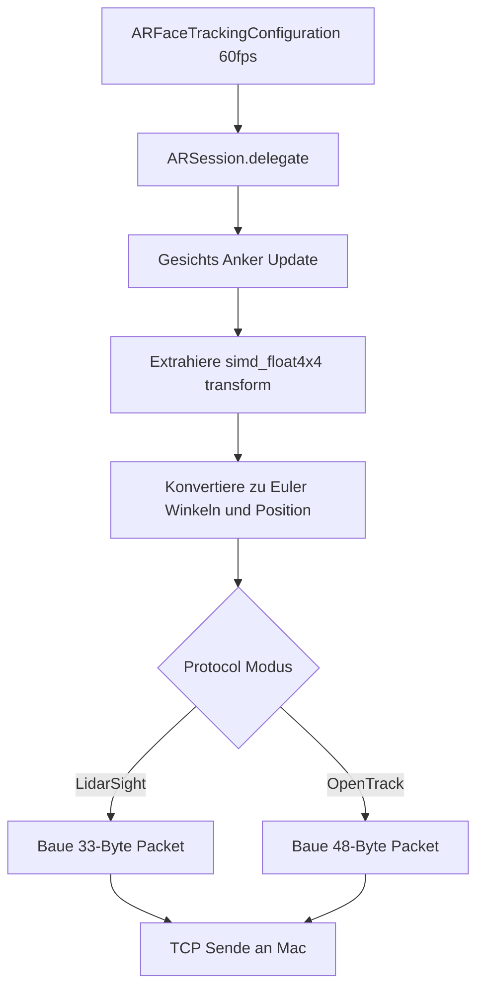
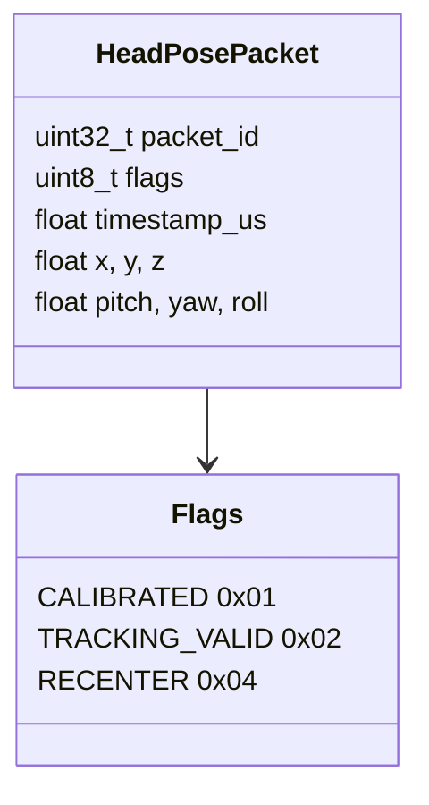
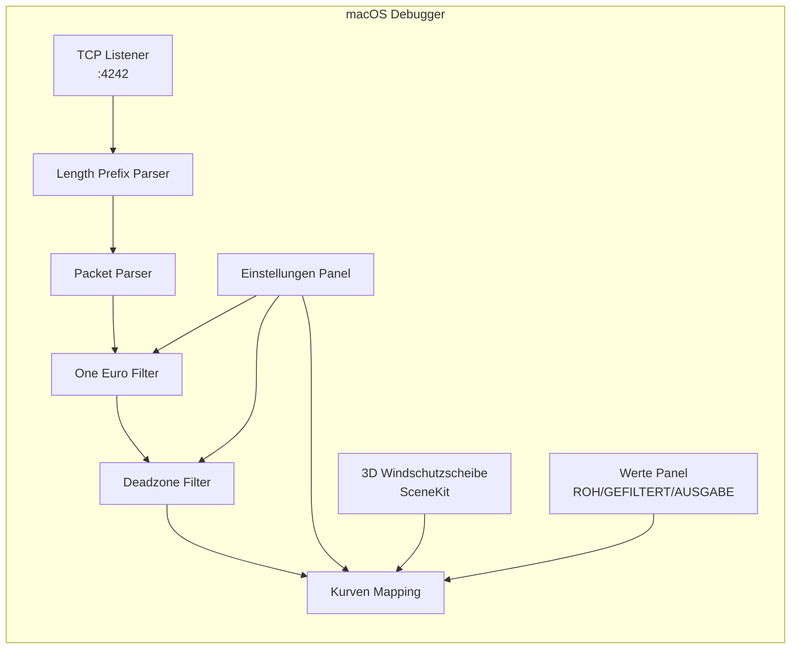
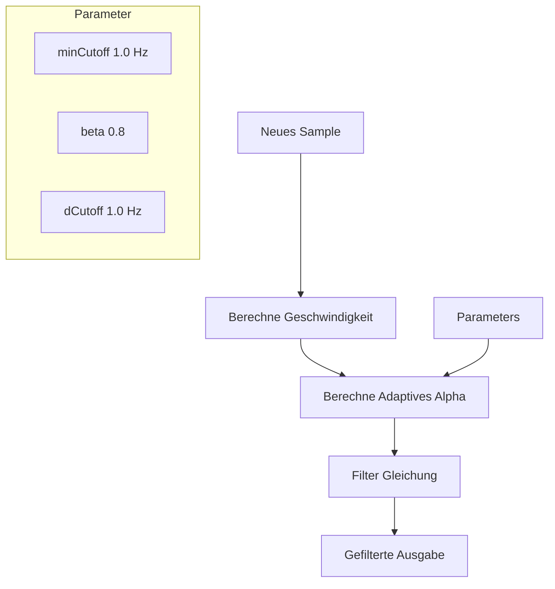
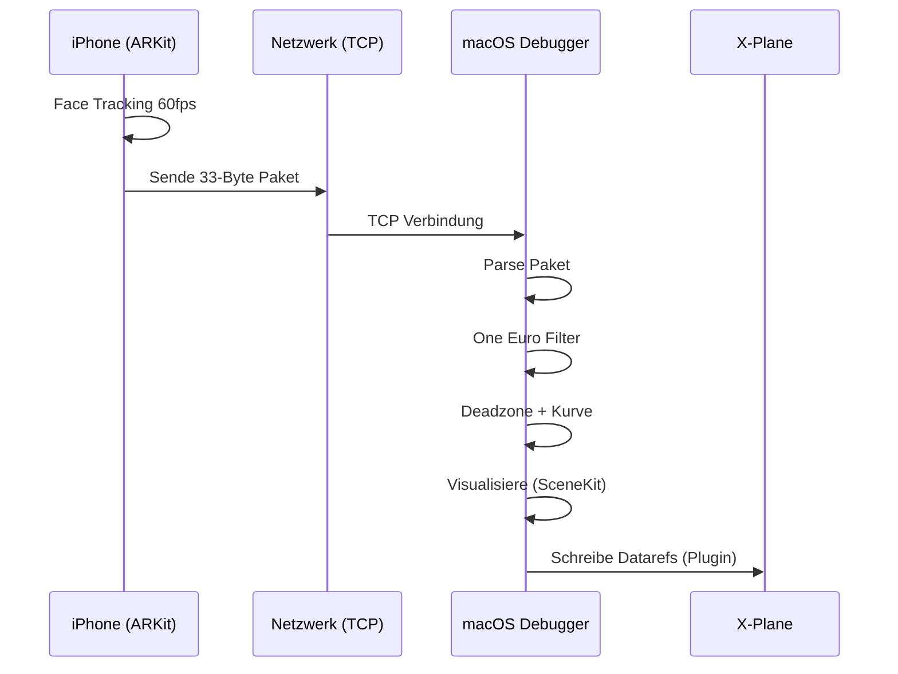

<video controls width="100%" src="/images/projects/LiDARSight/LiDARSight_Alpha.mov">
</video>

## Das Problem

Wenn du schon einmal einen Flugsimulator geflogen hast, kennst du das Gefühl: du rollst auf die Startbahn, drehst den Kopf um den Rand zu suchen, und... nichts passiert. Die Ansicht bleibt nach vorne gerichtet. Oder worse—du bist im Cockpit, versuchst deinen sechs zu checken, und die Kamera bewegt sich kaum.

Kommerzielle Head Tracking Lösungen gibt es. Tobii Eye Tracker kostet hunderte von Dollar. TrackIR erfordert Reflektor-Marker, die taped auf dein Gesicht. SmoothTrack—eine beliebte iOS App—funktioniert gut, aber ist Closed Source und hat Einschränkungen.

Was wäre, wenn du dein eigenes bauen könntest? Was wenn dein iPhone, auf einem Stativ vor dir, deine Kopfbewegung tracken und in Echtzeit an deinen Flugsimulator senden könnte?

Genau das haben wir uns vorgenommen zu bauen.

---

## Der Kern-Insight

Hier ist der Schlüssel-Insight, der dieses Projekt ermöglicht hat: **dein iPhone hat bereits alles, was für Head Tracking gebraucht wird**.

Die Front-TrueDepth Kamera—die gleiche Kamera, die dein Phone mit Face ID entsperrt—kann deine Gesichtsposition und Orientierung mit 60 Frames pro Sekunde tracken. Apple hat diese Möglichkeit durch ARKit, ihr Augmented Reality Framework, freigegeben.

Wir brauchten kein LiDAR. Wir brauchten keine speziellen Sensoren. Wir mussten nur auf das zugreifen, was bereits vorhanden war.

---

## TrueDepth vs LiDAR: Den Unterschied verstehen

Ein häufiger Punkt der Verwirrung: **iPhone hat zwei verschiedene Tiefen-Sensing-Systeme**, und sie sind für verschiedene Anwendungsfälle konzipiert.

### Apple TrueDepth (Front Kamera)

Das TrueDepth Kamerasystem befindet sich in der Notch/Pille von iPhone X und später. Es besteht aus:

- **Dot Projektor** — Projiziert >30.000 unsichtbare Infrarot-Punkte auf dein Gesicht
- **Infrarot Kamera** — Erfasst die Punkte und baut eine Tiefenkarte
- **Flood Illuminator** — Beleuchtet dein Gesicht im Dunkeln


TrueDepth ist konzipiert für **Nahbereich-Gesichtserfassung** (bis zu 3 Metern). Es ist optimiert für:
- Face ID Authentifizierung
- Animoji/Memoji Ausdrücke
- Unser Head Tracking Anwendungsfall

Laut Apple Dokumentation erkennt `ARFaceTrackingConfiguration` Gesichter innerhalb von 3 Metern und liefert Echtzeit-Positions/Orientierungsdaten.

### Apple LiDAR (Rear Kamera)

LiDAR (Light Detection and Ranging) ist ein komplett verschiedenes System—es ist ein Time-of-Flight (ToF) Sensor der:
- Tausende von Infrarot-Impulsen pro Sekunde sendet
- Rücklaufzeit misst um Entfernung zu berechnen
- Einen 3D Point Cloud der Umgebung erstellt


LiDAR ist konzipiert für **Raumskalierung** (bis zu 5 Metern):
- Misst Entfernung zu ~130×15×10m Bereich mit ±10cm Genauigkeit
- Instant Plane Detection (kein Scannen erforderlich)
- Szenengeometrie für Objekt-Occlusion
- Erweiterte ARKit Depth API (nur LiDAR-ausgestattete Devices)

---

## Warum wir TrueDepth nutzen, nicht LiDAR

Für Head Tracking **TrueDepth ist die richtige Wahl**:

| Fähigkeit | TrueDepth | LiDAR |
|------------|----------|-------|
| Reichweite | Bis zu 3m (optimiert für Gesicht) | Bis zu 5m (Raumskala) |
| Frame Rate | 60fps | Variiert nach Config |
| Gesichtsmesh | Ja (via ARFaceAnchor) | Nein (Szenengeometrie) |
| Benötigt für Face ID | Ja | Nein |
| Benötigtes Device | iPhone X+ | iPhone 12 Pro+ oder iPad Pro |

TrueDepth gibt uns genau das, was wir brauchen:
- Volle Gesichtsposition und Orientierung (6DoF)
- Gesichtsgeometrie-Mesh
- Blend Shapes für Ausdrücke (wenn wir sie wollen)
- Funktioniert auf jedem iPhone X oder später

**Der Schlüssel-Insight:** Du brauchst kein Pro iPhone für Head Tracking. Jedes iPhone mit Face ID funktioniert.

---

## Die Architektur

Unser System hat zwei Hauptkomponenten:




1. **iOS App** — Nutzt ARKit Face Tracking, sendet Pose-Daten über das Netzwerk
2. **macOS Debugger** — Standalone App um Head Tracking zu visualisieren und Datarefs an X-Plane zu schreiben

In zukünftigen Beiträgen werden wir das X-Plane Plugin im Detail behandeln (C++ mit der XPL API).

---

## Die iOS App: Erfassung der Gesichtsposition

Die iOS App führt eine ARKit Session mit `ARFaceTrackingConfiguration` aus. Diese Konfiguration ist für Face ID konzipiert, liefert aber auch Echtzeit-Gesichts-Anker-Daten—genau was wir brauchen.

Jeden Frame gibt uns ARKit ein `ARFaceAnchor` Objekt, das enthält:

```swift
// Von ARFaceAnchor
anchor.transform      // simd_float4x4 - Position & Orientierung
anchor.blendShapes   // Dictionary von 52 Gesichtsausdrücken
anchor.geometry      // ARFaceGeometry Mesh
```

Die **Transform-Matrix** ist eine 4x4 homogene Koordinatenmatrix, die die Position und Orientierung des Gesichts relativ zur Kamera darstellt:

```
| R00 R01 R02 Tx |
| R10 R11 R12 Ty |
| R20 R21 R22 Tz |
| 0   0   0  1 |
```

Wobei die obere 3x3 Rotation ist und (Tx, Ty, Tz) die Position ist.

Aus dieser Matrix extrahieren wir:
- **Position (X, Y, Z)** — Wie weit vor/zurück, links/rechts, oben/unten dein Kopf ist
- **Orientierung (Pitch, Yaw, Roll)** — Wie dein Kopf geneigt ist



All das passiert mit 60fps von der TrueDepth Kamera. Das Tracking ist bemerkenswert glatt, weil Apple Jahre von F&E investiert hat, damit Face ID zuverlässig funktioniert.

### Technischer Deep Dive: ARFaceAnchor

Laut Apple Dokumentation bietet `ARFaceAnchor`:

| Property | Typ | Beschreibung |
|----------|------|-------------|
| `transform` | `simd_float4x4` | Gesichtsposition/Orientierung im Kameraraum |
| `blendShapes` | `[ARFaceBlendShape: NSNumber]` | 52 Koeffizienten für Gesichtsausdrücke |
| `geometry` | `ARFaceGeometry` | 3D Mesh des erkannten Gesichts |

Die Transform ist im **Kameraraum**, was bedeutet, dass der Ursprung (0,0,0) dort ist, wo die iPhone Kamera sitzt. Wenn du deinen Kopf bewegst:
- **+X** = rechts
- **+Y** = oben
- **+Z** = zu dir hin (weg von der Kamera)

Das ist genau was wir brauchen—wir können diese Koordinaten transformieren um einen neutralen "Kalibrierungspunkt" zu etablieren und dann relative Bewegungen von diesem Baseline zu senden.

---

## Die Herausforderung: Daten vom iPhone bekommen

Hier ist die erste echte Herausforderung: wie bekommen wir diese Daten vom iPhone auf den Mac?

Wir hatten mehrere Optionen:

| Methode | Latenz | Zuverlässigkeit |
|--------|--------|--------------|
| UDP Broadcast | ~5ms | Niedrig (Pakete können verloren gehen) |
| TCP Socket | ~10ms | Hoch (garantierte Zustellung) |
| PeerTalk (USB) | ~3ms | Sehr Hoch |
| MultipeerConnectivity | ~5ms | Hoch (Apple proprietär) |

Wir haben uns für **TCP** entschieden für Zuverlässigkeit. Wenn du mitten im Flug bist, willst du keine verlorenen Pakete, die Jitter verursachen. Die ~10ms Latenz auf einem lokalen Netzwerk ist mehr als akzeptabel.

Die iOS App verbindet sich mit der Mac IP-Adresse auf Port 4242 (ein Port, den wir beliebig gewählt haben—4242 klingt cool, oder?).

---

## Daten-Paket-Design

Wir brauchten ein kompaktes Format, um über das Netzwerk zu senden. Hier ist, wofür wir uns entschieden haben:

```
Offset  Typ     Name
0       UInt32   packet_id     (Sequenznummer zur Ordnung)
4       UInt8    flags        (kalibriert, Tracking gültig, etc.)
5       Float    timestamp_us (wann das Sample erfasst wurde)
9       Float    x, y, z       (Position in Metern)
21      Float    pitch, yaw, roll (Rotation in Grad)
```

Insgesamt: **33 Bytes**. Kompakt und effizient.



Es gibt auch ein alternatives "OpenTrack" Protokoll—48 Bytes, verwendet von anderen Flight Sim Tools—das unser System ebenfalls für Kompatibilität unterstützt.


---

## Der macOS Debugger: Visualisierung der Daten

Jetzt haben wir Daten, die vom iPhone zum Mac fließen. Aber wie wissen wir, dass es funktioniert?

Wir haben eine macOS Debugger App gebaut, um alles zu visualisieren:



1. **TCP Listener** — Lauscht auf Port 4242 für eingehende iOS Verbindungen
2. **3D Windschutzscheibe** — SceneKit Ansicht, die ein virtuelles Cockpit mit deiner Kopfposition zeigt
3. **Werte Panel** — ROH → GEFILTERT → AUSGABE Werte in Echtzeit
4. **Einstellungen** — Filter-Parameter, Deadzone, Empfindlichkeit tunen

Der Debugger ist nicht nur zum Debuggen—es ist eine komplette Testumgebung. Du kannst verifizieren, dass Head Tracking funktioniert, ohne X-Plane zu starten.

---

## Die Glättungs-Herausforderung

ROHE Head Tracking Daten sind noisig. Deine Hand zittert. Das Tracking wackelt. Das wird besonders bei 60fps sichtbar—selbst kleine Vibrationen sind sichtbar.

Wir haben den **One Euro Filter** implementiert—ein Signalverarbeitungsalgorithmus, der genau für diesen Anwendungsfall Designed ist. Es ist ein adaptiver Filter der:
- High-Frequency Jitter glättet
- Schnell auf tatsächliche Kopfbewegungen reagiert
- Sich basierend auf Bewegungsgeschwindigkeit anpasst



Der Filter hat drei konfigurierbare Parameter:
- **minCutoff** — Minimum Filter Cutoff (wie viel Glättung)
- **beta** — Geschwindigkeits-adaptive Stärke
- **dCutoff** — Ableitungs-Cutoff für Reaktionsfähigkeit

Wir wenden diesen Filter auf der Mac Seite an (im Debugger und X-Plane Plugin), und halten die iOS Seite rein auf die Erfassung fokussiert.

---

## System Datenfluss

Hier ist der komplette End-to-End Datenfluss:



---

## Was als Nächstes

In zukünftigen Beiträgen werden wir tiefer eintauchen:

1. **Kalibrierung** — Wie wir eine neutrale Kopfposition setzen
2. **Deadzone und Kurven-Mapping** — Wie sich kleine Kopfbewegungen natürlich anfühlen
3. **Die iOS UI** — Bauen einer modernen SwiftUI Oberfläche mit Glassmorphism
4. **Protokolle und Netzwerk** — TCP vs UDP, Paket-Framing, Reconnection-Logik
5. **Debugging Geschichten** — Die Bugs, die wir gefunden und behoben haben

Jede Komponente hat ihre eigenen interessanten Herausforderungen. Weiter geht's...

---

## Probier es selbst

Der Code ist Open Source (MIT lizenziert). Wenn du ein iPhone X oder später hast:

1. Klone das Repository
2. Öffne das iOS Projekt in Xcode
3. Baue und führe auf deinem Device aus
4. Gebe die IP-Adresse deines Macs ein
5. Montiere dein iPhone auf einem Stativ, das zu dir zeigt
6. Tippe auf "Start Tracking"

Beobachte den macOS Debugger, um deinen Kopf in Echtzeit zu sehen.

*Weiter mit: Teil 2 — Inside der iOS App: ARKit Face Tracking Deep Dive*