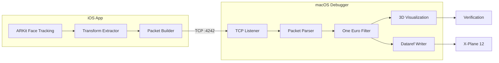
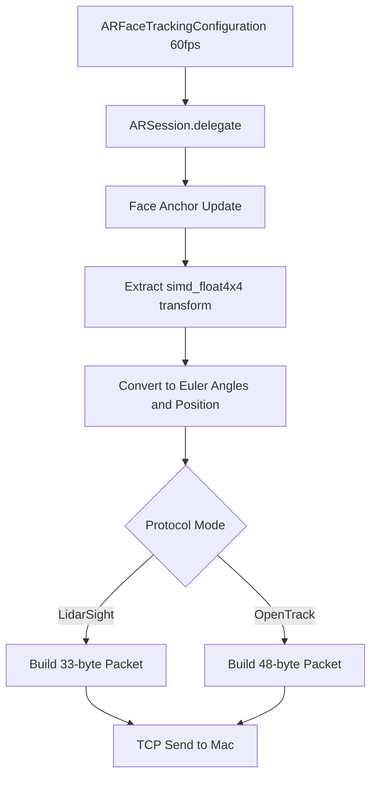
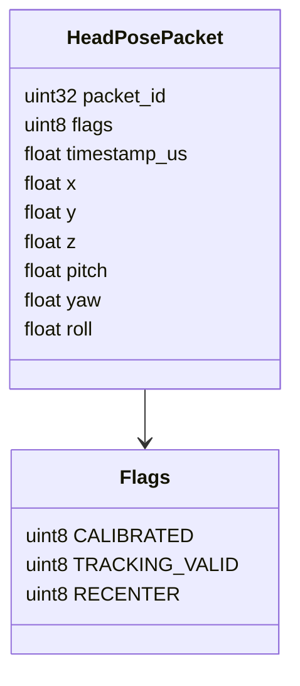
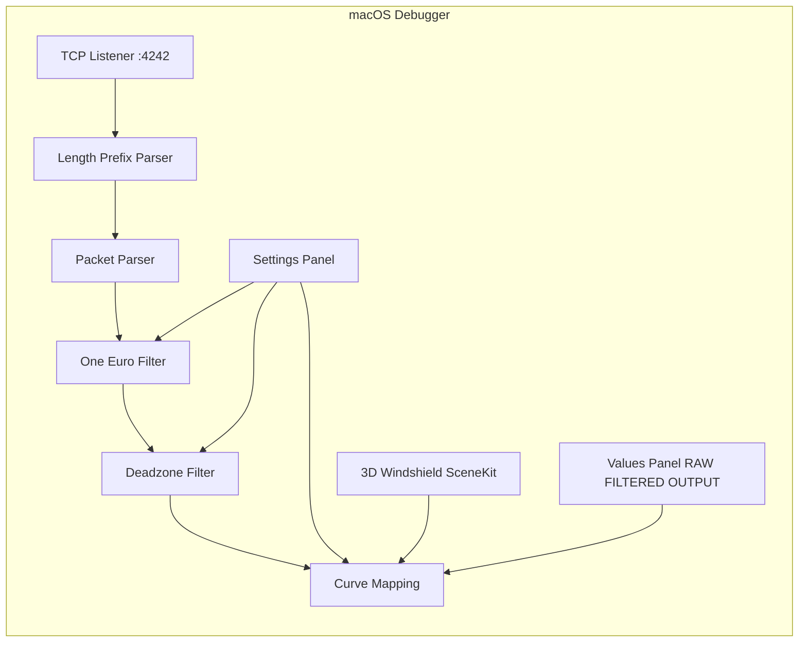
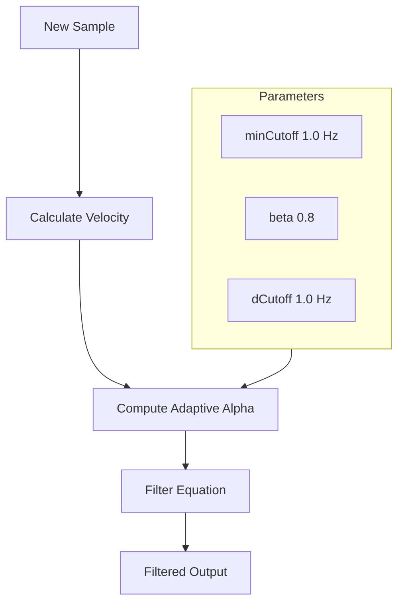
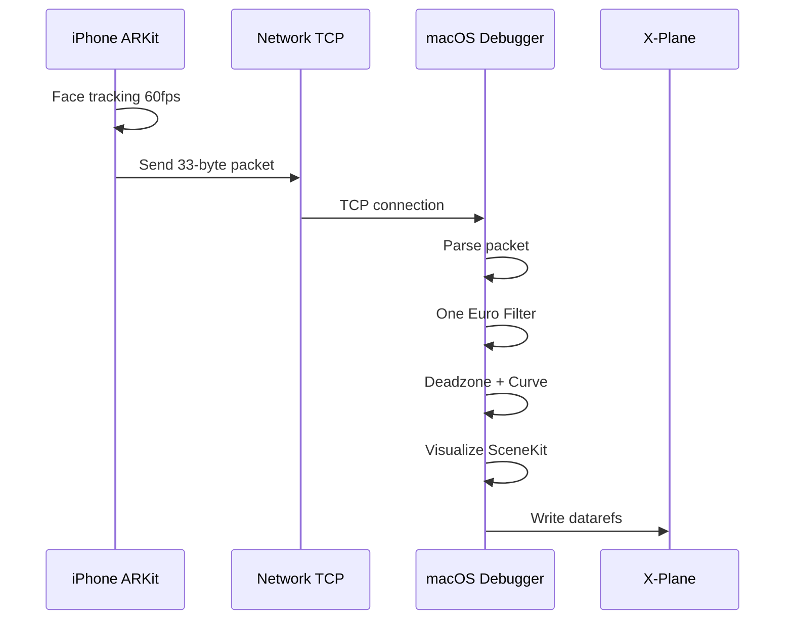

<video controls width="100%" src="/images/projects/LiDARSight/LiDARSight_Alpha.mov">
</video>

## The Problem

If you've ever flown a flight simulator, you know the feeling: you're taxiing on the runway, turn your head to look for the runway edge, and... nothing happens. The view stays locked forward. Or worse—you're in the cockpit, trying to check your six, and the camera barely moves.

Commercial head tracking solutions exist. Tobii Eye Tracker costs hundreds of dollars. TrackIR requires Reflector markers taped to your face. SmoothTrack—a popular iOS app—works well, but it's closed source and has limitations.

What if you could build your own? What if your iPhone, sitting on a tripod in front of you, could track your head movement and send it to your flight simulator in real-time?

That's exactly what we set out to build.

---

## The Core Insight

Here's the key realization that made this project possible: **your iPhone already has everything needed for head tracking**.

The front-facing TrueDepth camera—the same camera that unlocks your phone with Face ID—can track your face position and orientation at 60 frames per second. Apple exposed this capability through ARKit, their augmented reality framework.

We didn't need LiDAR. We didn't need special sensors. We just needed to tap into what was already there.

---

## TrueDepth vs LiDAR: Understanding the Difference

A common point of confusion: **iPhone has two different depth-sensing systems**, and they're designed for different use cases.

### Apple TrueDepth (Front Camera)

The TrueDepth camera system lives in the notch/pill of iPhone X and later. It consists of:

- **Dot projector** — Projects >30,000 invisible infrared dots onto your face
- **Infrared camera** — Captures the dots and builds a depth map
- **Flood illuminator** — Illuminates your face in darkness


TrueDepth is designed for **close-range facial capture** (up to 3 meters). It's optimized for:
- Face ID authentication
- Animoji/Memoji expressions
- Our head tracking use case

According to Apple's documentation, `ARFaceTrackingConfiguration` detects faces within 3 meters and provides real-time position/orientation data.

### Apple LiDAR (Rear Camera)

LiDAR (Light Detection and Ranging) is a completely different system—it's a Time-of-Flight (ToF) sensor that:
- Emits thousands of infrared pulses per second
- Measures return time to calculate distance
- Creates a 3D point cloud of the environment


LiDAR is designed for **room-scale mapping** (up to 5 meters):
- Measures distance to ~130×15×10m area with ±10cm accuracy
- Instant plane detection (no scanning required)
- Scene geometry for object occlusion
- Enhanced ARKit Depth API (LiDAR-equipped devices only)

---

## Why We Use TrueDepth, Not LiDAR

For head tracking, **TrueDepth is the right choice**:

| Capability | TrueDepth | LiDAR |
|------------|----------|-------|
| Range | Up to 3m (optimized for face) | Up to 5m (room scale) |
| Frame rate | 60fps | Varies by config |
| Face mesh | Yes (via ARFaceAnchor) | No (scene geometry) |
| Required for Face ID | Yes | No |
| Required device | iPhone X+ | iPhone 12 Pro+ or iPad Pro |

TrueDepth gives us exactly what we need:
- Full face position and orientation (6DoF)
- Face geometry mesh
- Blend shapes for expressions (if we wanted them)
- Works on any iPhone X or later

**The key insight:** You don't need a Pro iPhone for head tracking. Any iPhone with Face ID works.

---

## The Architecture

Our system has two main components:




1. **iOS App** — Uses ARKit face tracking, sends pose data over the network
2. **macOS Debugger** — Standalone app to visualize head tracking and write datarefs to X-Plane

In future posts, we'll cover the X-Plane plugin in detail (C++ with the XPL API).

---

## The iOS App: Capturing Face Position

The iOS app runs an ARKit session with `ARFaceTrackingConfiguration`. This configuration is designed for Face ID, but it also provides real-time face anchor data—exactly what we need.

Every frame, ARKit gives us an `ARFaceAnchor` object containing:

```swift
// From ARFaceAnchor
anchor.transform      // simd_float4x4 - position & orientation
anchor.blendShapes   // Dictionary of 52 facial blend shapes
anchor.geometry      // ARFaceGeometry mesh
```

The **transform matrix** is a 4x4 homogeneous coordinate matrix representing the face's position and orientation relative to the camera:

```
| R00 R01 R02 Tx |
| R10 R11 R12 Ty |
| R20 R21 R22 Tz |
| 0   0   0  1 |
```

Where the upper 3x3 is rotation and (Tx, Ty, Tz) is position.

From this matrix, we extract:
- **Position (X, Y, Z)** — How far forward/back, left/right, up/down your head is
- **Orientation (Pitch, Yaw, Roll)** — How your head is tilted



All of this happens at 60fps from the TrueDepth camera. The tracking is remarkably smooth because Apple has invested years of R&D into making Face ID work reliably.

### Technical Deep Dive: ARFaceAnchor

According to Apple's documentation, `ARFaceAnchor` provides:

| Property | Type | Description |
|----------|------|-------------|
| `transform` | `simd_float4x4` | Face position/orientation in camera space |
| `blendShapes` | `[ARFaceBlendShape: NSNumber]` | 52 coefficients for facial expressions |
| `geometry` | `ARFaceGeometry` | 3D mesh of the detected face |

The transform is in **camera space**, meaning the origin (0,0,0) is where the iPhone camera sits. As you move your head:
- **+X** = right
- **+Y** = up
- **+Z** = toward you (away from camera)

This is exactly what we need—we can transform these coordinates to establish a neutral "calibration point" and then send relative movements from that baseline.

---

## The Challenge: Getting Data Off the iPhone

Here's the first real challenge: how do we get this data from the iPhone to the Mac?

We had several options:

| Method | Latency | Reliability |
|--------|--------|--------------|
| UDP Broadcast | ~5ms | Low (packets can be lost) |
| TCP Socket | ~10ms | High (guaranteed delivery) |
| PeerTalk (USB) | ~3ms | Very High |
| MultipeerConnectivity | ~5ms | High (Apple proprietary) |

We chose **TCP** for reliability. When you're in the middle of a flight, you don't want dropped packets causing jitter. The ~10ms latency on a local network is more than acceptable.

The iOS app connects to the Mac's IP address on port 4242 (a port we picked arbitrarily—4242 sounds cool, right?).

---

## Data Packet Design

We needed a compact format to send over the network. Here's what we settled on:

```
Offset  Type     Name
0       UInt32   packet_id     (sequence number for ordering)
4       UInt8    flags        (calibrated, tracking valid, etc.)
5       Float    timestamp_us (when the sample was captured)
9       Float    x, y, z       (position in meters)
21      Float    pitch, yaw, roll (rotation in degrees)
```

Total: **33 bytes**. Compact and efficient.



There's also an alternative "OpenTrack" protocol—48 bytes, used by other flight sim tools—which our system also supports for compatibility.


---

## The macOS Debugger: Visualizing the Data

Now we have data flowing from iPhone to Mac. But how do we know it's working?

We built a macOS Debugger app to visualize everything:



1. **TCP Listener** — Listens on port 4242 for incoming iOS connections
2. **3D Windshield** — SceneKit view showing a virtual cockpit with your head position
3. **Values Panel** — RAW → FILTERED → OUTPUT values in real-time
4. **Settings** — Tune filter parameters, deadzone, sensitivity

The debugger isn't just for debugging—it's a complete testing environment. You can verify head tracking is working without even running X-Plane.

---

## The Smoothing Challenge

RAW head tracking data is noisy. Your hand shakes. The tracking jitters. This becomes especially apparent at 60fps—even small vibrations are visible.

We implemented the **One Euro Filter**—a signal processing algorithm designed exactly for this use case. It's an adaptive filter that:
- Smooths high-frequency jitter
- Responds quickly to actual head movements
- Adapts based on movement speed



The filter has three configurable parameters:
- **minCutoff** — Minimum filter cutoff (how much smoothing)
- **beta** — Velocity-adaptive strength
- **dCutoff** — Derivative cutoff for responsiveness

We apply this filter on the Mac side, keeping the iOS side focused purely on capturing.

---

## System Data Flow

Here's the complete end-to-end data flow:



---

## What's Next

In future posts, we'll dive deeper into:

1. **Calibration** — How we handle setting a neutral head position
2. **Deadzone and Curve Mapping** — Making small head movements feel natural
3. **The iOS UI** — Building a modern SwiftUI interface with glassmorphism
4. **Protocols and Networking** — TCP vs UDP, packet framing, reconnection logic
5. **X-Plane Integration** — Writing datarefs to control the camera view
6. **Debugging Stories** — The bugs we found and fixed along the way

Each component has its own interesting challenges. Let's continue...

---

## Try It Yourself

The code is open source (MIT licensed). If you have an iPhone X or later:

1. Clone the repository
2. Open the iOS project in Xcode
3. Build and run on your device
4. Enter your Mac's IP address
5. Mount your iPhone on a tripod facing you
6. Tap "Start Tracking"

Watch the macOS debugger to see your head moving in real-time.

*Next up: Part 2 — Inside the iOS App: ARKit Face Tracking Deep Dive*