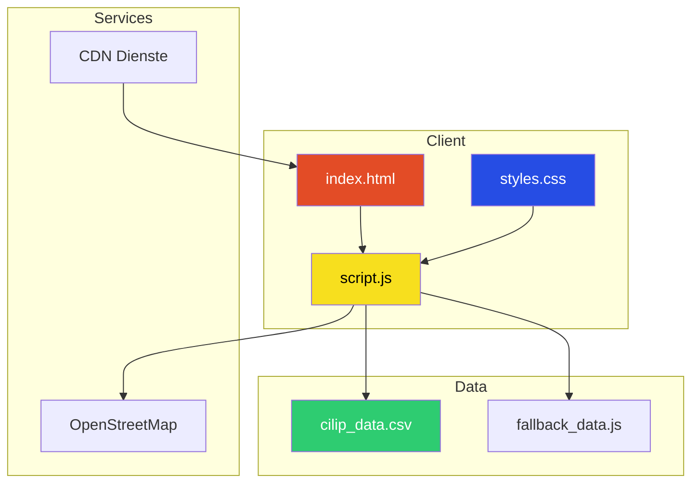
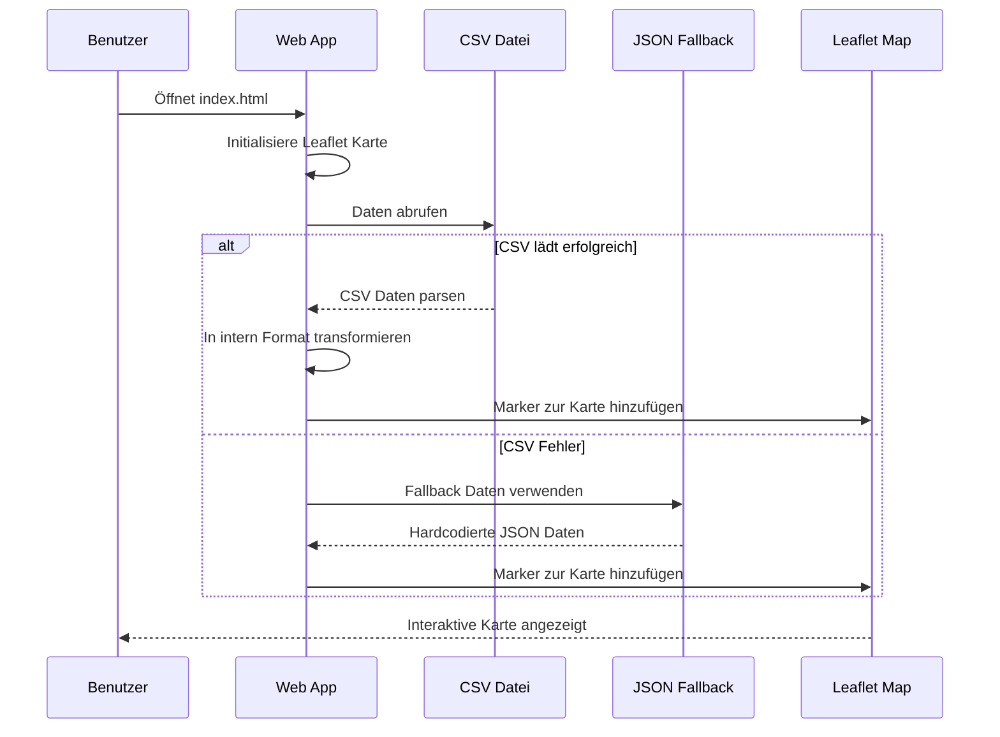
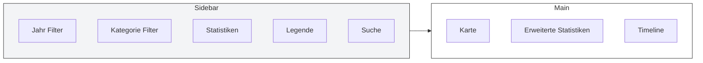
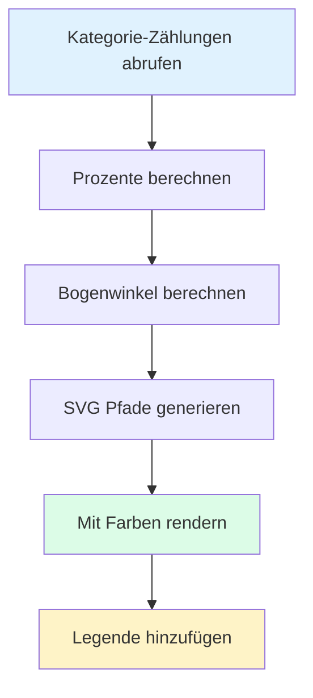
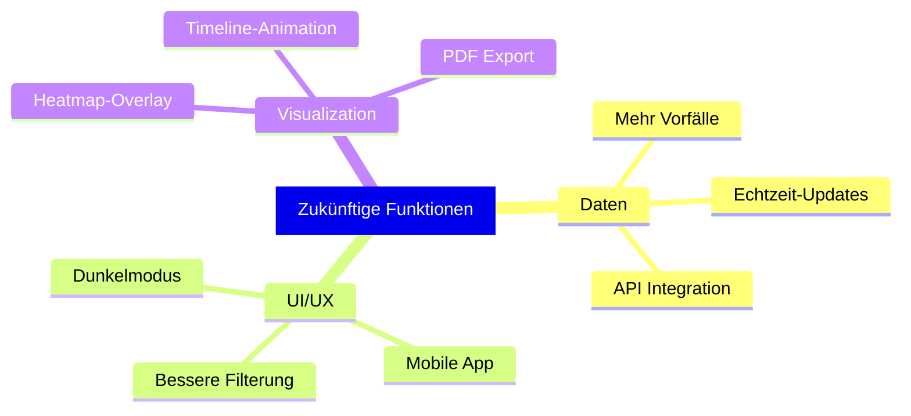

## Einleitung

In den letzten Jahren hat die Frage nach Polizeigewalt in Deutschland значиante öffentliche Aufmerksamkeit erlangt. Während offizielle Statistiken unvollständig und oft schwer zugänglich sind, dokumentiert die Organisation CILIP seit 1976 Vorfälle mit Polizei-Schusswaffen. Dieses Projekt zielt darauf ab, diese Daten der Öffentlichkeit durch eine interaktive webbasierte Karte zugänglich zu machen.

In diesem Blogbeitrag führe ich dich durch die technische Implementierung dieses Visualisierungstools, von der Datenverarbeitung bis zum interaktiven Frontend.

---

## Projektübersicht

Das Polizeischüsse Deutschland Projekt ist eine interaktive Webanwendung, die über 529 dokumentierte Vorfälle von Polizei-Schusswaffeneinsätzen in Deutschland von 1976 bis 2025 visualisiert. Die Anwendung bietet:

- Interaktive Kartenvisualisierung mit Leaflet.js
- Filterbare Daten nach Jahr und Kategorie
- Echtzeit-Statistiken mit SVG-Diagrammen
- Chronologische Timeline der Vorfälle
- Suchfunktion


---

## Architektur

Die Anwendung folgt einer client-seitigen Architektur ohne benötigten Backend. Alle Datenverarbeitung findet im Browser statt.



### Technologie-Stack

| Technologie | Zweck |
|------------|-------|
| HTML5 | Semantisches Markup |
| Tailwind CSS | Utility-First Styling |
| Vanilla JavaScript | Client-seitige Logik |
| Leaflet.js | Interaktive Karten |
| OpenStreetMap | Basis-Kartenkacheln |
| SVG | Diagramm-Rendering |

---

## Daten-Pipeline

Die Anwendung implementiert einen robusten Fallback-Mechanismus, um sicherzustellen, dass die Karte immer funktioniert, selbst wenn externe Datenquellen nicht verfügbar sind.



### Datenstruktur

Die primäre Datenquelle ist eine CSV-Datei mit 21 Spalten, einschließlich Fall, Name, Geschlecht, Alter, Datum, Ort, Bundesland und mehr.

Beispiel-Vorfall:
```javascript
{
    id: 'cilip-2024-7',
    date: '2024-06-30',
    city: 'Lauf an der Pegniz',
    state: 'Bayern',
    coordinates: [49.5333, 11.2833],
    category: 'fatal',
    description: 'Mann mit Messer von Polizei erschossen',
    weapon: 'Stichwaffe',
    casualties: 1,
    injured: 0
}
```

---

## Frontend-Implementierung

### Layout-Struktur

Die Seite verwendet ein responsives Grid-Layout mit einer Seitenleiste für Filter und einem Hauptbereich für die Karte, Statistiken und Timeline.



### SVG-Diagramm-Implementierung

Alle Diagramme werden mit SVG gerendert für klare, skalierbare Grafiken.



Beispiel SVG-Generierungscode:

```javascript
function drawCategoryPie(data) {
    const categories = ['fatal', 'injured', 'warning'];
    const colors = ['#ef4444', '#f97316', '#eab308'];
    
    const paths = categories.map((cat, i) => {
        const angle = (percentage / 100) * 360;
        const d = calculateArcPath(cx, cy, radius, startAngle, endAngle);
        return `<path d="${d}" fill="${colors[i]}"/>`;
    });
    
    return `<svg>${paths.join('')}</svg>`;
}
```

---

## Hauptfunktionen

### 1. Interaktive Karte

- Clustering für dichte Bereiche
- Farbcodierte Marker nach Kategorie
- Popup-Details mit Vorfall-Informationen
- Zoom- und Pan-Steuerung


### 2. Dynamische Filterung

```javascript
function getFilteredData() {
    const yearFilter = document.getElementById('yearFilter').value;
    const showFatal = document.getElementById('fatalShots').checked;
    const showInjured = document.getElementById('injuringShots').checked;
    const showWarning = document.getElementById('warningShots').checked;
    const searchQuery = document.getElementById('searchInput').value.toLowerCase();
    
    return allData.filter(incident => {
        const matchesYear = yearFilter === 'all' || incident.date.startsWith(yearFilter);
        const matchesCategory = 
            (showFatal && incident.category === 'fatal') ||
            (showInjured && incident.category === 'injured') ||
            (showWarning && incident.category === 'warning');
        const matchesSearch = incident.city.toLowerCase().includes(searchQuery) ||
                             incident.description.toLowerCase().includes(searchQuery);
        
        return matchesYear && matchesCategory && matchesSearch;
    });
}
```

### 3. SVG Statistik-Dashboard

Vier Tortendiagramme bieten Echtzeit-Statistiken:

- Kategorien: tödlich, verletzt, Warnschüsse
- Waffentypen: Schusswaffen, Messer, etc.
- Orte: Innenbereich, Außenbereich, unbekannt
- Bewaffnungsstatus: Bewaffnete vs. unbewaffnete Opfer


### 4. Chronologische Timeline

Eine scrollbare Liste von Vorfällen sortiert nach Datum, mit klickbaren Elementen, die den entsprechenden Kartenmarker fokussieren.

---

## Datenqualität und Einschränkungen

### Bekannte Probleme

1. Unvollständige Daten: Der Datensatz repräsentiert wahrscheinlich nicht alle tatsächlichen Vorfälle
2. Quellen-Bias: Daten kommen hauptsächlich aus Medienberichten
3. Geocodierung: Einige Orte haben möglicherweise falsche Koordinaten
4. Kategorisierung: Klassifikation kann variieren

### Datenquellen

| Quelle | Beschreibung |
|--------|-------------|
| CILIP | Primärdatenbank unter cilip.de |
| OpenStreetMap | Kartenkacheln |
| Leaflet.js | Karten-Bibliothek |

---

## Zukünftige Verbesserungen



### Geplante Erweiterungen

1. Dunkelmodus: Umschalter für dunkle Umgebung
2. Mobile Optimierung: PWA oder native App
3. Heatmap: Dichte-Visualisierung
4. Daten-Export: PDF-Berichterstellung
5. Timeline-Animation: Animation durch die Geschichte

---

## Fazit

Dieses Projekt demonstriert, wie offene Daten und moderne Webtechnologien kombiniert werden können, um zugängliche Visualisierungen komplexer sozialer Themen zu erstellen. Die gesamte Anwendung läuft im Browser ohne serverseitige Abhängigkeiten, was sie einfach zu deployen und warten macht.

Der Code ist Open Source auf GitHub verfügbar. Beiträge sind willkommen!

---

## Links

- Live Demo: [police-shootings-germany.vercel.app](https://police-shootings-germany.vercel.app/)
- Repository: [Police-Shootings-Germany](https://github.com/ModernAmusements/Police-Shootings-Germany)
- Dataset: [German Police Shootings 1976-2026](https://www.kaggle.com/datasets/nathanamusement/german-police-shootings-1976-2026)
- Write-up: [Documentation of Police Firearms Deployments in Germany](https://www.kaggle.com/writeups/nathanamusement/documentation-of-police-firearms-deployments-in-ge)

---

*Copyright 2026 - Polizeischüsse Deutschland*