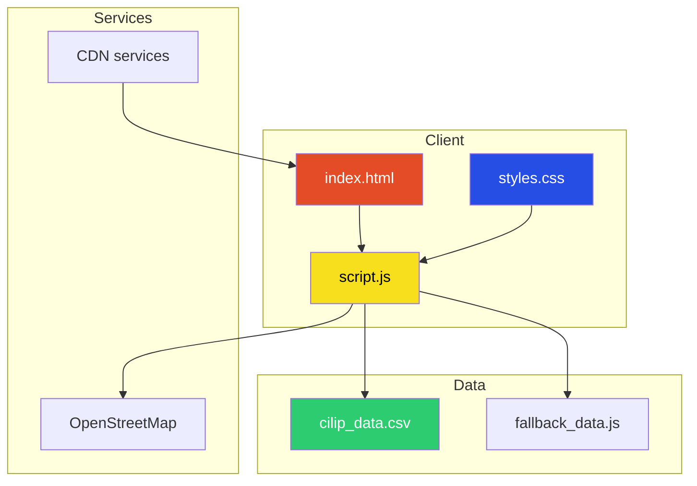
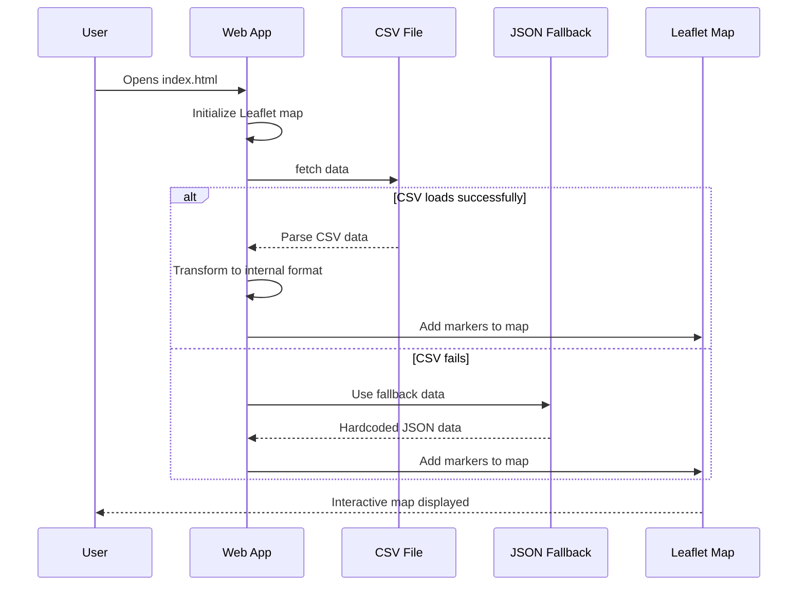
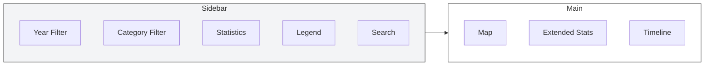
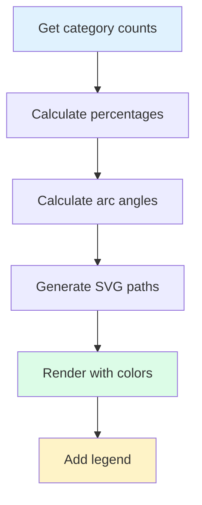
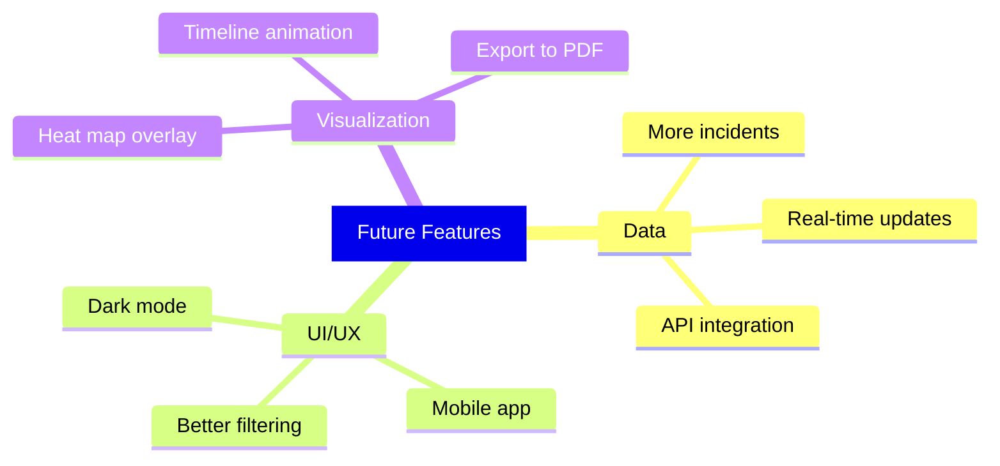

## Introduction

In recent years, the issue of police violence in Germany has gained significant public attention. While official statistics are incomplete and often difficult to access, the organization CILIP has been documenting incidents of police firearm usage since 1976. This project aims to make this data accessible to the public through an interactive web-based map.

In this blog post, I'll walk you through the technical implementation of this visualization tool, from data processing to the interactive frontend.

---

## Project Overview

The Police Shootings Germany project is an interactive web application that visualizes over 529 documented incidents of police firearm deployments in Germany from 1976 to 2025. The application provides:

- Interactive map visualization using Leaflet.js
- Filterable data by year and category
- Real-time statistics with SVG charts
- Chronological timeline of incidents
- Search functionality


---

## Architecture

The application follows a client-side architecture with no backend required. All data processing happens in the browser.



### Technology Stack

| Technology | Purpose |
|------------|---------|
| HTML5 | Semantic markup |
| Tailwind CSS | Utility-first styling |
| Vanilla JavaScript | Client-side logic |
| Leaflet.js | Interactive maps |
| OpenStreetMap | Base map tiles |
| SVG | Chart rendering |

---

## Data Pipeline

The application implements a robust fallback mechanism to ensure the map always works, even when external data sources are unavailable.



### Data Structure

The primary data source is a CSV file with 21 columns including Fall, Name, Gender, Age, Date, Location, State, and more.

Example incident:
```javascript
{
    id: 'cilip-2024-7',
    date: '2024-06-30',
    city: 'Lauf an der Pegniz',
    state: 'Bayern',
    coordinates: [49.5333, 11.2833],
    category: 'fatal',
    description: 'Mann mit Messer von Polizei erschossen',
    weapon: 'Stichwaffe',
    casualties: 1,
    injured: 0
}
```

---

## Frontend Implementation

### Layout Structure

The page uses a responsive grid layout with a sidebar for filters and a main area for the map, statistics, and timeline.



### SVG Chart Implementation

All charts are rendered using SVG for crisp, scalable graphics.



Example SVG generation code:

```javascript
function drawCategoryPie(data) {
    const categories = ['fatal', 'injured', 'warning'];
    const colors = ['#ef4444', '#f97316', '#eab308'];
    
    const paths = categories.map((cat, i) => {
        const angle = (percentage / 100) * 360;
        const d = calculateArcPath(cx, cy, radius, startAngle, endAngle);
        return `<path d="${d}" fill="${colors[i]}"/>`;
    });
    
    return `<svg>${paths.join('')}</svg>`;
}
```

---

## Key Features

### 1. Interactive Map

- Clustering for dense areas
- Color-coded markers by category
- Popup details with incident information
- Zoom and pan controls


### 2. Dynamic Filtering

```javascript
function getFilteredData() {
    const yearFilter = document.getElementById('yearFilter').value;
    const showFatal = document.getElementById('fatalShots').checked;
    const showInjured = document.getElementById('injuringShots').checked;
    const showWarning = document.getElementById('warningShots').checked;
    const searchQuery = document.getElementById('searchInput').value.toLowerCase();
    
    return allData.filter(incident => {
        const matchesYear = yearFilter === 'all' || incident.date.startsWith(yearFilter);
        const matchesCategory = 
            (showFatal && incident.category === 'fatal') ||
            (showInjured && incident.category === 'injured') ||
            (showWarning && incident.category === 'warning');
        const matchesSearch = incident.city.toLowerCase().includes(searchQuery) ||
                             incident.description.toLowerCase().includes(searchQuery);
        
        return matchesYear && matchesCategory && matchesSearch;
    });
}
```

### 3. SVG Statistics Dashboard

Four pie charts provide real-time statistics:

- Categories: Fatal, Injured, Warning shots
- Weapon Types: Firearms, knives, etc.
- Locations: Indoor, outdoor, unknown
- Armed Status: Armed vs. unarmed victims


### 4. Chronological Timeline

A scrollable list of incidents sorted by date, with clickable items that focus the corresponding map marker.

---

## Data Quality and Limitations

### Known Issues

1. Incomplete Data: The dataset likely underrepresents actual incidents
2. Source Bias: Data comes primarily from media reports
3. Geocoding: Some locations may have incorrect coordinates
4. Categorization: Classification may vary

### Data Sources

| Source | Description |
|--------|-------------|
| CILIP | Primary database at cilip.de |
| OpenStreetMap | Map tiles |
| Leaflet.js | Map library |

---

## Future Improvements



### Planned Enhancements

1. Dark Mode: Toggle for low-light viewing
2. Mobile Optimization: PWA or native app
3. Heat Map: Density visualization
4. Data Export: PDF report generation
5. Timeline Animation: Animate through history

---

## Conclusion

This project demonstrates how open data and modern web technologies can be combined to create accessible visualizations of complex social issues. The entire application runs in the browser with no server-side dependencies, making it easy to deploy and maintain.

The code is open source and available on GitHub. Contributions are welcome.

---

## Links

- Live Demo: [police-shootings-germany.vercel.app](https://police-shootings-germany.vercel.app/)
- Repository: [Police-Shootings-Germany](https://github.com/ModernAmusements/Police-Shootings-Germany)
- Dataset: [German Police Shootings 1976-2026](https://www.kaggle.com/datasets/nathanamusement/german-police-shootings-1976-2026)
- Write-up: [Documentation of Police Firearms Deployments in Germany](https://www.kaggle.com/writeups/nathanamusement/documentation-of-police-firearms-deployments-in-ge)

---

*Copyright 2026 - Police Shootings Germany*