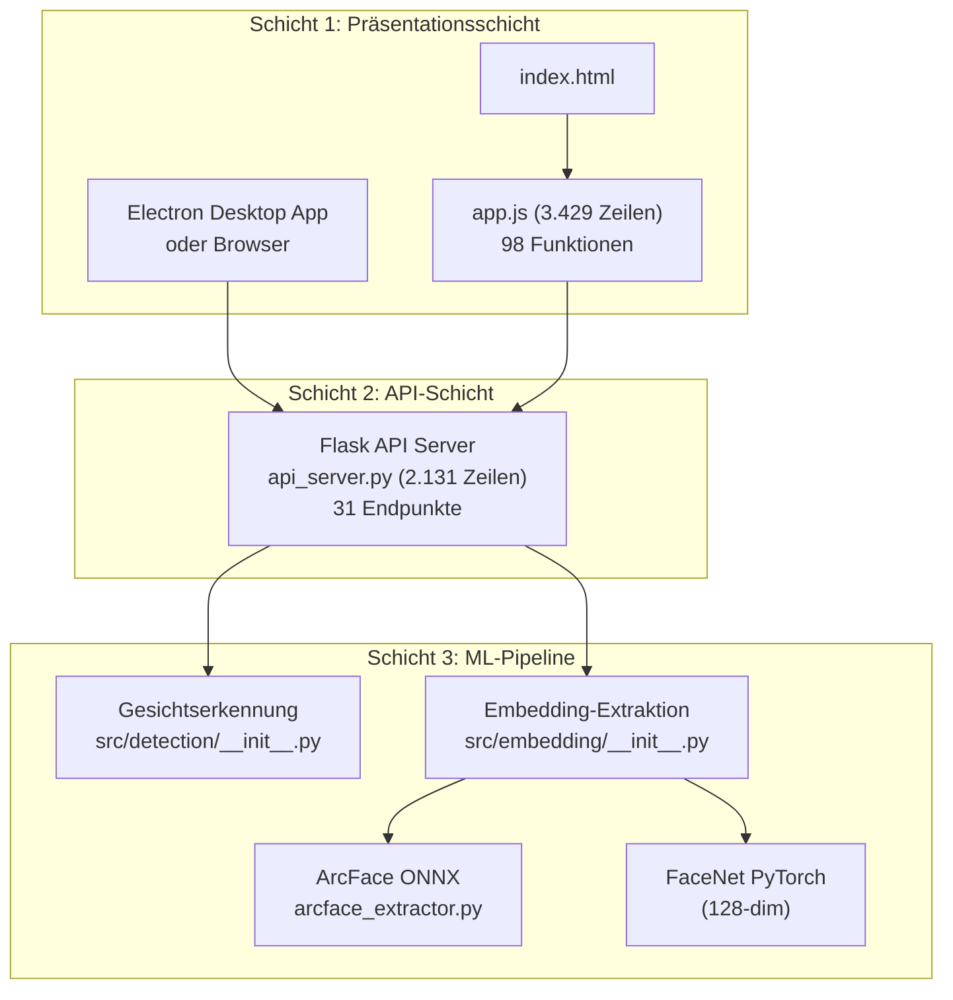
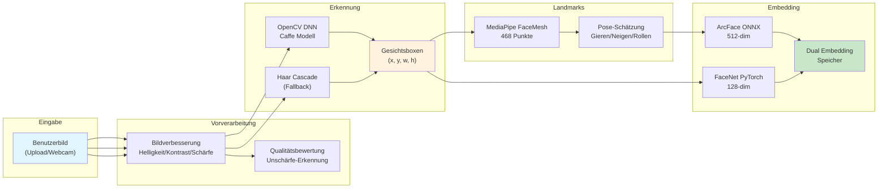
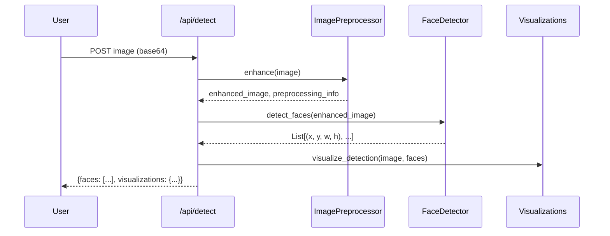
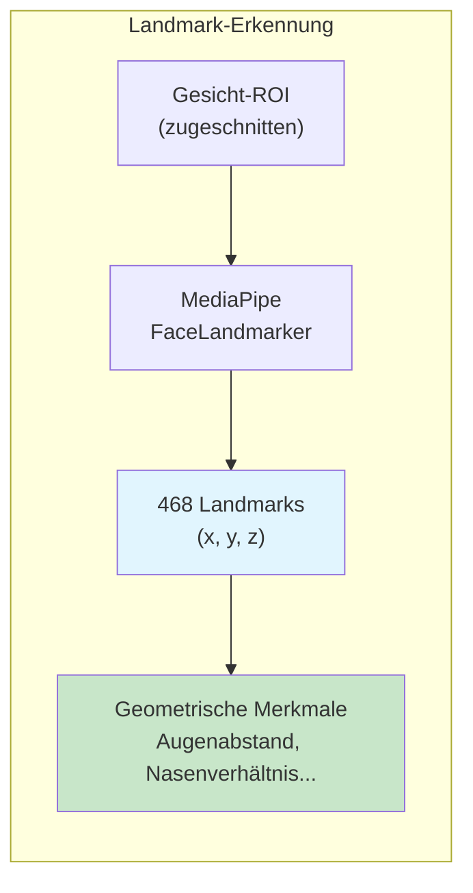
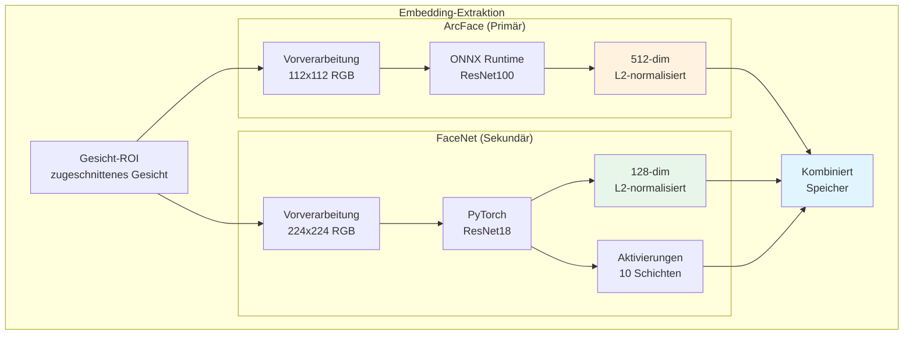
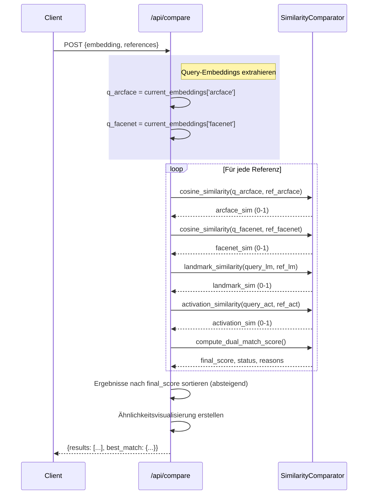
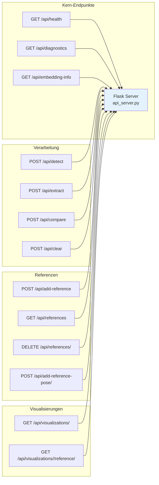
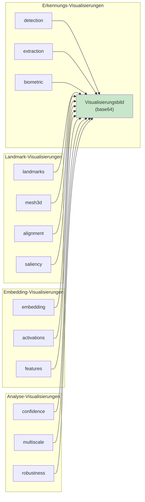
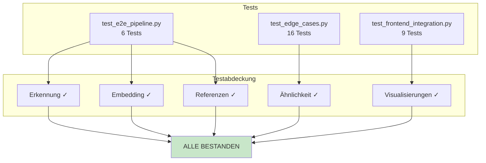

## Einleitung

Dies ist ein technischer Tiefeneinblick in MANTAX, ein ethisches Gesichtserkennungssystem für NGO-Anwendungsfälle. In diesem Blogpost erkunden wir die vollständige Architektur, Datenflüsse und Implementierungsdetails—alles, was ein Entwickler wissen muss, um zu verstehen, wie dieses System funktioniert.

---

## Systemarchitektur-Überblick

MANTAX folgt einer Drei-Schichten-Architektur mit klarer Trennung zwischen Präsentation, Geschäftslogik und maschinellem Lernen.



### Technologie-Stack

| Schicht | Technologie | Zweck |
|---------|-------------|-------|
| Frontend | Electron + Vanilla JS | Desktop-App mit Custom Titlebar |
| Styling | SCSS → CSS | macOS Tahoe Liquid Glass Design |
| Backend | Flask (Python) | REST API mit 31 Endpunkten |
| ML-Laufzeit | ONNX Runtime (ArcFace) + PyTorch (FaceNet) | Dual-Modell-Embedding-Extraktion |
| Gesichtserkennung | OpenCV DNN + MediaPipe | Gesichtslokalisierung + 468-Punkt-Landmarks |


---

## Die Daten-Pipeline

Wenn ein Benutzer ein Bild hochlädt, durchläuft es eine gut definierte Pipeline. Verfolgen wir diese Reise:



---

## Gesichtserkennungsmodul

Das Erkennungsmodul (`src/detection/__init__.py`) behandelt den ersten kritischen Schritt: Finden, wo sich Gesichter in einem Bild befinden.

### Erkennungsablauf



### Primäre Erkennungsmethode: OpenCV DNN

Das System verwendet ein vortrainiertes Caffe-Modell für Deep-Learning-basierte Gesichtserkennung:

```python
# Aus src/detection/__init__.py:78-97
def _detect_faces_dnn(self, image: np.ndarray) -> List[Tuple[int, int, int, int]]:
    h, w = image.shape[:2]
    blob = cv2.dnn.blobFromImage(
        cv2.resize(image, (300, 300)), 1.0,
        (300, 300), (104.0, 177.0, 123.0)
    )
    self.net.setInput(blob)
    detections = self.net.forward()

    faces = []
    for i in range(detections.shape[2]):
        confidence = detections[0, 0, i, 2]
        if confidence > self.confidence_threshold:
            box = detections[0, 0, i, 3:7] * np.array([w, h, w, h])
            (startX, startY, endX, endY) = box.astype("int")
            face_box = (startX, startY, endX - startX, endY - startY)
            faces.append(face_box)
    return faces
```

**Erforderliche Modell-Dateien:**
- `deploy.prototxt.txt` - Caffe-Architekturdefinition
- `res10_300x300_ssd_iter_140000.caffemodel` - Vortrainierte Gewichte

### Fallback: Haar Cascade

Wenn DNN nicht geladen werden kann, fällt das System elegant auf Haar Cascade zurück:

```python
# Aus src/detection/__init__.py:99-102
def _detect_faces_haar(self, image: np.ndarray):
    gray = cv2.cvtColor(image, cv2.COLOR_BGR2GRAY)
    faces = self.face_cascade.detectMultiScale(
        gray, scaleFactor=1.1, minNeighbors=5, minSize=(30, 30)
    )
    return [(x, y, w, h) for (x, y, w, h) in faces]
```

### Gesicht-ROI-Extraktion

Sobald Gesichter erkannt wurden, extrahiert die API den Bereich von Interesse (ROI):

```python
# Aus api_server.py:403-409
for i, (x, y, w, h) in enumerate(current_faces):
    face_img = current_image[y:y+h, x:x+w]
    faces_data.append({
        'id': i,
        'bbox': [x, y, w, h],
        'thumbnail': image_to_base64(face_img)
    })
```


---

## Gesichtspunkt-Erkennung

Nach der Erkennung von Gesichtern extrahiert das System 468 Gesichtspunkte mit MediaPipe Face Mesh:



### Landmark-Extraktionscode

```python
# Aus src/detection/__init__.py:361-450
def estimate_landmarks(self, face_image, face_box):
    landmarks = {}
    
    if self._mediapipe_available and hasattr(self, 'face_landmarker'):
        # MediaPipe für 498 echte Landmarks verwenden
        rgb_image = cv2.cvtColor(face_image, cv2.COLOR_BGR2RGB)
        mp_image = Image(image_format=ImageFormat.SRGB, data=rgb_image)
        results = self.face_landmarker.detect(mp_image)
        
        if results.face_landmarks:
            face_landmarks = results.face_landmarks[0]
            # Wichtige Landmarks extrahieren
            landmarks = {
                'left_eye': (int(lm.x * w), int(lm.y * h)),
                'right_eye': (int(lm.x * w), int(lm.y * h)),
                'nose': (int(lm.x * w), int(lm.y * h)),
                'mouth': (int(lm.x * w), int(lm.y * h)),
                # ... 468 Punkte insgesamt
            }
    else:
        # Fallback: proportionale Schätzung
        landmarks = self._estimate_landmarks_proportional(face_image, face_box)
    
    return landmarks
```

### Geometrische Merkmalsextraktion

Zu Vergleichszwecken extrahieren wir skaleninvariante geometrische Merkmale:

```python
# Aus api_server.py:235-314
def extract_landmark_features(landmarks):
    # Augenbezogene Verhältnisse (skaleninvariant)
    features['eye_distance'] = eye_distance / face_width
    features['eye_nose_ratio'] = eye_nose / face_width
    features['nose_mouth_ratio'] = nose_mouth / face_width
    features['width_height_ratio'] = face_width / face_height
    features['face_symmetry'] = abs(nose_x - eye_center_x) / face_width
    # ... weitere Merkmale
    return features
```


---

## Embedding-Extraktion (Dual-Modell)

Dies ist der Kern des Systems—Umwandlung von Gesichtsbildern in mathematische Embeddings, die verglichen werden können.



### ArcFace-Implementierung

ArcFace bietet überlegene Diskriminierung zwischen verschiedenen Gesichtern:

```python
# Aus src/embedding/arcface_extractor.py
class ArcFaceEmbeddingExtractor:
    def __init__(self):
        # ONNX-Modell laden
        self.session = onnxruntime.InferenceSession('arcface_r100_v1.onnx')
        self.input_name = self.session.get_inputs()[0].name
        self.output_name = self.session.get_outputs()[0].name
        
    def extract_embedding(self, face_image):
        # Vorverarbeitung: 112x112 RGB, normalisieren
        face = cv2.resize(face_image, (112, 112))
        face = self._preprocess(face)  # Normalisierung
        
        # Inferenz ausführen
        embedding = self.session.run(
            [self.output_name], 
            {self.input_name: face}
        )[0]
        
        # L2 normalisieren
        embedding = embedding / np.linalg.norm(embedding)
        return embedding.flatten()  # 512-dim
```

### FaceNet-Implementierung

FaceNet bietet sekundäre Signale und Visualisierungen neuronaler Aktivierungen:

```python
# Aus src/embedding/__init__.py:52-78
class FaceNetEmbeddingExtractor:
    def __init__(self, embedding_size=128):
        self.model = ImprovedEmbeddingExtractor(embedding_size).to(self.device)
        self.mean = np.array([0.485, 0.456, 0.406])
        self.std = np.array([0.229, 0.224, 0.225])
        
    def extract_embedding(self, face_image):
        # Vorverarbeitung: 224x224, ImageNet-Normalisierung
        face = cv2.resize(face_image, (224, 224))
        face = cv2.cvtColor(face, cv2.COLOR_BGR2RGB)
        face = (face / 255.0 - self.mean) / self.std
        
        # Forward-Pass
        with torch.no_grad():
            embedding = self.model(torch.from_numpy(face).permute(2,0,1).unsqueeze(0))
        return embedding.cpu().numpy().flatten()  # 128-dim
```

### Neuronale Netzwerk-Aktivierungen

FaceNet extrahiert auch Zwischenschichten-Aktivierungen zur Visualisierung:

```python
# Aus src/embedding/__init__.py:83-130
def get_activations(self, face_image):
    activations = {}
    layer_names = ['conv1', 'bn1', 'relu', 'maxpool', 
                   'layer1', 'layer2', 'layer3', 'layer4', 'gap', 'fc']
    
    with torch.no_grad():
        x = self.preprocess(face_image)
        for i, child in enumerate(self.model.backbone.children()):
            x = child(x)
            if i < len(layer_names):
                activations[layer_names[i]] = x.detach().cpu().numpy()[0]
    
    activations['embedding'] = self.extract_embedding(face_image)
    return activations
```

**Extrahierte Aktivierungen:**
| Schicht | Ausgabeform | Zweck |
|---------|-------------|-------|
| conv1 | (64, 112, 112) | Erste Konvolutionen |
| bn1 | (64, 112, 112) | Erste Batch-Norm |
| layer1 | (64, 56, 56) | Niedrigstufige Merkmale |
| layer2 | (128, 28, 28) | Mittelstufige Merkmale |
| layer3 | (256, 14, 14) | Hochstufige Merkmale |
| layer4 | (512, 7, 7) | Endgültige Merkmale |
| embedding | (128,) | Endgültiges Embedding |


---

## Der Compare-Endpunkt (Vollständiger Ablauf)

Hier ist der vollständige Vergleichsablauf vom `/api/compare`-Endpunkt:



### Dual-Modell-Bewertung

Die Bewertung kombiniert mehrere Signale mit gelernten Gewichten:

```python
# Aus src/embedding/__init__.py (SimilarityComparator)
def compute_dual_match_score(self, arcface_sim, facenet_sim, 
                             landmark_sim, quality, activation_sim,
                             iris_sim=None, expression_sim=None):
    # Gewichtete Kombination
    score = (
        0.60 * arcface_sim +      # Primär: ArcFace
        0.20 * facnet_sim +      # Sekundär: FaceNet
        0.10 * landmark_sim +     # Geometrie
        0.05 * activation_sim +   # Neuronale Muster
        0.05 * quality_factor     # Bildqualität
    )
    
    # Optional: Iris- + Ausdrucksähnlichkeit
    if iris_sim is not None:
        score += 0.03 * iris_sim
    if expression_sim is not None:
        score += 0.02 * expression_sim
    
    return {
        'score': score,
        'reasons': [f"ArcFace: {arcface_sim:.0%}", ...]
    }
```

### Konfidenzbänder

Anstelle von Binärentscheidungen gibt das System Konfidenzbänder aus:

```python
# Aus SimilarityComparator
def get_match_verdict(self, score):
    if score >= 0.70:
        return ('match', 'Sehr Hoch', 'Wahrscheinlich dieselbe Person')
    elif score >= 0.45:
        return ('possible', 'Hoch', 'Möglicherweise dieselbe Person')
    elif score >= 0.30:
        return ('uncertain', 'Mittel', 'Menschliche Überprüfung erforderlich')
    else:
        return ('no_match', 'Unzureichend', 'Wahrscheinlich verschiedene Personen')
```

---

## API-Endpunkte-Referenz

Die Flask-API expose 31 Endpunkte für alle Operationen:



| Endpunkt | Methode | Zweck |
|----------|---------|-------|
| `/api/health` | GET | System-Gesundheitscheck |
| `/api/embedding-info` | GET | Aktuelle Modellinfo |
| `/api/diagnostics` | GET | System-Diagnose |
| `/api/detect` | POST | Gesichtserkennung |
| `/api/extract` | POST | Embedding-Extraktion |
| `/api/add-reference` | POST | Referenzbild hinzufügen |
| `/api/references` | GET | Alle Referenzen auflisten |
| `/api/references/<id>` | DELETE | Referenz entfernen |
| `/api/compare` | POST | Embeddings vergleichen |
| `/api/visualizations/<type>` | GET | Visualisierung abrufen |
| `/api/clear` | POST | Sitzung löschen |

---

## Visualisierungen (14 Typen)

Das System bietet 14 verschiedene KI-Visualisierungen, um Ermittlern zu helfen zu verstehen, *warum* Scores berechnet wurden:



### Visualisierungsimplementierung-Beispiel

```python
# Aus src/embedding/__init__.py:132-186
def visualize_embedding(self, embedding):
    """Embedding als Balkendiagramm rendern."""
    output = np.zeros((200, 400, 3), dtype=np.uint8)
    output.fill(245)
    
    # Titel zeichnen
    cv2.putText(output, "128-Dim Face Embedding", (20, 25), ...)
    
    # Balken zeichnen
    for i in range(0, len(embedding), step):
        value = embedding[i]
        normalized = (value - embedding.min()) / (embedding.max() - embedding.min())
        bar_len = int(normalized * 280)
        
        color = (255 - int(normalized * 255), int(normalized * 255), 100)
        cv2.rectangle(output, (start_x, y), (start_x + bar_len, y + 12), color, -1)
    
    return output
```


---

## Sitzungszustandsverwaltung

Die API verwaltet den In-Memory-Sitzungszustand:

```python
# Aus api_server.py:71-88
current_image = None              # Hochgeladenes Bild (numpy array)
current_original_image = None     # Original (vor Verbesserung)
current_faces = []                 # Liste der Gesichtsboxen
current_embedding = None           # Primäres Embedding
current_embeddings = {}            # {'arcface': ..., 'facenet': ...}
current_face_image = None          # Zugeschnittenes Gesicht-ROI
current_pose = {}                  # {yaw, pitch, roll, pose_category}
current_landmarks = None           # Geometrische Merkmale
current_quality = {}               # Qualitätsmetriken
current_activations = {}           # Neuronale Aktivierungen
current_lbp = None                 # LBP-Histogramm
current_asymmetry = None            # Asymmetrie-Merkmale
current_normalized_embedding = None # 3D-ausgerichtetes Embedding
references = []                    # Referenzbibliothek
```

### Persistenz

Referenzen werden zur Persistenz über Neustarts hinweg in JSON gespeichert:

```python
# Aus api_server.py:112-120
def save_references():
    """Referenzen in JSON-Datei speichern."""
    with open(REFERENCES_FILE, 'w') as f:
        json.dump({'references': references}, f, indent=2)

def load_references():
    """Referenzen beim Start aus JSON-Datei laden."""
    if os.path.exists(REFERENCES_FILE):
        with open(REFERENCES_FILE, 'r') as f:
            data = json.load(f)
            references = data.get('references', [])
```

---

## Testinfrastruktur

Das System umfasst umfassende Tests:



### Tests ausführen

```bash
# E2E-Pipeline-Tests
python test_e2e_pipeline.py

# Grenzfall-Tests  
python test_edge_cases.py

# Frontend-Integrations-Tests
python test_frontend_integration.py
```

---

## Dateistruktur

```
MANTAX/
├── api_server.py              # Flask API (2.131 Zeilen)
├── start.sh                   # Startskript
│
├── src/
│   ├── detection/
│   │   └── __init__.py        # FaceDetector (1.247 Zeilen)
│   │   └── preprocessing.py  # Bildverbesserung
│   └── embedding/
│       ├── __init__.py        # FaceNetExtractor + SimilarityComparator (1.070 Zeilen)
│       └── arcface_extractor.py  # ArcFace ONNX-Wrapper
│
├── electron-ui/
│   ├── index.html             # UI-Struktur
│   ├── renderer/
│   │   └── app.js             # Frontend-Logik (3.429 Zeilen, 98 Funktionen)
│   └── styles/
│       ├── design-system.scss # Quellstile
│       └── design-system.css  # Kompilierte Stile
│
├── test_e2e_pipeline.py       # E2E-Tests
├── test_edge_cases.py         # Grenzfall-Tests
└── reference_images/
    └── embeddings.json        # Persistenter Speicher
```

---

## Wichtige Designentscheidungen

### 1. Dual-Modell-Architektur
Die Verwendung sowohl von ArcFace (512-dim) als auch FaceNet (128-dim) zusammen bietet bessere Diskriminierung als jedes allein. ArcFace bewältigt den primären Abgleich, während FaceNet sekundäre Signale und Aktivierungsvisualisierungen bietet.

### 2. Konfidenzbänder, keine Binärentscheidungen
Das System gibt Konfidenzbänder (Sehr Hoch/Hoch/Mittel/Unzureichend) statt "Match/Kein Match" aus. Dies stellt sicher, dass menschliche Ermittler immer die endgültige Entscheidung treffen.

### 3. Lokale Verarbeitung
Keine Bilder werden an externe Server gesendet. Alle Berechnungen finden auf dem Computer des Benutzers statt, was die Datenschutzbedenken der NGOs adressiert.

### 4. Nicht umkehrbare Embeddings
Gesichtserkennungs-Embeddings können nicht verwendet werden, um das ursprüngliche Gesicht zu rekonstruieren—was eine zusätzliche Schutzebene bietet.

### 5. Einwilligungsverfolgung
Jedes Referenzbild enthält Metadaten über Einwilligungsstatus, Quelle und Zweck—wesentlich für NGO-Dokumentationsanforderungen.

---

## Zusammenfassung

MANTAX ist ein vollständig funktionsfähiges ethisches Gesichtserkennungssystem, gebaut mit:

- **Flask API** (2.131 Zeilen) mit 31 Endpunkten
- **Dual-Modell-Embedding** (ArcFace 512-dim + FaceNet 128-dim)
- **OpenCV DNN** Gesichtserkennung mit MediaPipe-Landmarks
- **Electron Desktop-App** mit macOS Tahoe Liquid Glass UI
- **Umfassende Tests** (E2E, Grenzfälle, Frontend)

Das System ist für NGO-Anwendungsfälle konzipiert mit:
- Lokaler Verarbeitung (kein Cloud)
- Mensch-in-the-loop Verifizierung
- Einwilligungsverfolgung
- Konfidenzbändern statt Binärentscheidungen

Im nächsten Blogpost erkunden wir die JavaScript-Refactoring-Reise—wie wir eine 3.429-Zeilen monolithische `app.js` übernommen und sie in 7 modulare Dateien nach Best Practices aufgeteilt haben.

---

## Demo-Video

Hier ist eine Demo, die ein No-Match-Szenario zeigt:

<video controls width="100%" src="/images/projects/face_scanner/no-match.mov">
</video>

*Als Nächstes: Die JavaScript-Refactoring-Geschichte*