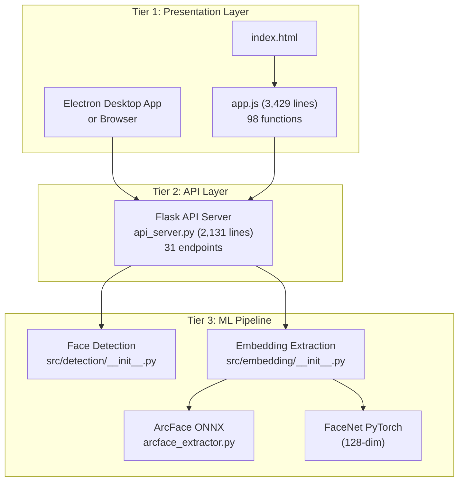
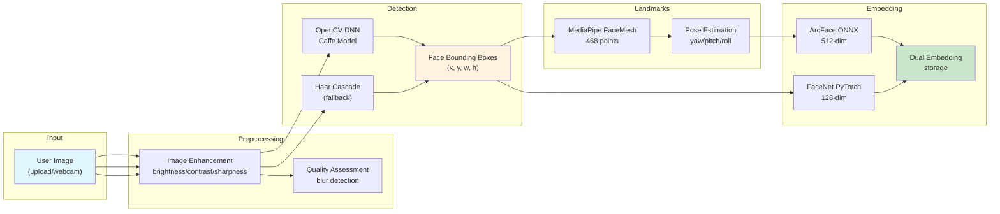
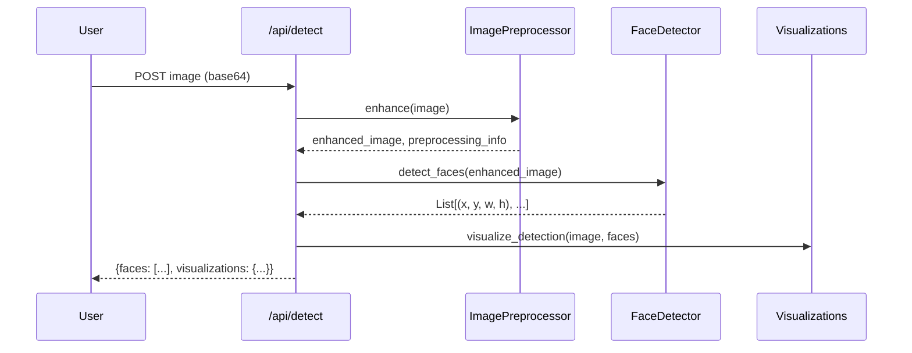
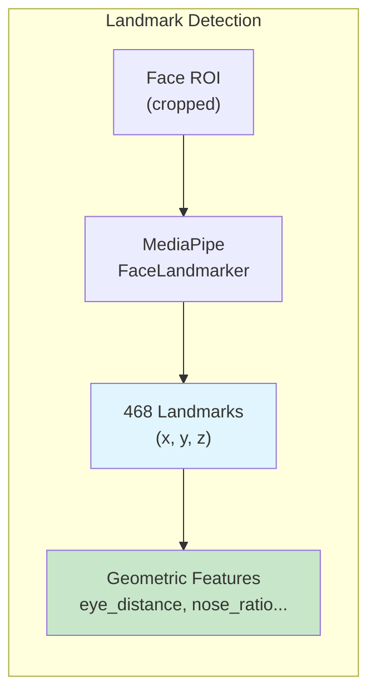
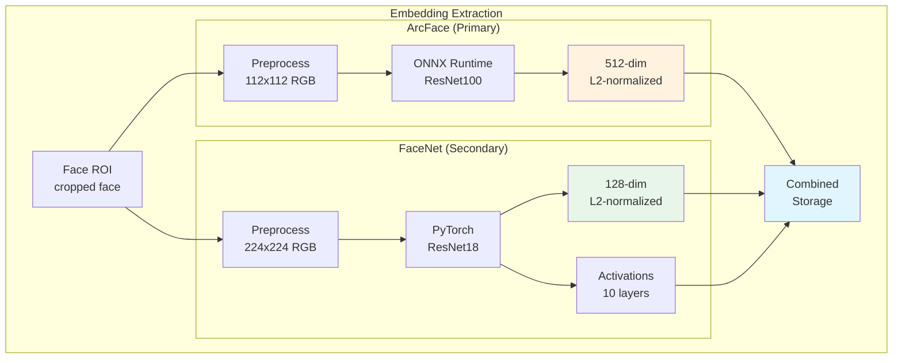
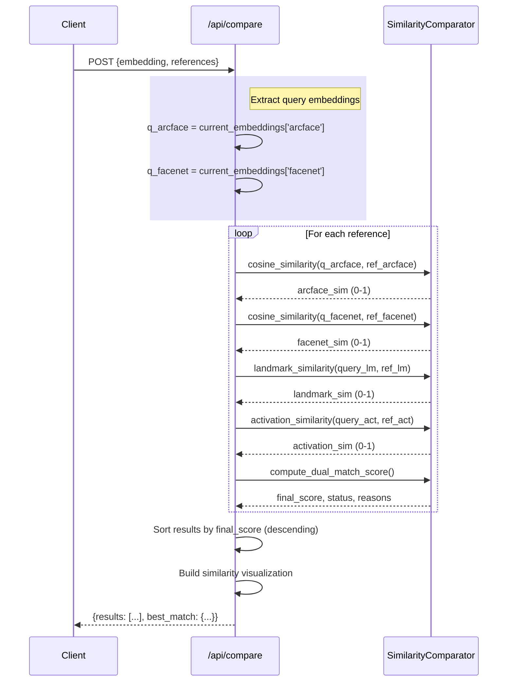
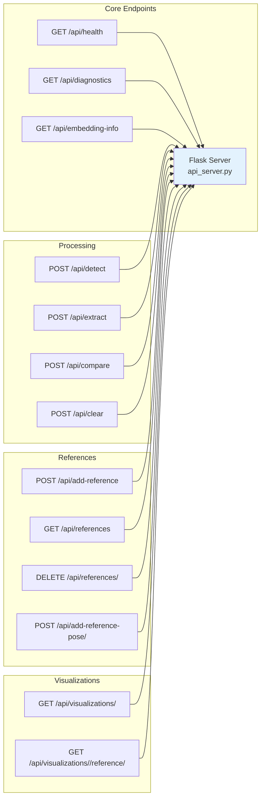
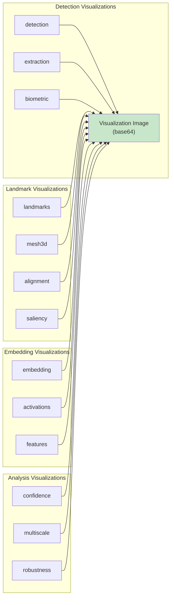
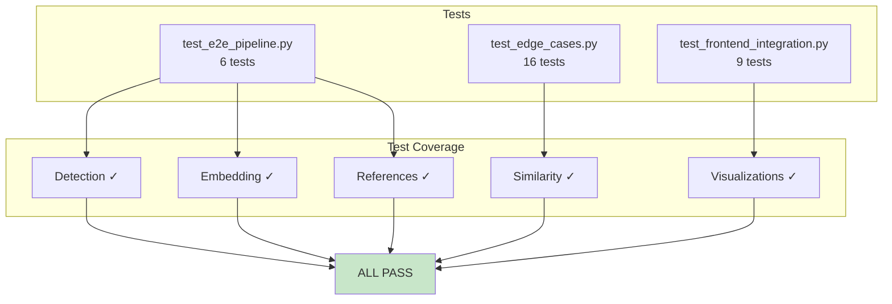

## Introduction

This is a technical deep-dive into MANTAX, an ethical facial recognition system designed for NGO use cases. In this blogpost, we'll explore the complete architecture, data flows, and implementation details—everything a developer needs to understand how this system works.

---

## System Architecture Overview

MANTAX follows a three-tier architecture with clear separation between presentation, business logic, and machine learning components.



### Technology Stack

| Layer | Technology | Purpose |
|-------|------------|---------|
| Frontend | Electron + Vanilla JS | Desktop app with custom titlebar |
| Styling | SCSS → CSS | macOS Tahoe Liquid Glass design |
| Backend | Flask (Python) | REST API with 31 endpoints |
| ML Runtime | ONNX Runtime (ArcFace) + PyTorch (FaceNet) | Dual-model embedding extraction |
| Face Detection | OpenCV DNN + MediaPipe | Face localization + 468-point landmarks |


---

## The Data Pipeline

When a user uploads an image, it flows through a well-defined pipeline. Let's trace this journey:



---

## Face Detection Module

The detection module (`src/detection/__init__.py`) handles the first critical step: finding where faces are in an image.

### Detection Flow



### Primary Detection Method: OpenCV DNN

The system uses a pre-trained Caffe model for deep learning-based face detection:

```python
# From src/detection/__init__.py:78-97
def _detect_faces_dnn(self, image: np.ndarray) -> List[Tuple[int, int, int, int]]:
    h, w = image.shape[:2]
    blob = cv2.dnn.blobFromImage(
        cv2.resize(image, (300, 300)), 1.0,
        (300, 300), (104.0, 177.0, 123.0)
    )
    self.net.setInput(blob)
    detections = self.net.forward()

    faces = []
    for i in range(detections.shape[2]):
        confidence = detections[0, 0, i, 2]
        if confidence > self.confidence_threshold:
            box = detections[0, 0, i, 3:7] * np.array([w, h, w, h])
            (startX, startY, endX, endY) = box.astype("int")
            face_box = (startX, startY, endX - startX, endY - startY)
            faces.append(face_box)
    return faces
```

**Model files required:**
- `deploy.prototxt.txt` - Caffe architecture definition
- `res10_300x300_ssd_iter_140000.caffemodel` - Pre-trained weights

### Fallback: Haar Cascade

If DNN fails to load, the system gracefully falls back to Haar Cascade:

```python
# From src/detection/__init__.py:99-102
def _detect_faces_haar(self, image: np.ndarray):
    gray = cv2.cvtColor(image, cv2.COLOR_BGR2GRAY)
    faces = self.face_cascade.detectMultiScale(
        gray, scaleFactor=1.1, minNeighbors=5, minSize=(30, 30)
    )
    return [(x, y, w, h) for (x, y, w, h) in faces]
```

### Face ROI Extraction

Once faces are detected, the API extracts the region of interest (ROI):

```python
# From api_server.py:403-409
for i, (x, y, w, h) in enumerate(current_faces):
    face_img = current_image[y:y+h, x:x+w]
    faces_data.append({
        'id': i,
        'bbox': [x, y, w, h],
        'thumbnail': image_to_base64(face_img)
    })
```


---

## Facial Landmark Detection

After detecting faces, the system extracts 468 facial landmarks using MediaPipe Face Mesh:



### Landmark Extraction Code

```python
# From src/detection/__init__.py:361-450
def estimate_landmarks(self, face_image, face_box):
    landmarks = {}
    
    if self._mediapipe_available and hasattr(self, 'face_landmarker'):
        # Use MediaPipe for 468 real landmarks
        rgb_image = cv2.cvtColor(face_image, cv2.COLOR_BGR2RGB)
        mp_image = Image(image_format=ImageFormat.SRGB, data=rgb_image)
        results = self.face_landmarker.detect(mp_image)
        
        if results.face_landmarks:
            face_landmarks = results.face_landmarks[0]
            # Extract key landmarks
            landmarks = {
                'left_eye': (int(lm.x * w), int(lm.y * h)),
                'right_eye': (int(lm.x * w), int(lm.y * h)),
                'nose': (int(lm.x * w), int(lm.y * h)),
                'mouth': (int(lm.x * w), int(lm.y * h)),
                # ... 468 points total
            }
    else:
        # Fallback: proportional estimation
        landmarks = self._estimate_landmarks_proportional(face_image, face_box)
    
    return landmarks
```

### Geometric Feature Extraction

For comparison purposes, we extract scale-invariant geometric features:

```python
# From api_server.py:235-314
def extract_landmark_features(landmarks):
    # Eye-related ratios (scale-invariant)
    features['eye_distance'] = eye_distance / face_width
    features['eye_nose_ratio'] = eye_nose / face_width
    features['nose_mouth_ratio'] = nose_mouth / face_width
    features['width_height_ratio'] = face_width / face_height
    features['face_symmetry'] = abs(nose_x - eye_center_x) / face_width
    # ... more features
    return features
```


---

## Embedding Extraction (Dual-Model)

This is the core of the system—converting face images into mathematical embeddings that can be compared.



### ArcFace Implementation

ArcFace provides superior discrimination between different faces:

```python
# From src/embedding/arcface_extractor.py
class ArcFaceEmbeddingExtractor:
    def __init__(self):
        # Load ONNX model
        self.session = onnxruntime.InferenceSession('arcface_r100_v1.onnx')
        self.input_name = self.session.get_inputs()[0].name
        self.output_name = self.session.get_outputs()[0].name
        
    def extract_embedding(self, face_image):
        # Preprocess: 112x112 RGB, normalize
        face = cv2.resize(face_image, (112, 112))
        face = self._preprocess(face)  # Normalization
        
        # Run inference
        embedding = self.session.run(
            [self.output_name], 
            {self.input_name: face}
        )[0]
        
        # L2 normalize
        embedding = embedding / np.linalg.norm(embedding)
        return embedding.flatten()  # 512-dim
```

### FaceNet Implementation

FaceNet provides secondary signals and neural activation visualizations:

```python
# From src/embedding/__init__.py:52-78
class FaceNetEmbeddingExtractor:
    def __init__(self, embedding_size=128):
        self.model = ImprovedEmbeddingExtractor(embedding_size).to(self.device)
        self.mean = np.array([0.485, 0.456, 0.406])
        self.std = np.array([0.229, 0.224, 0.225])
        
    def extract_embedding(self, face_image):
        # Preprocess: 224x224, ImageNet normalization
        face = cv2.resize(face_image, (224, 224))
        face = cv2.cvtColor(face, cv2.COLOR_BGR2RGB)
        face = (face / 255.0 - self.mean) / self.std
        
        # Forward pass
        with torch.no_grad():
            embedding = self.model(torch.from_numpy(face).permute(2,0,1).unsqueeze(0))
        return embedding.cpu().numpy().flatten()  # 128-dim
```

### Neural Network Activations

FaceNet also extracts intermediate layer activations for visualization:

```python
# From src/embedding/__init__.py:83-130
def get_activations(self, face_image):
    activations = {}
    layer_names = ['conv1', 'bn1', 'relu', 'maxpool', 
                   'layer1', 'layer2', 'layer3', 'layer4', 'gap', 'fc']
    
    with torch.no_grad():
        x = self.preprocess(face_image)
        for i, child in enumerate(self.model.backbone.children()):
            x = child(x)
            if i < len(layer_names):
                activations[layer_names[i]] = x.detach().cpu().numpy()[0]
    
    activations['embedding'] = self.extract_embedding(face_image)
    return activations
```

**Activation layers extracted:**
| Layer | Output Shape | Purpose |
|-------|-------------|---------|
| conv1 | (64, 112, 112) | First convolutions |
| bn1 | (64, 112, 112) | First batch norm |
| layer1 | (64, 56, 56) | Low-level features |
| layer2 | (128, 28, 28) | Mid-level features |
| layer3 | (256, 14, 14) | High-level features |
| layer4 | (512, 7, 7) | Final features |
| embedding | (128,) | Final embedding |


---

## The Compare Endpoint (Complete Flow)

Here's the full comparison flow from the `/api/compare` endpoint:



### Dual-Model Scoring

The scoring combines multiple signals with learned weights:

```python
# From src/embedding/__init__.py (SimilarityComparator)
def compute_dual_match_score(self, arcface_sim, facenet_sim, 
                             landmark_sim, quality, activation_sim,
                             iris_sim=None, expression_sim=None):
    # Weighted combination
    score = (
        0.60 * arcface_sim +      # Primary: ArcFace
        0.20 * facenet_sim +      # Secondary: FaceNet
        0.10 * landmark_sim +     # Geometry
        0.05 * activation_sim +   # Neural patterns
        0.05 * quality_factor     # Image quality
    )
    
    # Optional: iris + expression similarity
    if iris_sim is not None:
        score += 0.03 * iris_sim
    if expression_sim is not None:
        score += 0.02 * expression_sim
    
    return {
        'score': score,
        'reasons': [f"ArcFace: {arcface_sim:.0%}", ...]
    }
```

### Confidence Bands

Rather than binary decisions, the system outputs confidence bands:

```python
# From SimilarityComparator
def get_match_verdict(self, score):
    if score >= 0.70:
        return ('match', 'Very High', 'Likely same person')
    elif score >= 0.45:
        return ('possible', 'High', 'Possibly same person')
    elif score >= 0.30:
        return ('uncertain', 'Moderate', 'Human review required')
    else:
        return ('no_match', 'Insufficient', 'Likely different people')
```

---

## API Endpoints Reference

The Flask API exposes 31 endpoints for all operations:



| Endpoint | Method | Purpose |
|----------|--------|---------|
| `/api/health` | GET | System health check |
| `/api/embedding-info` | GET | Current model info |
| `/api/diagnostics` | GET | System diagnostics |
| `/api/detect` | POST | Face detection |
| `/api/extract` | POST | Embedding extraction |
| `/api/add-reference` | POST | Add reference image |
| `/api/references` | GET | List all references |
| `/api/references/<id>` | DELETE | Remove reference |
| `/api/compare` | POST | Compare embeddings |
| `/api/visualizations/<type>` | GET | Get visualization |
| `/api/clear` | POST | Clear session |

---

## Visualizations (14 Types)

The system provides 14 different AI visualizations to help investigators understand *why* scores were computed:



### Visualization Implementation Example

```python
# From src/embedding/__init__.py:132-186
def visualize_embedding(self, embedding):
    """Render embedding as bar chart."""
    output = np.zeros((200, 400, 3), dtype=np.uint8)
    output.fill(245)
    
    # Draw title
    cv2.putText(output, "128-Dim Face Embedding", (20, 25), ...)
    
    # Draw bars
    for i in range(0, len(embedding), step):
        value = embedding[i]
        normalized = (value - embedding.min()) / (embedding.max() - embedding.min())
        bar_len = int(normalized * 280)
        
        color = (255 - int(normalized * 255), int(normalized * 255), 100)
        cv2.rectangle(output, (start_x, y), (start_x + bar_len, y + 12), color, -1)
    
    return output
```


---

## Session State Management

The API maintains in-memory session state:

```python
# From api_server.py:71-88
current_image = None              # Uploaded image (numpy array)
current_original_image = None     # Original (before enhancement)
current_faces = []                 # List of face bounding boxes
current_embedding = None           # Primary embedding
current_embeddings = {}            # {'arcface': ..., 'facenet': ...}
current_face_image = None          # Cropped face ROI
current_pose = {}                  # {yaw, pitch, roll, pose_category}
current_landmarks = None           # Geometric features
current_quality = {}               # Quality metrics
current_activations = {}           # Neural activations
current_lbp = None                 # LBP histogram
current_asymmetry = None            # Asymmetry features
current_normalized_embedding = None # 3D-aligned embedding
references = []                    # Reference library
```

### Persistence

References are saved to JSON for persistence across restarts:

```python
# From api_server.py:112-120
def save_references():
    """Save references to JSON file."""
    with open(REFERENCES_FILE, 'w') as f:
        json.dump({'references': references}, f, indent=2)

def load_references():
    """Load references from JSON file on startup."""
    if os.path.exists(REFERENCES_FILE):
        with open(REFERENCES_FILE, 'r') as f:
            data = json.load(f)
            references = data.get('references', [])
```

---

## Testing Infrastructure

The system includes comprehensive tests:



### Running Tests

```bash
# E2E pipeline tests
python test_e2e_pipeline.py

# Edge case tests  
python test_edge_cases.py

# Frontend integration tests
python test_frontend_integration.py
```

---

## File Structure

```
MANTAX/
├── api_server.py              # Flask API (2,131 lines)
├── start.sh                   # Startup script
│
├── src/
│   ├── detection/
│   │   └── __init__.py        # FaceDetector (1,247 lines)
│   │   └── preprocessing.py   # Image enhancement
│   └── embedding/
│       ├── __init__.py        # FaceNetExtractor + SimilarityComparator (1,070 lines)
│       └── arcface_extractor.py  # ArcFace ONNX wrapper
│
├── electron-ui/
│   ├── index.html             # UI structure
│   ├── renderer/
│   │   └── app.js             # Frontend logic (3,429 lines, 98 functions)
│   └── styles/
│       ├── design-system.scss # Source styles
│       └── design-system.css  # Compiled styles
│
├── test_e2e_pipeline.py       # E2E tests
├── test_edge_cases.py         # Edge case tests
└── reference_images/
    └── embeddings.json        # Persistent storage
```

---

## Key Design Decisions

### 1. Dual-Model Architecture
Using both ArcFace (512-dim) and FaceNet (128-dim) together provides better discrimination than either alone. ArcFace handles the primary matching while FaceNet provides secondary signals and activation visualizations.

### 2. Confidence Bands, Not Binary Decisions
The system outputs confidence bands (Very High/High/Moderate/Insufficient) instead of "match/no-match". This ensures human investigators always make the final decision.

### 3. Local-Only Processing
No images are sent to external servers. All computation happens on the user's machine, addressing NGO privacy concerns.

### 4. Non-Reversible Embeddings
Facial embeddings cannot be used to reconstruct the original face—providing an additional layer of privacy protection.

### 5. Consent Tracking
Every reference image includes metadata about consent status, source, and purpose—essential for NGO documentation requirements.

---

## Summary

MANTAX is a fully functional ethical facial recognition system built with:

- **Flask API** (2,131 lines) with 31 endpoints
- **Dual-model embedding** (ArcFace 512-dim + FaceNet 128-dim)
- **OpenCV DNN** face detection with MediaPipe landmarks
- **Electron desktop app** with macOS Tahoe Liquid Glass UI
- **Comprehensive testing** (E2E, edge cases, frontend)

The system is designed for NGO use cases with:
- Local-only processing (no cloud)
- Human-in-the-loop verification
- Consent tracking
- Confidence bands instead of binary decisions

In the next blogpost, we'll explore the JavaScript refactoring journey—how we tackled a 3,429-line monolithic `app.js` and broke it into 7 modular files following best practices.

---

## Demo Video

Here's a demo showing a no-match scenario:

<video controls width="100%" src="/images/projects/face_scanner/no-match.mov">
</video>

*Next: The JavaScript Refactoring Story*