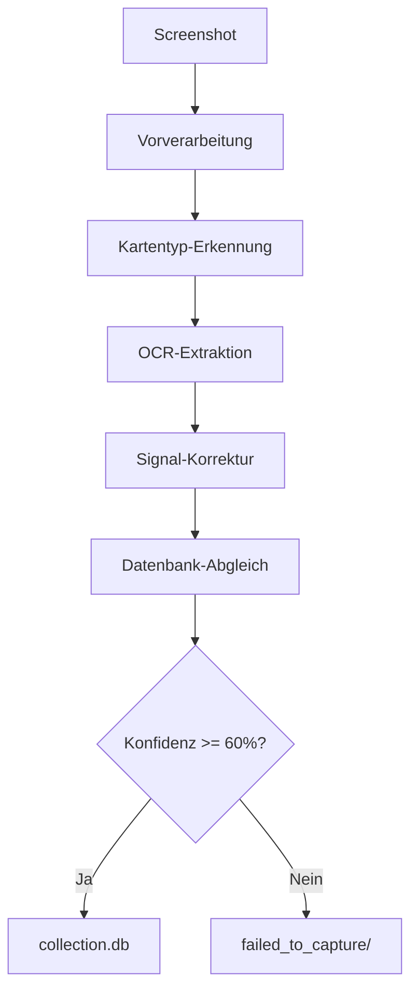
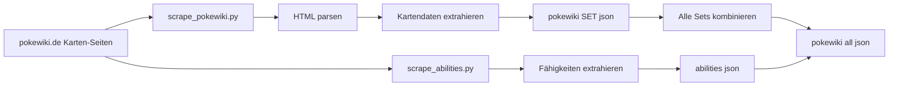
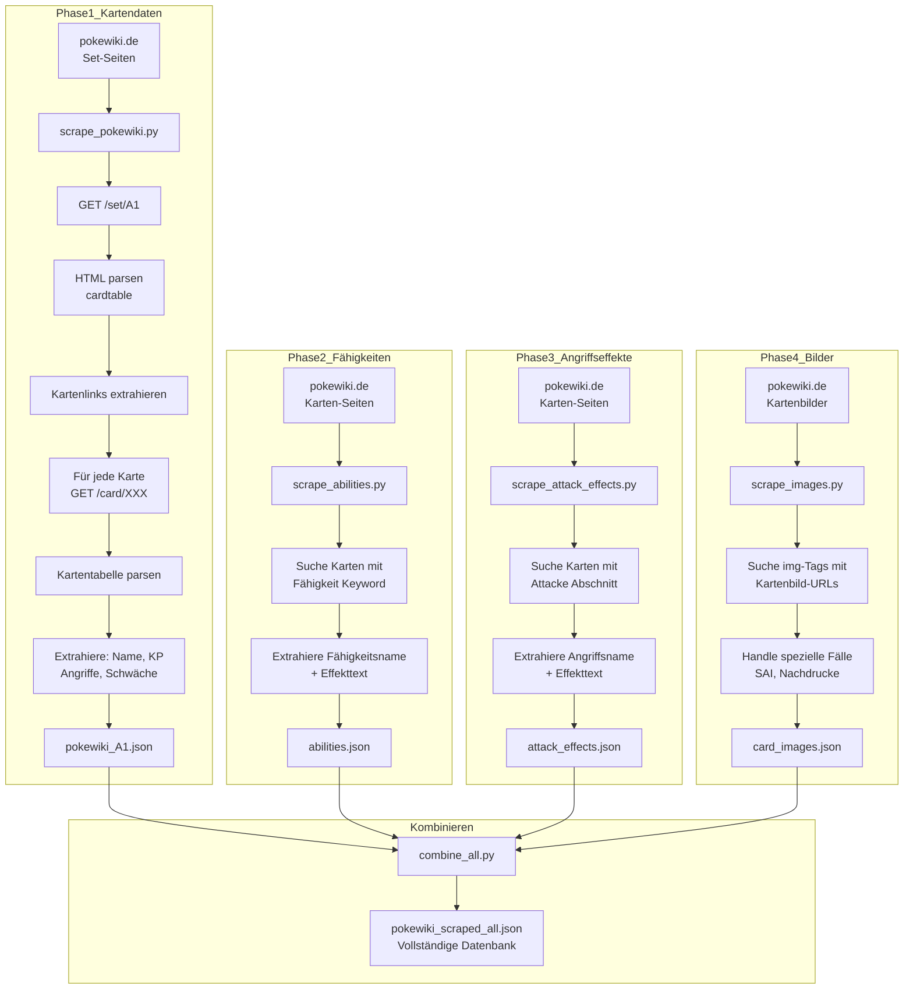
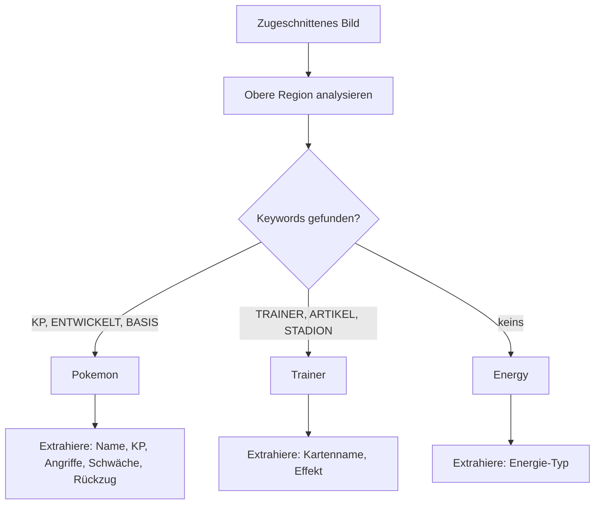
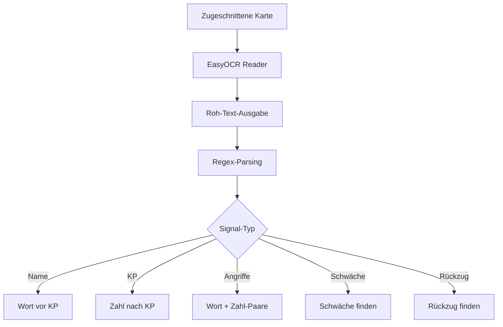
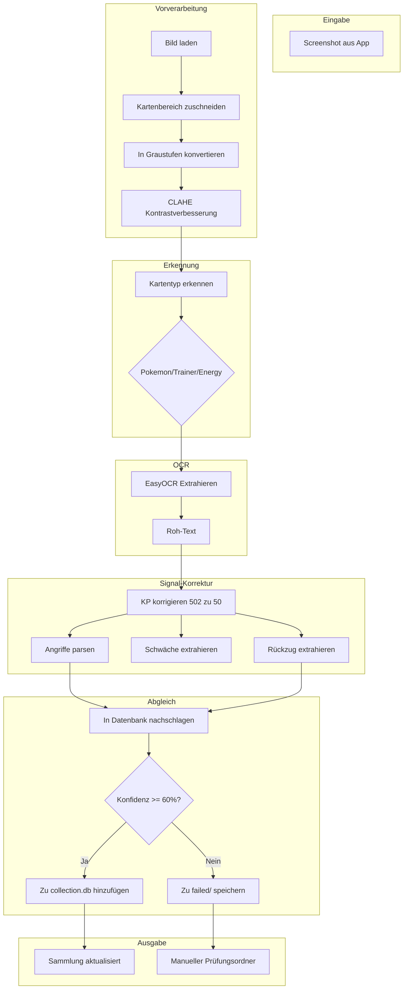
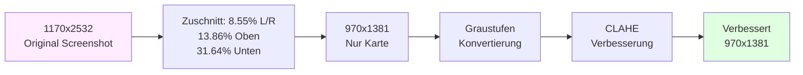
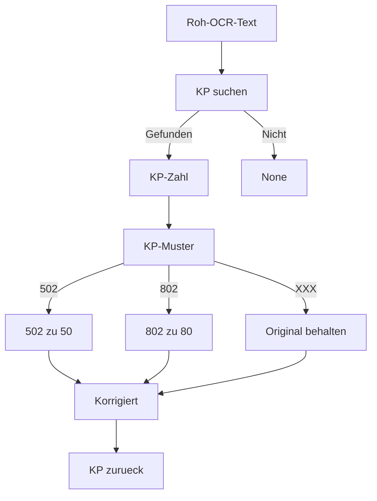
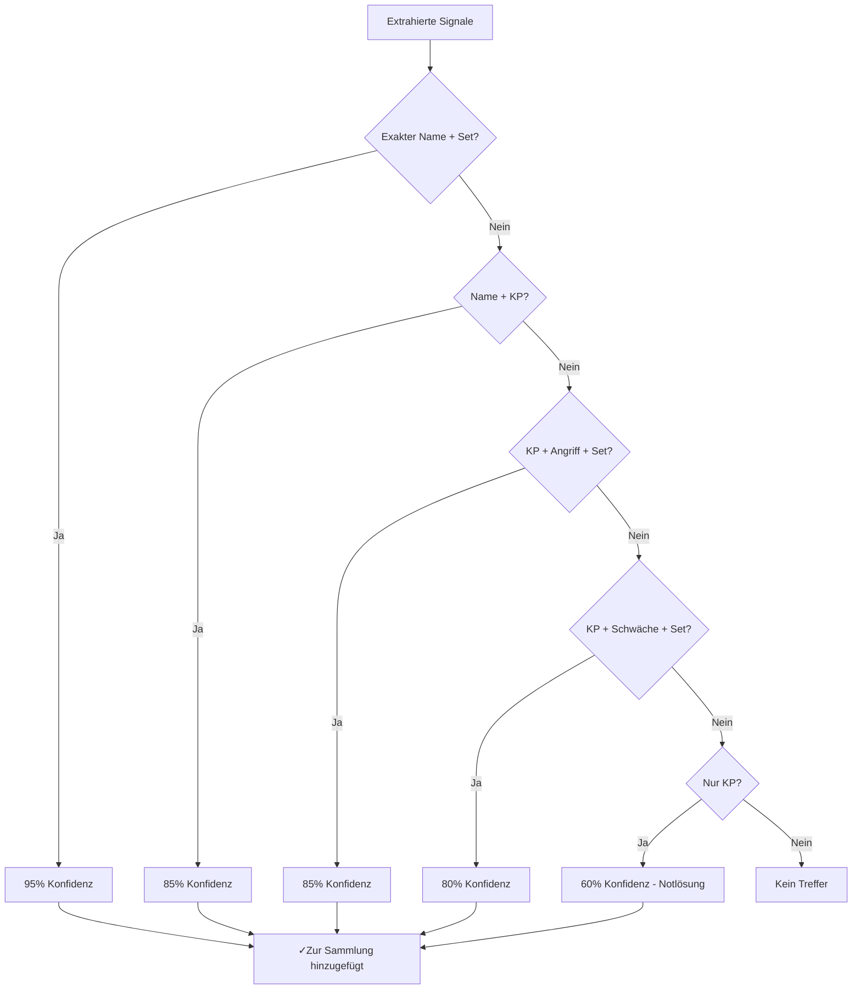
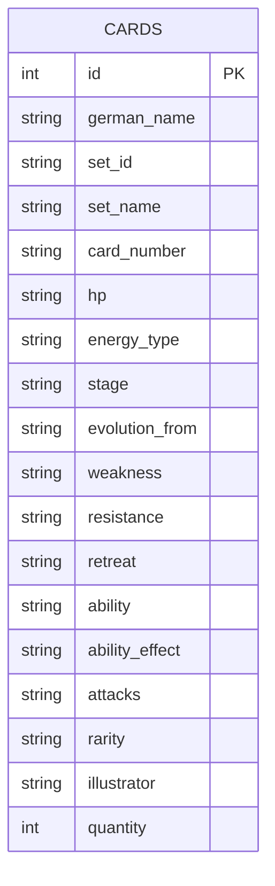

## Einleitung

Als Pokemon TCG Pocket-Spieler fand ich mich jedes Mal dabei, meine Sammlung manuell zu durchsuchen, wenn ich wissen wollte, ob ich eine bestimmte Karte hatte. Das Spiel erlaubt dir, Karten zu erfassen, aber es gibt keinen einfachen Weg, deine Sammlung zu exportieren oder zu durchsuchen. Also habe ich einen gebaut.

Dieser Artikel dokumentiert, wie ich ein vollständiges Karten-Extraktionssystem mit OCR, Web-Scraping und SQLite gebaut habe. Ich führe dich durch die Architektur, die Herausforderungen, die ich gemeistert habe, und wie ich sie gelöst habe.

---

## Das Problem

Karten manuell zu katalogisieren ist mühselig:
- Screenshot einer Karte in der App
- Kartenname in einer Datenbank nachschlagen
- In einer Tabelle erfassen

Das wollte ich automatisieren: **Screenshot → OCR → Datenbank** in Sekunden, nicht Minuten.

---

## Systemarchitektur

Das System hat fünf Hauptkomponenten:



### Komponenten-Übersicht

| Komponente | Zweck |
|-----------|---------|
| `vorverarbeitung/` | Bildzuschnitt, Kontrastverbesserung |
| `extraktion/` | Pokemon/Trainer/Energy-Karten erkennen |
| `ocr_engine/` | EasyOCR + Tesseract für Textextraktion |
| `api/local_lookup.py` | Multi-Signal-Kartenabgleich |
| `database.py` | SQLite-Sammlungsspeicher |

---

## Datensammlung: Scraping von Pokewiki.de

Bevor ich Karten abgleichen konnte, brauchte ich eine Datenbank. Ich habe [pokewiki.de](https://www.pokewiki.de) (deutsches Pokemon-Wiki) nach Kartendaten gescraped.



### Was ich gescraped habe

- **2540 einzigartige Karten** in 17 Sets (A1-B2a, PROMO-A, PROMO-B)
- **124 einzigartige Fähigkeiten** mit Effektbeschreibungen
- **4509 Bild-URLs** (inklusive Nachdrucke)
- **~200 Angriffseffekte** mit detailliertem Text

### Scraping-Datenfluss



```json
{
  "german_name": "Bisasam",
  "set_id": "A1",
  "hp": "70",
  "energy_type": "Grass",
  "attacks": [{"name": "Rankenhieb", "damage": "40", "cost": ["Grass", "Colorless"]}],
  "weakness": "Fire+20",
  "retreat": "1",
  "rarity": "2 Diamond"
}
```

---

## Karten-Erkennung: Pokemon vs Trainer vs Energy

Nicht alle Karten sind gleich. Pokemon-Karten haben KP, Angriffe und Fähigkeiten. Trainer-Karten haben völlig andere Felder. Ich musste zuerst den Kartentyp erkennen.



Die Erkennung nutzt deutsche Keywords, da das Spiel auf Deutsch angezeigt wird:

```python
pokemon_keywords = {"KP", "ENTWICKELT", "ENTWICKELT SICH", "BASIS", "PHASE"}
trainer_keywords = {"TRAINER", "ARTIKEL", "UNTERSTÜTZUNG", "STADION"}
```

---

## OCR-Extraktion: EasyOCR zur Rettung

Mit dem bekannten Kartentyp extrahierte ich Text mit EasyOCR mit deutschen und englischen Modellen.

### Extraktions-Pipeline



### Vollständiger End-to-End-Datenfluss



### Bildvorverarbeitungs-Pipeline



### OCR-Signal-Korrektur-Pipeline



### Beispiel-Extraktion

**Eingabe**: Screenshot der Karte Igastarnish (Grass/Bug Pokemon)

**Roh-OCR-Ausgabe**:
```
PHASE Igastarnish
Entwickelt sich aus Igamaro
KP 90
Nr. 0651 Spitzpanzer-Pokemon
Nietenranke
60
Schwäche
Illustr. 5ban Graphics
® +20
Rückzug
```

**Extrahierte Signale**:
```json
{
  "name": "IGASTARNISH",
  "hp": "90",
  "attacks": ["Nietenranke 60"],
  "weakness": "Fire+20",
  "retreat": "2"
}
```

---

## Herausforderungen & Lösungen

### Herausforderung 1: OCR liest KP-Werte falsch

**Problem**: EasyOCR liest oft KP-Werte falsch. "502" bedeutet "50", "802" bedeutet "80". Die zusätzliche Ziffer ist Rauschen vom KP-Icon.

**Lösung**: Nachbearbeitung mit Regex, die nachfolgende Ziffern entfernt:

```python
def correct_hp(hp_str):
    if not hp_str:
        return None
    # "502" -> "50", "802" -> "80"
    match = re.match(r'^(\d)0?2$', hp_str)
    if match:
        return match.group(1) + "0"
    return hp_str
```

### Herausforderung 2: Doppelte Karten in der Datenbank

**Problem**: Einige Karten erscheinen in mehreren Sets (Nachdrucke). Der Scraper erstellte doppelte Einträge mit verschiedenen Set-IDs, aber demselben Kartennamen.

**Lösung**: Deduplikationslogik hinzugefügt, die Einträge zusammenführt basierend auf:
- Exaktem deutschen Namen
- Gleicher KP-Wert
- Gleicher Pokédex-Nummer

```python
# Vor dem Einfügen auf vorhandene Karte prüfen
existing = db.query("SELECT * FROM cards WHERE german_name = ? AND hp = ?", 
                   [card['german_name'], card['hp']])
if existing:
    existing['quantity'] += 1
```

### Herausforderung 3: Fehlende Kartenbilder

**Problem**: Erster Scrapevorgang erhielt nur 1483 Bilder. 1969 Karten hatten keine Bild-URLs.

**Lösung**: `scrape_images.py` ein zweites Mal mit aggressiverem Timeout-Handling und Retry-Logik ausgeführt:

```python
for attempt in range(3):
    try:
        img_url = fetch_image_url(card_name)
        if img_url:
            images[card_name] = img_url
            break
    except RequestException:
        time.sleep(2 ** attempt)  # Exponentielles Backoff
```

### Herausforderung 4: Besondere Illustration-Karten

**Problem**: Special Illustration (SAI)-Karten haben verschiedene Bild-URLs auf pokewiki - sie werden auf einem separaten CDN mit verschiedenen URL-Mustern gehostet.

**Lösung**: SAI-Karten anhand der Seltenheit ("4 Star" oder "Special Illustration") erkennen und ein anderes URL-Muster verwenden:

```python
if card.get('rarity') in ['4 Star', 'Special Illustration']:
    url = f"https://files.pokewiki.net/cardimages/{set_id}/special/{card_number}.png"
else:
    url = f"https://files.pokewiki.net/cardimages/{set_id}/{card_number}.png"
```

### Herausforderung 5: Schwäche/Rückzug nicht extrahiert

**Problem**: Das Regex für Schwäche und Rückzug funktionierte nicht mit der OCR-Ausgabe. Das Schwäche-Symbol (Fire+20) erschien in einer separaten Zeile.

**Lösung**: Regex-Muster verbessert und gesamten OCR-Ausgabe-Kontext betrachtet:

```python
# Schwäche abgleichen: Elementtyp + Zahl nach "Schwäche" suchen
weakness_match = re.search(r'Schwäche.*?(\w+)\s*\+(\d+)', ocr_text)
# Rückzug abgleichen: Zahl nach "Rückzug" suchen
retreat_match = re.search(r'Rückzug\s+(\d+)', ocr_text)
```

---

## Karten-Abgleich: Die Multi-Signal-Engine

Mit extrahierten Signalen und einer Datenbank brauchte ich einen Abgleichalgorithmus. Ich implementierte einen prioritätsbasierten Ansatz:



### Konfidenz-Bewertung

| Strategie | Konfidenz | Wann verwendet |
|-----------|----------|----------------|
| Name + Set | 95% | Exakter deutscher Name + Set-ID |
| Name + KP | 85% | Fuzzy-Name + KP-Übereinstimmung |
| KP + Angriff + Set | 85% | KP + Angriffsname + Set-Kombination |
| KP + Schwäche + Set | 80% | KP + Schwäche + Set-Kombination |
| Nur KP | 60% | Notlösung - nur KP-Übereinstimmung |

Karten unter 60% Konfidenz gehen in `failed_to_capture/` zur manuellen Überprüfung.

---

## Datenbank-Design

Die Sammlung verwendet SQLite mit einem einfachen, aber effektiven Schema:

```python
# database.py - Core SQLite Operationen

CREATE_TABLE = """
CREATE TABLE IF NOT EXISTS cards (
    id INTEGER PRIMARY KEY AUTOINCREMENT,
    german_name TEXT NOT NULL,
    set_id TEXT NOT NULL,
    set_name TEXT,
    card_number TEXT,
    hp TEXT,
    energy_type TEXT,
    stage TEXT,
    evolution_from TEXT,
    weakness TEXT,
    resistance TEXT,
    retreat TEXT,
    ability TEXT,
    ability_effect TEXT,
    attacks TEXT,
    rarity TEXT,
    illustrator TEXT,
    quantity INTEGER DEFAULT 1,
    UNIQUE(german_name, set_id, card_number)
)
"""

# Karte mit Mengenverfolgung hinzufügen
def add_card(card_data):
    existing = db.execute("""
        SELECT * FROM cards 
        WHERE german_name = ? AND set_id = ? AND card_number = ?
    """, (card_data['german_name'], card_data['set_id'], card_data['card_number'])).fetchone()
    
    if existing:
        db.execute("UPDATE cards SET quantity = quantity + 1 WHERE id = ?", [existing['id']])
    else:
        db.execute("INSERT INTO cards (...) VALUES (...)", ...)
```



Wichtige Features:
- **Mengenverfolgung**: Increment beim Hinzufügen von Duplikaten
- **Vollständige Kartendaten**: Alle Felder für Filterung gespeichert
- **Schnelle Lookups**: Indiziert auf name, set_id, KP

---

## Python Core: Das Extraktions-Skript

Der Haupteinstiegspunkt ist `extract_batch_v2.py`. So funktioniert es:

```python
# extract_batch_v2.py - Haupt-Extraktions-Pipeline

import easyocr
import cv2
import json

# OCR-Reader initialisieren (Deutsch + Englisch)
READER = easyocr.Reader(['de', 'en'], gpu=False)

def process_card(image_path):
    # Schritt 1: Bild vorverarbeiten
    cropped = preprocess_image(image_path)
    
    # Schritt 2: Kartentyp erkennen
    card_type = detect_card_type(cropped)
    
    # Schritt 3: Text via OCR extrahieren
    signals = easyocr_extract(cropped, card_type)
    
    # Schritt 4: OCR-Fehler korrigieren
    signals = correct_signals(signals)
    
    # Schritt 5: Gegen Datenbank abgleichen
    result = lookup_card(signals)
    
    # Schritt 6: Zur Sammlung hinzufügen
    if result.confidence >= 0.6:
        add_card(result.card)
        return "success"
    else:
        save_failed(signals)
        return "failed"
```

### Bildvorverarbeitung

```python
# preprocessing/card_cropper.py

def preprocess_image(image_path):
    img = cv2.imread(image_path)
    
    # Auf Kartenbereich zuschneiden (entfernt UI-Elemente)
    h, w = img.shape[:2]
    cropped = img[
        int(h * 0.1386):int(h * 0.6864),  # Oben 13.86%, Unten 31.64%
        int(w * 0.0855):int(w * 0.9145)   # Links/Rechts 8.55%
    ]
    
    # In Graustufen konvertieren
    gray = cv2.cvtColor(cropped, cv2.COLOR_BGR2GRAY)
    
    # Kontrast verbessern
    clahe = cv2.createCLAHE(clipLimit=2.0, tileGridSize=(8,8))
    enhanced = clahe.apply(gray)
    
    return enhanced
```

### Kartentyp-Erkennung

```python
# extraction/card_type.py

def detect_card_type(image):
    # Oberen Bereich nach Keywords analysieren
    top_region = image[:200, :]
    text = READER.readtext(top_region, detail=0)
    text_str = ' '.join(text).upper()
    
    pokemon_keywords = {"KP", "ENTWICKELT", "ENTWICKELT SICH", "BASIS", "PHASE"}
    trainer_keywords = {"TRAINER", "ARTIKEL", "UNTERSTÜTZUNG", "STADION"}
    
    if pokemon_keywords.intersection(text_str.split()):
        return "pokemon"
    elif trainer_keywords.intersection(text_str.split()):
        return "trainer"
    else:
        return "energy"
```

---

## Python Core: Die Karten-Abgleich-Engine

Die Abgleichlogik in `api/local_lookup.py` implementiert Multi-Signal-Abgleich:

```python
# api/local_lookup.py - Karten-Abgleichlogik

import json
import re
from difflib import SequenceMatcher

# Kartendatenbank laden
with open('api/cache/pokewiki_scraped_all.json') as f:
    CARDS = json.load(f)

class LookupResult:
    def __init__(self, card, confidence, strategy):
        self.card = card
        self.confidence = confidence
        self.strategy = strategy
        self.success = confidence >= 0.6

def lookup_card(name=None, hp=None, target_set=None, attacks=None, weakness=None):
    # Strategie 1: Exakter Name + Set (95% Konfidenz)
    if name and target_set:
        for card in CARDS:
            if card['german_name'].upper() == name.upper() and card['set_id'] == target_set:
                return LookupResult(card, 0.95, "exact_name_set")
    
    # Strategie 2: Name + KP (85% Konfidenz)
    if name and hp:
        matches = [c for c in CARDS if fuzzy_match(c['german_name'], name) and c['hp'] == hp]
        if matches:
            return LookupResult(matches[0], 0.85, "name_hp")
    
    # Strategie 3: KP + Angriff + Set (85% Konfidenz)
    if hp and attacks and target_set:
        for card in CARDS:
            if card['hp'] == hp and card['set_id'] == target_set:
                attack_names = [a['name'] for a in card.get('attacks', [])]
                if any(fuzzy_match(a, atk) for atk in attacks for a in attack_names):
                    return LookupResult(card, 0.85, "hp_attack_set")
    
    # Strategie 4: KP + Schwäche + Set (80% Konfidenz)
    if hp and weakness and target_set:
        for card in CARDS:
            if card['hp'] == hp and card['set_id'] == target_set and card.get('weakness') == weakness:
                return LookupResult(card, 0.80, "hp_weakness_set")
    
    # Strategie 5: Nur KP (60% - Notlösung)
    if hp:
        matches = [c for c in CARDS if c['hp'] == hp]
        if matches:
            return LookupResult(matches[0], 0.60, "hp_only")
    
    return LookupResult(None, 0, "no_match")

def fuzzy_match(a, b, threshold=0.8):
    return SequenceMatcher(None, a.lower(), b.lower()).ratio() >= threshold
```

---

## Python Core: Der Web-Scraper

Den Aufbau der Datenbank erforderte mehrere Scraper:

```python
# api/scrapers/scrape_pokewiki.py - Kartendaten-Scraper

import requests
from bs4 import BeautifulSoup
import json
import time

SETS = ['A1', 'A1a', 'A2', 'A2a', 'A2b', 'A3', 'A3a', 'A3b', 'A4', 'A4a', 'A4b',
        'B1', 'B1a', 'B2', 'B2a', 'PROMO-A', 'PROMO-B']

def scrape_set(set_id):
    url = f"https://www.pokewiki.de/{set_id}"
    response = requests.get(url, timeout=30)
    soup = BeautifulSoup(response.text, 'html.parser')
    
    cards = []
    for card_link in soup.select('.cardtable a'):
        card_url = card_link.get('href')
        card_data = scrape_card_page(card_url)
        cards.append(card_data)
        time.sleep(0.5)  # Rate limiting
    
    return cards

def scrape_card_page(url):
    response = requests.get(url, timeout=30)
    soup = BeautifulSoup(response.text, 'html.parser')
    
    # Kartendaten aus Tabelle extrahieren
    card = {
        'german_name': soup.select_one('.cardtable-name').text.strip(),
        'hp': soup.select_one('.cardtable-hp').text.strip(),
        'energy_type': soup.select_one('.cardtable-type').text.strip(),
        'attacks': extract_attacks(soup),
        'weakness': soup.select_one('.cardtable-weakness').text.strip(),
        'retreat': soup.select_one('.cardtable-retreat').text.strip(),
    }
    
    return card
```

---

## Ergebnisse

Nach Implementierung aller Komponenten:

- **Extraktionszeit**: ~3-5 Sekunden pro Karte
- **Erfolgsrate**: ~85% der Karten werden mit 60%+ Konfidenz zugeordnet
- **Sammlungsgröße**: Begonnen mit 1 Karte (Ledyba, natürlich)
- **Datenabdeckung**: Alle 2540 deutschen Karten mit Bildern

---

## Gelernte Lektionen

1. **Nachbearbeitung ist essentiell**: OCR ist nie perfekt. Baue robuste Korrekturlogik für häufige Fehlermodi.

2. **Scraping ist iterativ**: Erster Durchgang holt selten alles. Plane mehrere Durchgänge, um Lücken zu füllen.

3. **Konfidenz-Bewertung ist subjektiv**: 60% Schwellenwert funktioniert, aber einige Fehlpositive rutschen durch. Erwäge Feedback-Schleife.

4. **Deutscher Text ist knifflig**: Sonderzeichen (ü, ö, ä) und zusammengesetzte Wörter verursachen Abgleichprobleme. Normalisieren vor dem Vergleichen.

---

## Zukünftige Arbeit

- Bildbasiertes Zuordnen mit Karten-Art hinzufügen
- Mobile App für Kamera-Erfassung implementieren
- Duplikaterkennung aus verschiedenen Sets hinzufügen
- Web-Interface für Sammlungs-Durchsuchung bauen

---

## Fazit

Den Bau dieses Karten-Extraktors hat mir viel über OCR-Pipelines, Web-Scraping im großen Maßstab und Multi-Signal-Abgleichalgorithmen beigebracht. Die wichtigste Erkenntnis: **Beginne einfach, iteriere bei Fehlern**.

Der vollständige Quellcode ist im Projekt-Repository verfügbar. Viel Spaß beim Sammeln!

---

*Erstellt mit Python, EasyOCR, SQLite und jeder Menge deutscher Kartendaten.*