## Introduction

As a Pokemon TCG Pocket player, I found myself manually searching through my collection every time I wanted to check if I had a specific card. The game lets you capture cards, but there's no easy way to export or search your collection. So I built one.

This article documents how I built a complete card extraction system using OCR, web scraping, and SQLite. I'll walk through the architecture, the challenges I faced, and how I solved them.

---

## The Problem

Manually cataloging cards is tedious:
- Screenshot a card in the app
- Look up the card name in a database
- Record it in a spreadsheet

I wanted to automate this: **screenshot → OCR → database** in seconds, not minutes.

---

## System Architecture

The system has five main components:

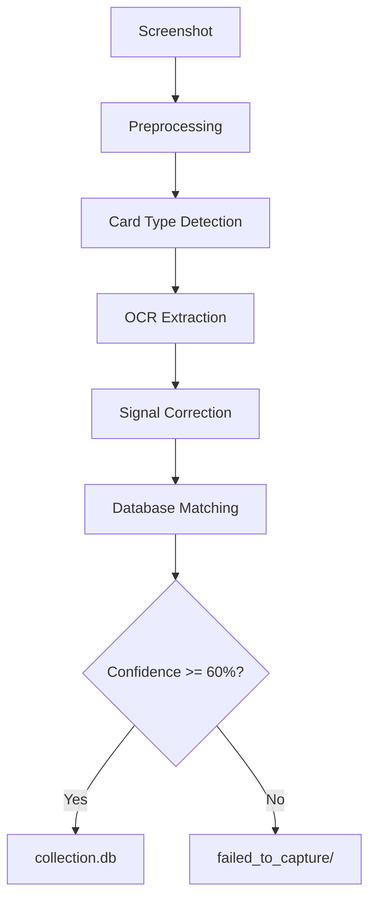

### Component Breakdown

| Component | Purpose |
|-----------|---------|
| `preprocessing/` | Image cropping, contrast enhancement |
| `extraction/` | Detect Pokemon/Trainer/Energy cards |
| `ocr_engine/` | EasyOCR + Tesseract for text extraction |
| `api/local_lookup.py` | Multi-signal card matching |
| `database.py` | SQLite collection storage |

---

## Data Collection: Scraping Pokewiki.de

Before I could match cards, I needed a database. I scraped [pokewiki.de](https://www.pokewiki.de) (German Pokemon wiki) for card data.

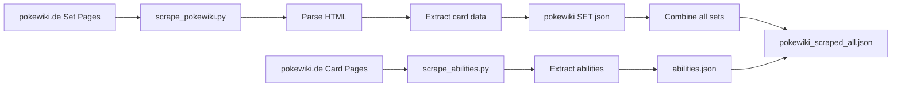

### What I Scraped

- **2540 unique cards** across 17 sets (A1-B2a, PROMO-A, PROMO-B)
- **124 unique abilities** with effect descriptions
- **4509 image URLs** (including reprints)
- **~200 attack effects** with detailed text

### Scraping Data Flow

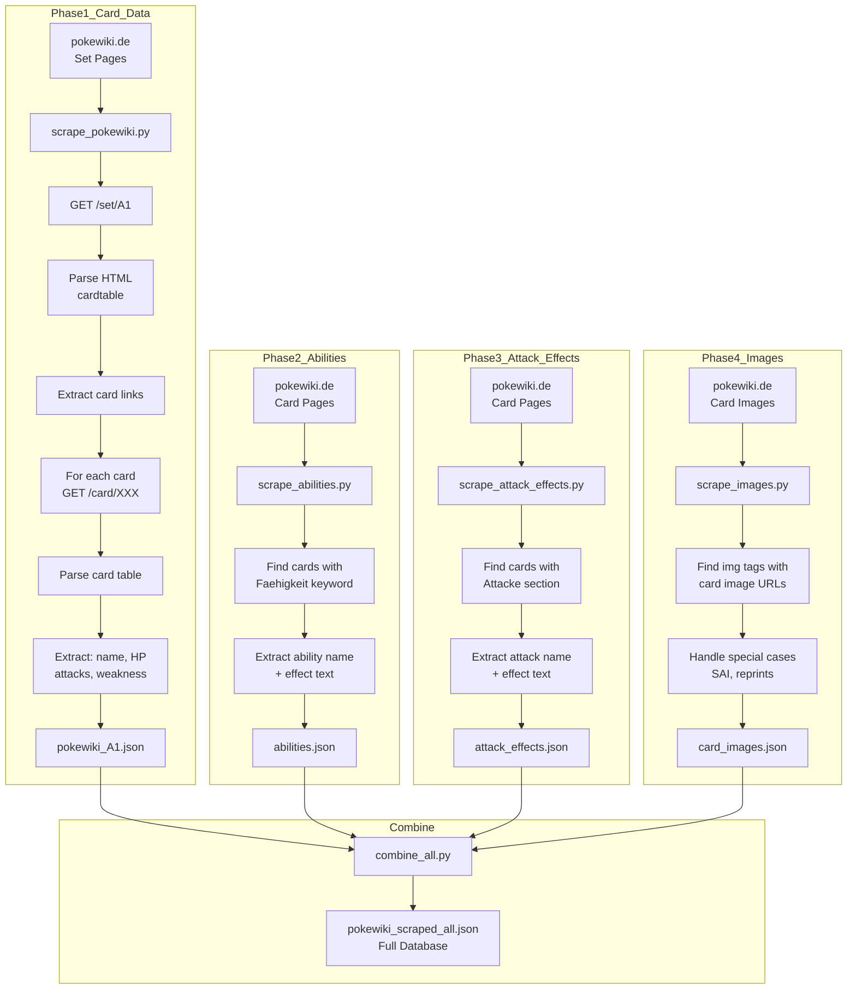

```json
{
  "german_name": "Bisasam",
  "set_id": "A1",
  "hp": "70",
  "energy_type": "Grass",
  "attacks": [{"name": "Rankenhieb", "damage": "40", "cost": ["Grass", "Colorless"]}],
  "weakness": "Fire+20",
  "retreat": "1",
  "rarity": "2 Diamond"
}
```

---

## Card Detection: Pokemon vs Trainer vs Energy

Not all cards are equal. Pokemon cards have HP, attacks, and abilities. Trainer cards have different fields entirely. I needed to detect the card type first.

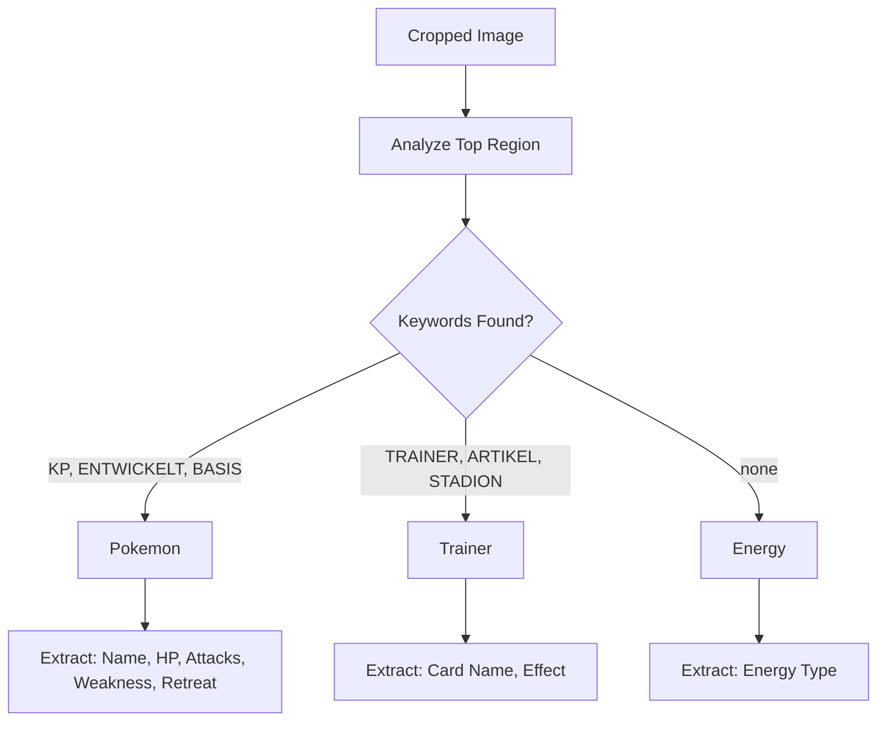

The detection uses German keywords since the game displays in German:

```python
pokemon_keywords = {"KP", "ENTWICKELT", "ENTWICKELT SICH", "BASIS", "PHASE"}
trainer_keywords = {"TRAINER", "ARTIKEL", "UNTERSTÜTZUNG", "STADION"}
```

---

## OCR Extraction: EasyOCR to the Rescue

With the card type known, I extracted text using EasyOCR with German and English models.

### Extraction Pipeline

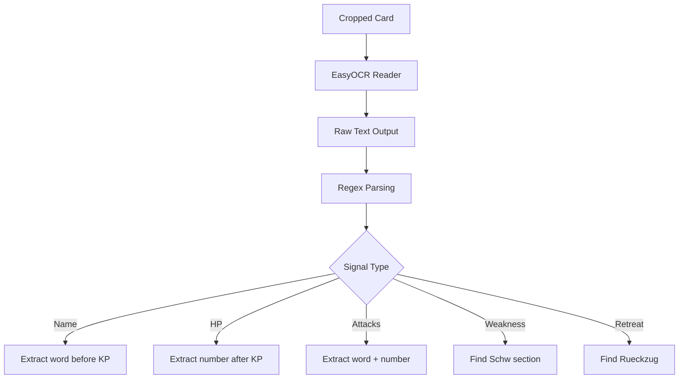

### Full End-to-End Data Flow

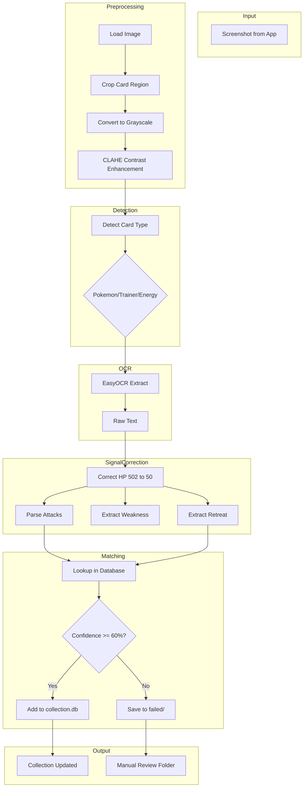

### Image Preprocessing Pipeline

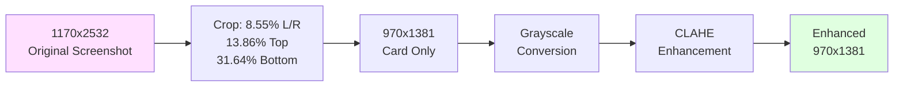

### OCR Signal Correction Pipeline

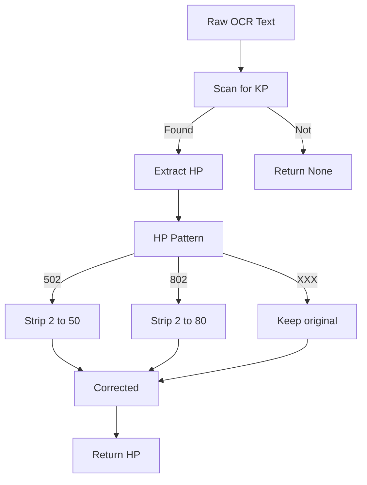

### Sample Extraction

**Input**: Card screenshot of Igastarnish (Grass/Bug Pokemon)

**Raw OCR Output**:
```
PHASE Igastarnish
Entwickelt sich aus Igamaro
KP 90
Nr. 0651 Spitzpanzer-Pokemon
Nietenranke
60
Schwäche
Illustr. 5ban Graphics
® +20
Rückzug
```

**Parsed Signals**:
```json
{
  "name": "IGASTARNISH",
  "hp": "90",
  "attacks": ["Nietenranke 60"],
  "weakness": "Fire+20",
  "retreat": "2"
}
```

---

## Challenges & Solutions

### Challenge 1: OCR Misreads HP Values

**Problem**: EasyOCR frequently misread HP values. "502" meant "50", "802" meant "80". The extra digit was noise from the KP icon.

**Solution**: Post-processing regex that strips trailing digits:

```python
def correct_hp(hp_str):
    if not hp_str:
        return None
    # "502" -> "50", "802" -> "80"
    match = re.match(r'^(\d)0?2$', hp_str)
    if match:
        return match.group(1) + "0"
    return hp_str
```

### Challenge 2: Duplicate Cards in Database

**Problem**: Some cards appear in multiple sets (reprints). The scraper was creating duplicate entries with different set IDs but the same card name.

**Solution**: Added deduplication logic that merges entries based on:
- Exact German name match
- Same HP value
- Same Pokédex number

```python
# Check for existing card before inserting
existing = db.query("SELECT * FROM cards WHERE german_name = ? AND hp = ?", 
                   [card['german_name'], card['hp']])
if existing:
    existing['quantity'] += 1
```

### Challenge 3: Missing Card Images

**Problem**: Initial scrape only got 1483 images. 1969 cards had no image URLs.

**Solution**: Ran `scrape_images.py` a second time with more aggressive timeout handling and retry logic:

```python
for attempt in range(3):
    try:
        img_url = fetch_image_url(card_name)
        if img_url:
            images[card_name] = img_url
            break
    except RequestException:
        time.sleep(2 ** attempt)  # Exponential backoff
```

### Challenge 4: Special Illustration Cards

**Problem**: Special illustration (SAI) cards have different image URLs on pokewiki - they're hosted on a separate CDN with different URL patterns.

**Solution**: Detect SAI cards by rarity ("4 Star" or "Special Illustration") and use a different URL template:

```python
if card.get('rarity') in ['4 Star', 'Special Illustration']:
    url = f"https://files.pokewiki.net/cardimages/{set_id}/special/{card_number}.png"
else:
    url = f"https://files.pokewiki.net/cardimages/{set_id}/{card_number}.png"
```

### Challenge 5: Weakness/Retreat Not Extracted

**Problem**: The regex for weakness and retreat wasn't matching the OCR output. The weakness symbol (Fire+20) appeared on a separate line.

**Solution**: Improved regex patterns and looked at the full OCR output context:

```python
# Match weakness: look for element type + number after "Schwäche"
weakness_match = re.search(r'Schwäche.*?(\w+)\s*\+(\d+)', ocr_text)
# Match retreat: look for number after "Rückzug"
retreat_match = re.search(r'Rückzug\s+(\d+)', ocr_text)
```

---

## Card Matching: The Multi-Signal Engine

With extracted signals and a database, I needed a matching algorithm. I implemented a priority-based approach:

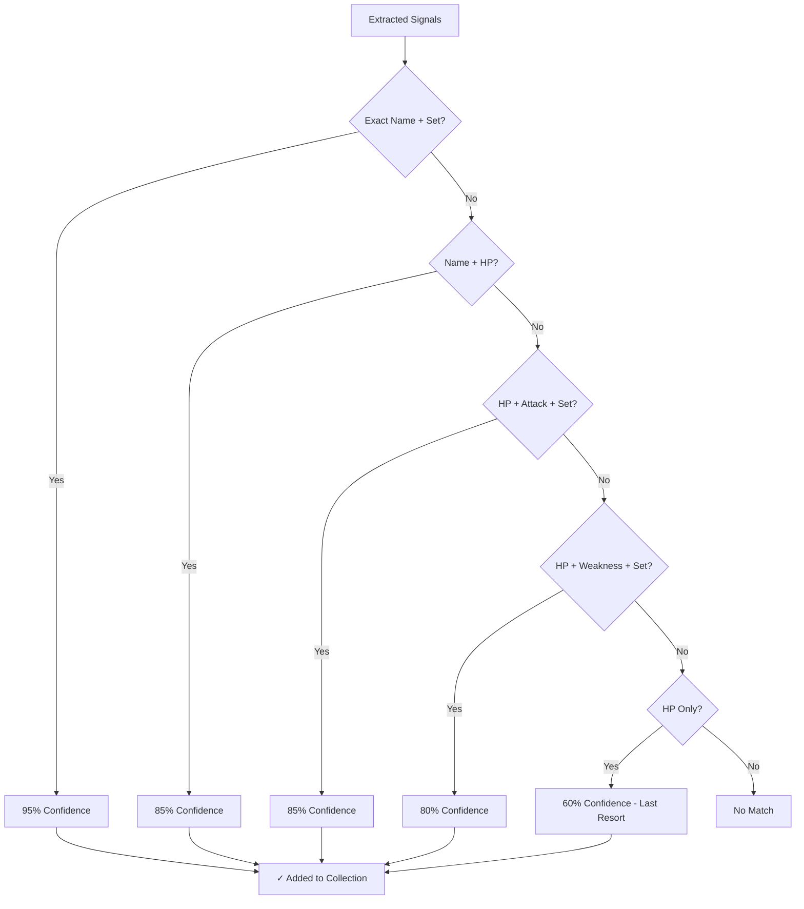

### Confidence Scoring

| Strategy | Confidence | When Used |
|----------|------------|-----------|
| Name + Set | 95% | Exact German name + set ID match |
| Name + HP | 85% | Name fuzzy match + HP match |
| HP + Attack + Set | 85% | HP + attack name + set combo |
| HP + Weakness + Set | 80% | HP + weakness + set combo |
| HP only | 60% | Last resort - just HP match |

Cards below 60% confidence go to `failed_to_capture/` for manual review.

---

## Database Design

The collection uses SQLite with a simple but effective schema:

```python
# database.py - Core SQLite operations

CREATE_TABLE = """
CREATE TABLE IF NOT EXISTS cards (
    id INTEGER PRIMARY KEY AUTOINCREMENT,
    german_name TEXT NOT NULL,
    set_id TEXT NOT NULL,
    set_name TEXT,
    card_number TEXT,
    hp TEXT,
    energy_type TEXT,
    stage TEXT,
    evolution_from TEXT,
    weakness TEXT,
    resistance TEXT,
    retreat TEXT,
    ability TEXT,
    ability_effect TEXT,
    attacks TEXT,
    rarity TEXT,
    illustrator TEXT,
    quantity INTEGER DEFAULT 1,
    UNIQUE(german_name, set_id, card_number)
)
"""

# Add card with quantity tracking
def add_card(card_data):
    existing = db.execute("""
        SELECT * FROM cards 
        WHERE german_name = ? AND set_id = ? AND card_number = ?
    """, (card_data['german_name'], card_data['set_id'], card_data['card_number'])).fetchone()
    
    if existing:
        db.execute("UPDATE cards SET quantity = quantity + 1 WHERE id = ?", [existing['id']])
    else:
        db.execute("INSERT INTO cards (...) VALUES (...)", ...)
```

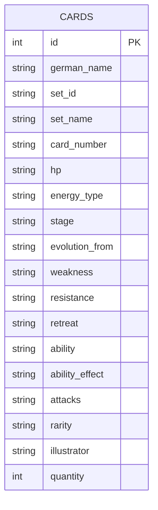

Key features:
- **Quantity tracking**: Increment when adding duplicates
- **Full card data**: All fields stored for filtering
- **Fast lookups**: Indexed on name, set_id, hp

---

## Python Core: The Extraction Script

The main entry point is `extract_batch_v2.py`. Here's how it works:

```python
# extract_batch_v2.py - Main extraction pipeline

import easyocr
import cv2
import json

# Initialize OCR reader (German + English)
READER = easyocr.Reader(['de', 'en'], gpu=False)

def process_card(image_path):
    # Step 1: Preprocess image
    cropped = preprocess_image(image_path)
    
    # Step 2: Detect card type
    card_type = detect_card_type(cropped)
    
    # Step 3: Extract text via OCR
    signals = easyocr_extract(cropped, card_type)
    
    # Step 4: Correct OCR errors
    signals = correct_signals(signals)
    
    # Step 5: Match against database
    result = lookup_card(signals)
    
    # Step 6: Add to collection
    if result.confidence >= 0.6:
        add_card(result.card)
        return "success"
    else:
        save_failed(signals)
        return "failed"
```

### Image Preprocessing

```python
# preprocessing/card_cropper.py

def preprocess_image(image_path):
    img = cv2.imread(image_path)
    
    # Crop to card region (removes UI elements)
    h, w = img.shape[:2]
    cropped = img[
        int(h * 0.1386):int(h * 0.6864),  # Top 13.86%, Bottom 31.64%
        int(w * 0.0855):int(w * 0.9145)   # Left/Right 8.55%
    ]
    
    # Convert to grayscale
    gray = cv2.cvtColor(cropped, cv2.COLOR_BGR2GRAY)
    
    # Enhance contrast
    clahe = cv2.createCLAHE(clipLimit=2.0, tileGridSize=(8,8))
    enhanced = clahe.apply(gray)
    
    return enhanced
```

### Card Type Detection

```python
# extraction/card_type.py

def detect_card_type(image):
    # Analyze top portion for keywords
    top_region = image[:200, :]
    text = READER.readtext(top_region, detail=0)
    text_str = ' '.join(text).upper()
    
    pokemon_keywords = {"KP", "ENTWICKELT", "ENTWICKELT SICH", "BASIS", "PHASE"}
    trainer_keywords = {"TRAINER", "ARTIKEL", "UNTERSTÜTZUNG", "STADION"}
    
    if pokemon_keywords.intersection(text_str.split()):
        return "pokemon"
    elif trainer_keywords.intersection(text_str.split()):
        return "trainer"
    else:
        return "energy"
```

---

## Python Core: The Card Matching Engine

The matching logic in `api/local_lookup.py` implements multi-signal matching:

```python
# api/local_lookup.py - Card matching logic

import json
import re
from difflib import SequenceMatcher

# Load card database
with open('api/cache/pokewiki_scraped_all.json') as f:
    CARDS = json.load(f)

class LookupResult:
    def __init__(self, card, confidence, strategy):
        self.card = card
        self.confidence = confidence
        self.strategy = strategy
        self.success = confidence >= 0.6

def lookup_card(name=None, hp=None, target_set=None, attacks=None, weakness=None):
    # Strategy 1: Exact name + set (95% confidence)
    if name and target_set:
        for card in CARDS:
            if card['german_name'].upper() == name.upper() and card['set_id'] == target_set:
                return LookupResult(card, 0.95, "exact_name_set")
    
    # Strategy 2: Name + HP (85% confidence)
    if name and hp:
        matches = [c for c in CARDS if fuzzy_match(c['german_name'], name) and c['hp'] == hp]
        if matches:
            return LookupResult(matches[0], 0.85, "name_hp")
    
    # Strategy 3: HP + Attack + Set (85% confidence)
    if hp and attacks and target_set:
        for card in CARDS:
            if card['hp'] == hp and card['set_id'] == target_set:
                attack_names = [a['name'] for a in card.get('attacks', [])]
                if any(fuzzy_match(a, atk) for atk in attacks for a in attack_names):
                    return LookupResult(card, 0.85, "hp_attack_set")
    
    # Strategy 4: HP + Weakness + Set (80% confidence)
    if hp and weakness and target_set:
        for card in CARDS:
            if card['hp'] == hp and card['set_id'] == target_set and card.get('weakness') == weakness:
                return LookupResult(card, 0.80, "hp_weakness_set")
    
    # Strategy 5: HP only (60% - last resort)
    if hp:
        matches = [c for c in CARDS if c['hp'] == hp]
        if matches:
            return LookupResult(matches[0], 0.60, "hp_only")
    
    return LookupResult(None, 0, "no_match")

def fuzzy_match(a, b, threshold=0.8):
    return SequenceMatcher(None, a.lower(), b.lower()).ratio() >= threshold
```

---

## Python Core: The Web Scraper

Building the database required multiple scrapers:

```python
# api/scrapers/scrape_pokewiki.py - Card data scraper

import requests
from bs4 import BeautifulSoup
import json
import time

SETS = ['A1', 'A1a', 'A2', 'A2a', 'A2b', 'A3', 'A3a', 'A3b', 'A4', 'A4a', 'A4b',
        'B1', 'B1a', 'B2', 'B2a', 'PROMO-A', 'PROMO-B']

def scrape_set(set_id):
    url = f"https://www.pokewiki.de/{set_id}"
    response = requests.get(url, timeout=30)
    soup = BeautifulSoup(response.text, 'html.parser')
    
    cards = []
    for card_link in soup.select('.cardtable a'):
        card_url = card_link.get('href')
        card_data = scrape_card_page(card_url)
        cards.append(card_data)
        time.sleep(0.5)  # Rate limiting
    
    return cards

def scrape_card_page(url):
    response = requests.get(url, timeout=30)
    soup = BeautifulSoup(response.text, 'html.parser')
    
    # Extract card data from table
    card = {
        'german_name': soup.select_one('.cardtable-name').text.strip(),
        'hp': soup.select_one('.cardtable-hp').text.strip(),
        'energy_type': soup.select_one('.cardtable-type').text.strip(),
        'attacks': extract_attacks(soup),
        'weakness': soup.select_one('.cardtable-weakness').text.strip(),
        'retreat': soup.select_one('.cardtable-retreat').text.strip(),
    }
    
    return card
```

---

## Results

After implementing all components:

- **Extraction time**: ~3-5 seconds per card
- **Success rate**: ~85% of cards match at 60%+ confidence
- **Collection size**: Started with 1 card (Ledyba, naturally)
- **Data coverage**: All 2540 German cards with images

## Data Collection: Data Flow

This document shows the data flow through the Pokemon TCG Pocket card extraction system.

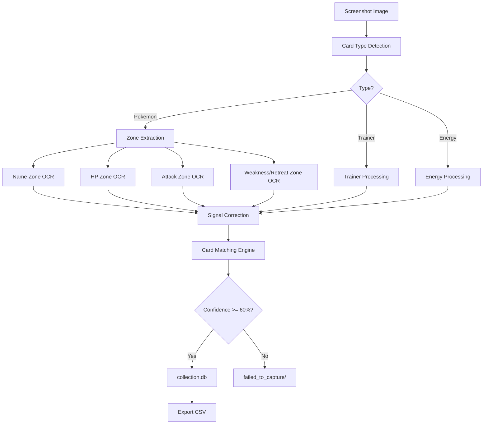

### Database Sources

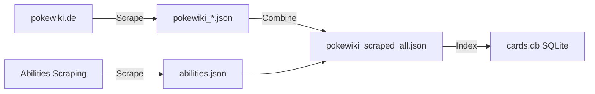

### Card Matching Priority

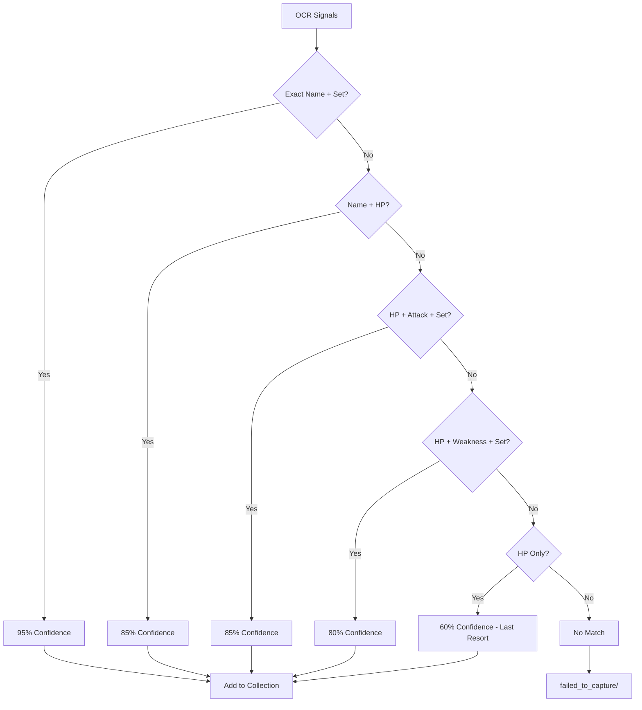

### Data Schema

**Input**: Screenshot
```
PKM_CARDS/A1/card_001.png
```

**After OCR**: Signals
```json
{
  "name": "Darkrai-ex",
  "hp": "130",
  "attacks": ["Dark Mist"],
  "weakness": "Fire+20",
  "retreat": "2"
}
```

**Database Match**: Card Data
```json
{
  "german_name": "Darkrai-ex",
  "set_id": "A2",
  "set_name": "Kollision von Raum und Zeit",
  "hp": "130",
  "energy_type": "Psychic",
  "stage": "Stage 1",
  "attacks": [{"name": "Dark Mist", "damage": "130"}],
  "weakness": "Fire+20",
  "retreat": "2",
  "ability": "Shadow Dagger",
  "ability_effect": "...",
  "rarity": "4 Star"
}
```

**Collection Storage**
```
collection.db → cards table
├── name: Darkrai-ex
├── set_name: A2
├── hp: 130
├── quantity: 1
└── ... (all card fields)
```

### File Transformations

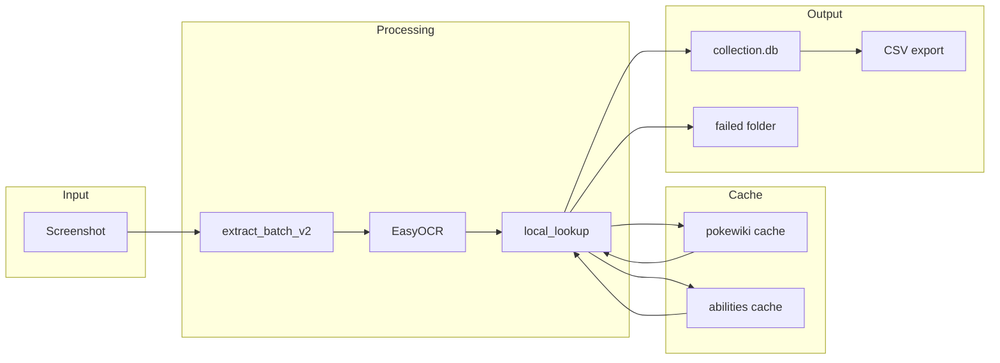

### Collection Statistics Flow

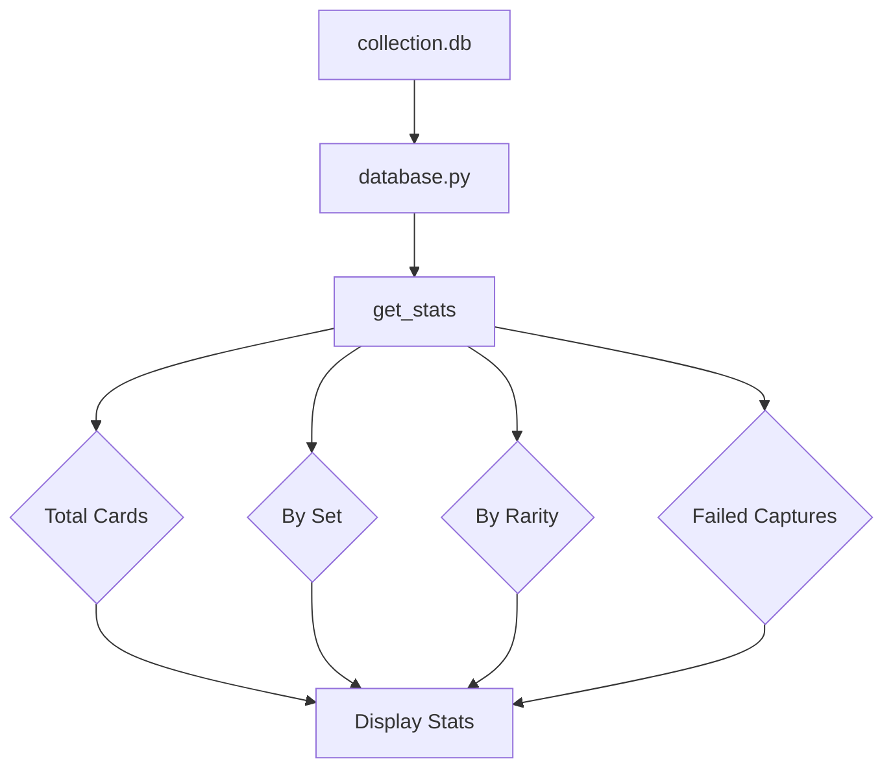

### Scraping Workflow

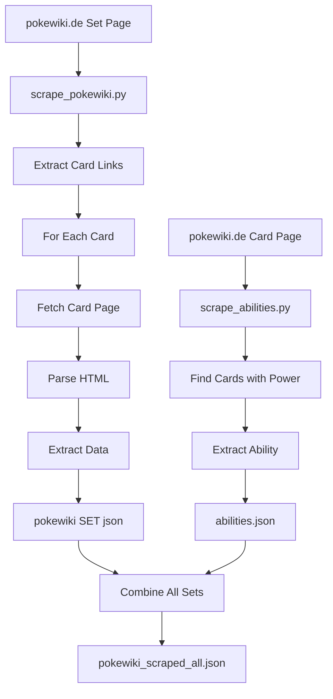

---

## Lessons Learned

1. **Post-processing is essential**: OCR is never perfect. Build robust correction logic for common failure modes.

2. **Scraping is iterative**: First pass rarely gets everything. Plan for multiple passes to fill gaps.

3. **Confidence scoring is subjective**: 60% threshold works, but some false positives slip through. Consider user feedback loop.

4. **German text is tricky**: Special characters (ü, ö, ä) and compound words cause matching issues. Normalize before comparing.

---

## Future Work

- Add image-based matching using card art
- Implement mobile app for camera capture
- Add duplicate detection from different sets
- Build web interface for collection browsing

---

## Conclusion

Building this card extractor taught me a lot about OCR pipelines, web scraping at scale, and multi-signal matching algorithms. The key takeaway: **start simple, iterate on failures**.

The full source code is available in the project repository. Happy collecting!

---

*Built with Python, EasyOCR, SQLite, and lots of German card data.*