Dieses Projekt ist ein Python-basiertes Web-Scraping-System zur Erfassung umfassender Daten über Ärzte und Gesundheitseinrichtungen in Bielefeld, Deutschland. Der Scraper nutzt Playwright (eine moderne Browser-Automatisierungsbibliothek), um mit Google Search zu interagieren und Geschäftsinformationen zu extrahieren, darunter Bewertungen, Rezensionsanzahlen, Adressen und DSGVO-bezogeneLöschhinweise.


## Projektübersicht

**Hauptziele:**
- Erfassung von Daten von 500+ Ärzten, Zahnärzten, Kliniken und Arztpraxen
- Erfassung von Bewertungen, Rezensionsanzahlen, Adressen und gelöschten Rezensionshinweisen
- Datenqualität durch strenge Validierungsregeln gewährleisten
- Eine wiederverwendbare, wartbare Scraper-Architektur aufbauen

## Architektur

### Systemübersicht

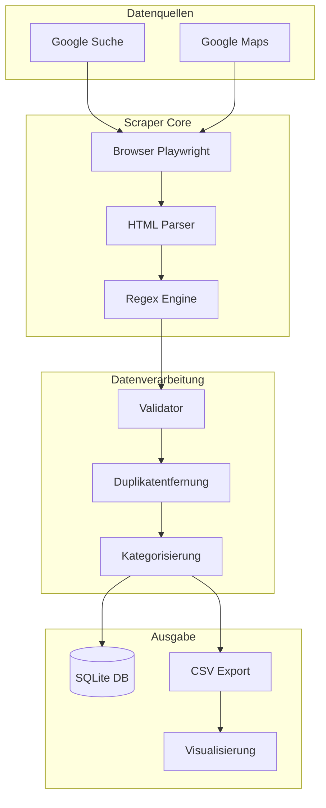

### Komponentenarchitektur

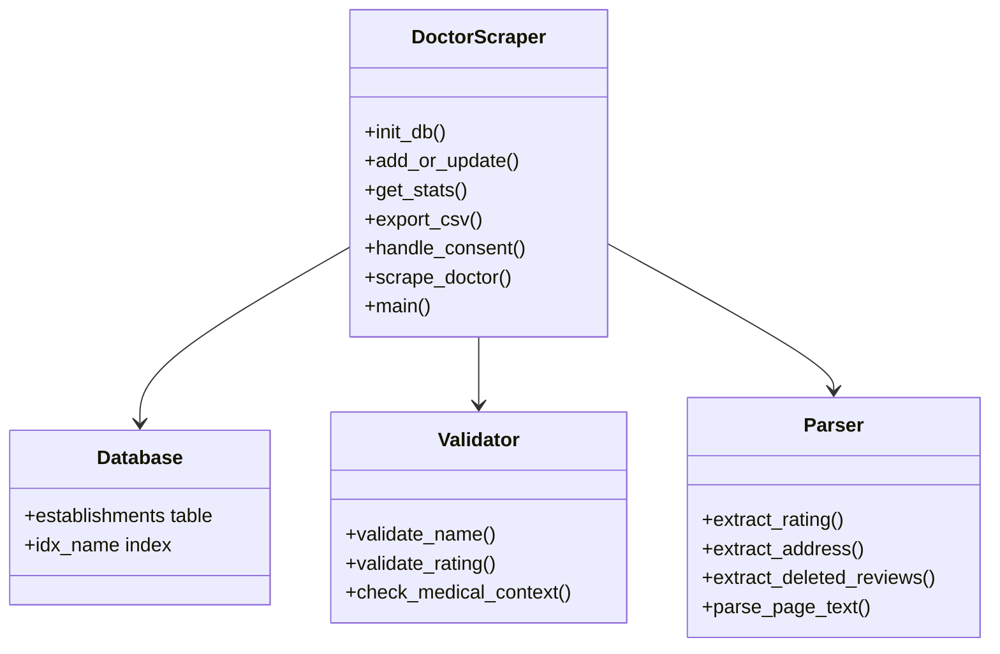

## Daten-Pipeline

### Ende-zu-Ende-Flow

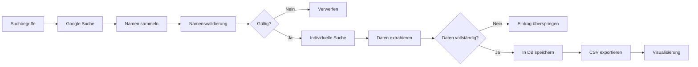

### Phase 1: Suche & Sammlung

Der Scraper verwendet eine Multi-Term-Suchstrategie für maximale Abdeckung:

```python
search_terms = [
    'Arzt Bielefeld',
    'Zahnarzt Bielefeld',
    'Klinik Bielefeld'
]
```

Jeder Suchbegriff durchsucht 3 Seiten × 10 Ergebnisse = 30 potenzielle Einträge pro Begriff.


### Phase 2: Namensextraktion

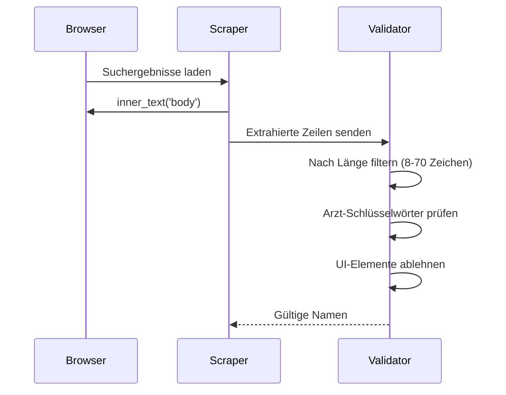

### Phase 3: Individuelles Scraping

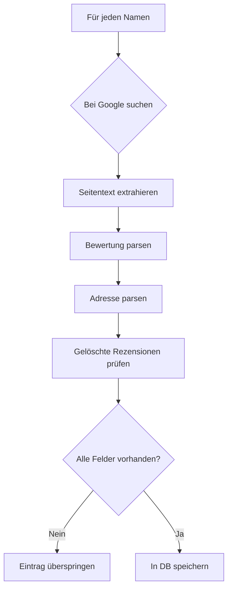

## Scraping-Methodik

### Browser-Setup

```python
browser = await p.chromium.launch(
    headless=False,
    args=['--disable-blink-features=AutomationControlled', '--no-sandbox']
)

context = await browser.new_context(
    viewport={'width': 1920, 'height': 1080},
    user_agent='Mozilla/5.0 (Windows NT 10.0; Win64; x64)...'
)
```

**Wichtige Konfigurationen:**
- `headless=False`: Für visuelle Fehlersuche
- `AutomationControlled` Flag: Bot-Erkennung umgehen
- `no-sandbox`: Für einige Linux-Umgebungen erforderlich

### Consent-Handling

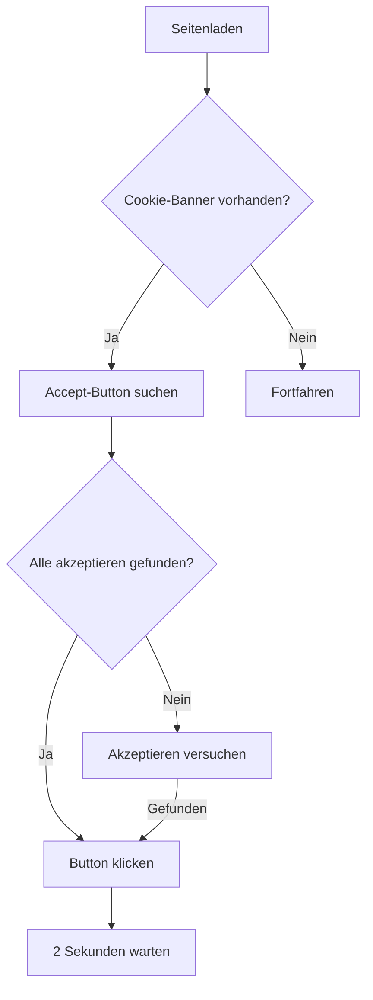

### Datenextraktionsmuster

#### Bewertungsmuster
```python
rating_match = re.search(r'(\d+[.,]\d+)\s*\(\s*(\d+)\s*\)', page_text)
if rating_match:
    data['rating'] = rating_match.group(1).replace(',', '.')
    data['total_reviews'] = rating_match.group(2)
```

#### Gelöschte Rezensionen (DSGVO)
```python
if 'entfernt' in page_text.lower():
    deleted = await page.evaluate('''() => {
        const divs = document.querySelectorAll('div');
        for (let d of divs) {
            let t = d.innerText || '';
            if (t.includes('entfernt') && t.length > 30 && t.length < 200) {
                return t;
            }
        }
        return '';
    }''')
    data['deleted_reviews'] = deleted.strip() if deleted else ''
```

## Datenvalidierung & Bereinigung

### Validierungsregeln

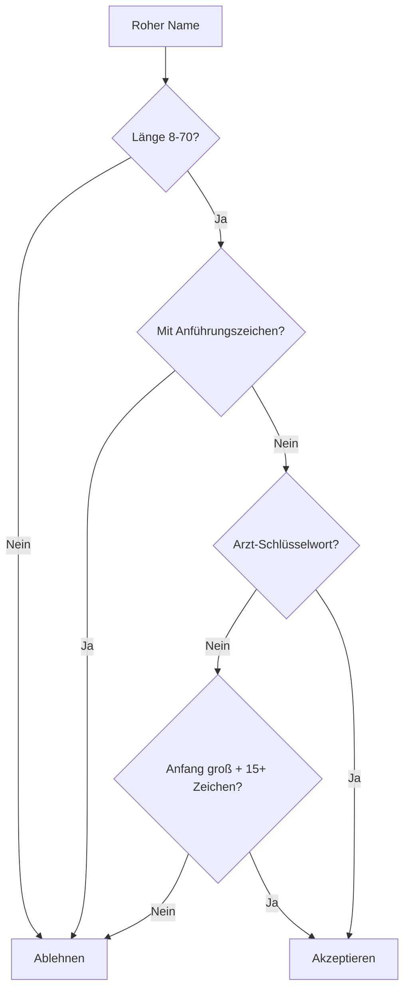

### Arzt-Schlüsselwörter (müssen übereinstimmen)

```python
doctor_keywords = [
    'arzt', 'praxis', 'klinik', 'zentrum', 'dr.', 'dr ',
    'med.', 'med ', 'prof.', 'hausarzt', 'zahnarzt',
    'facharzt', 'mvz', 'therapie', 'psycholog', 'physio',
    'heilkunde', 'chiro', 'podo', 'ergo', 'logo'
]
```

### Ablehnungsmuster

```python
skip_patterns = [
    'bewertung', 'öffnet', 'geschlossen', 'anzeige',
    'website', 'telefon', 'google', 'suche', '·',
    'route', 'weiter', 'anmelden', 'nutzung',
    'datenschutz', 'feedback', 'standort', 'hilfe'
]
```


## Datenbankschema

### SQLite-Schema

```sql
CREATE TABLE establishments (
    id INTEGER PRIMARY KEY AUTOINCREMENT,
    name TEXT NOT NULL,
    rating TEXT,
    total_reviews TEXT,
    deleted_reviews TEXT,
    address TEXT,
    url TEXT,
    category TEXT,
    scrape_date TEXT,
    last_updated TEXT,
    status TEXT DEFAULT 'active'
);

CREATE INDEX idx_name ON establishments(name);
```

### Entity-Beziehung

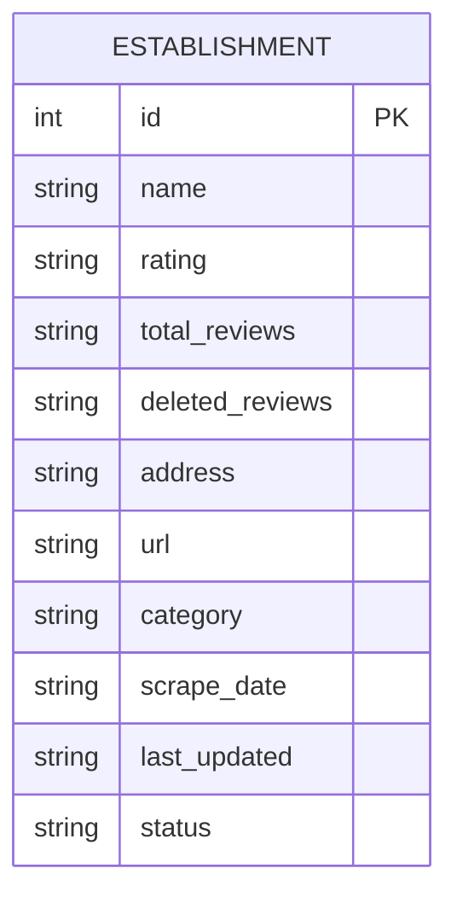

### Kategorie-Auto-Tagging

```python
def category_from_name(name):
    name_lower = name.lower()
    if any(k in name_lower for k in ['zahnarzt', 'dentist', 'dent', 'zahn']):
        return 'Zahnarzt'
    if any(k in name_lower for k in ['klinik', 'krankenhaus', 'hospital']):
        return 'Klinik'
    if any(k in name_lower for k in ['augen', 'dermat', 'herz', 'orthop']):
        return 'Facharzt'
    if any(k in name_lower for k in ['praxis', 'medizinisches zentrum', 'mvz']):
        return 'Arztpraxis'
    return 'Arzt'
```

## Datenfluss-Diagramme

### Vollständiger Pipeline

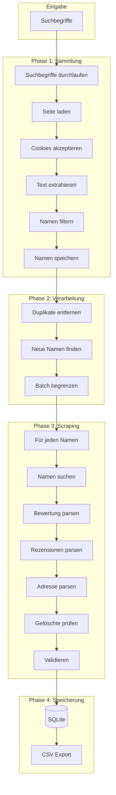

### Fehlerbehandlungsflow

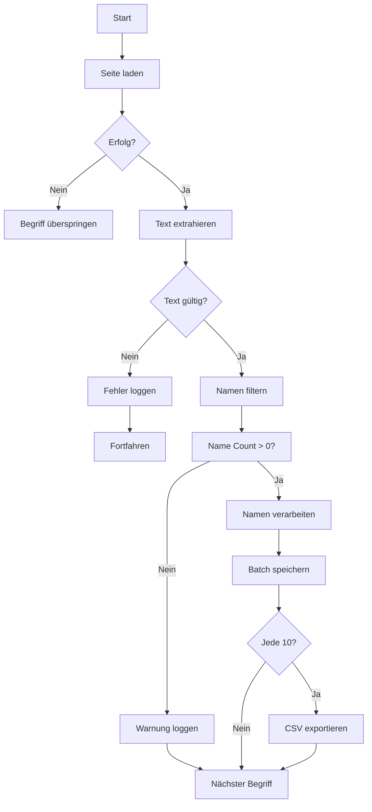

## Herausforderungen & Lösungen

### Herausforderung 1: Dynamische Google-UI

**Problem:** Google ändert häufig die HTML-Struktur und CSS-Klassennamen.

**Lösung:** Textbasierte Extraktion statt CSS-Selektoren verwenden:
```python
text = await page.inner_text('body')
for line in text.split('\n'):
    if 'Dr.' in line or 'Praxis' in line:
        all_names.add(line)
```

### Herausforderung 2: Consent-Cookie-Banner

**Lösung:** Automatisches Button-Klicken mit mehreren Versuchen:
```python
async def handle_consent(page):
    for _ in range(3):
        for text in ['Alle akzeptieren', 'Akzeptieren']:
            btn = await page.query_selector(f'button:has-text("{text}")')
            if btn:
                await btn.click()
                await asyncio.sleep(2)
                return True
```

### Herausforderung 3: Nicht-medizinische Einträge

**Lösung:** Strenge Filterung mit Schlüsselwortvalidierung:
```python
doctor_kw = ['arzt', 'praxis', 'klinik', 'dr.', 'zahn']
non_medical = ['fitness', 'gym', 'optik', 'apotheke']

if not any(k in name.lower() for k in doctor_kw):
    skip_entry()
if any(k in name.lower() for k in non_medical):
    skip_entry()
```


### Herausforderung 4: Doppelte Einträge

**Lösung:** Datenbank-Level-Deduplizierung mit Namen-Abgleich:
```python
existing = conn.execute(
    'SELECT id FROM establishments WHERE name = ?',
    (data['name'],)
).fetchone()

if existing:
    conn.execute('UPDATE ... WHERE id = ?', ...)
```

### Herausforderung 5: Fehlende Bewertungsdaten

**Lösung:** Strenge Validierung - nur Einträge mit vollständigen Daten speichern:
```python
if not rating or not reviews:
    print('✗ - Übersprungen (keine Bewertung)')
    continue
```

## Ergebnisse & Statistiken

### Aktueller Datensatz

| Metrik | Wert |
|--------|-------|
| Gesamteinträge | 157 |
| Mit Bewertungen | 157 (100%) |
| Mit Rezensionen | 157 (100%) |
| Mit gelöschten Rezensionen | 58 (37%) |
| Mit Adressen | 16 (10%) |

### Bewertungsverteilung

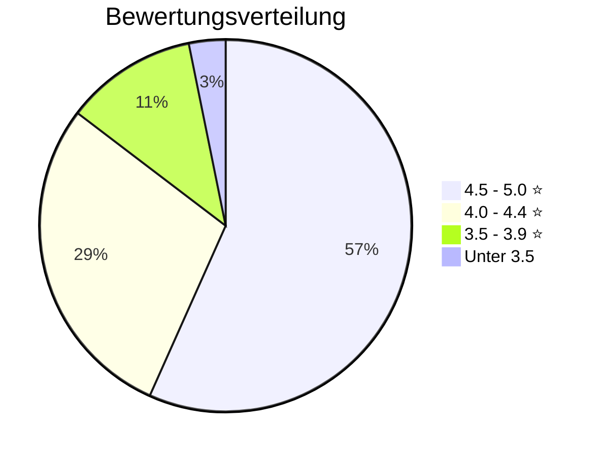

### Kategorieaufschlüsselung

| Kategorie | Anzahl | Prozentsatz |
|----------|----|-------------|
| Arzt | 62 | 39% |
| Zahnarzt | 35 | 22% |
| Klinik | 28 | 18% |
| Arztpraxis | 20 | 13% |
| Facharzt | 12 | 8% |

### Gelöschte Rezensionen Analyse

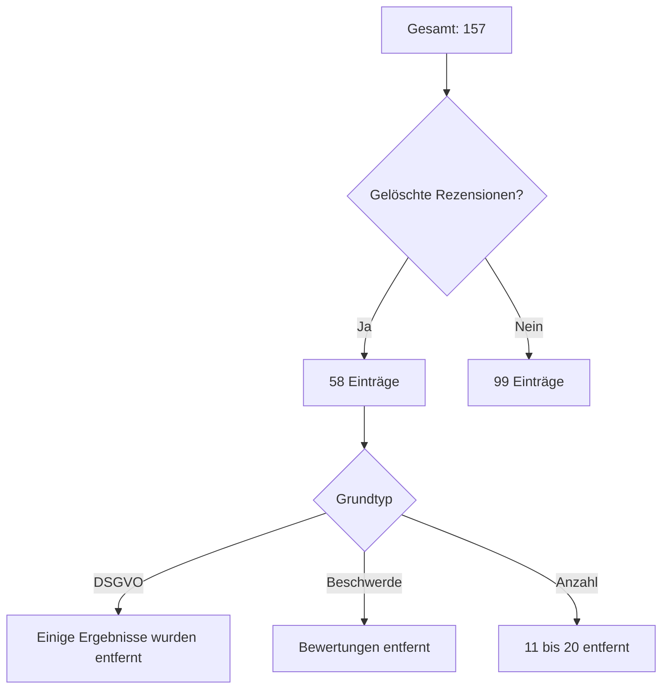

## Technischer Stack

### Abhängigkeiten

- playwright>=1.40.0
- asyncio
- sqlite3
- csv
- re
- datetime

### Dateistruktur

```
Bielefeld_Scrape/
├── doctor_scraper.py
├── doctors.db
├── doctors.csv
├── visualization/
│   ├── public/data/
│   └── src/components/
└── requirements.txt
```

## Zukünftige Verbesserungen

### Geplante Verbesserungen

1. **Parallele Verarbeitung** - Mehrere Browser-Kontexte gleichzeitig
2. **Erweiterte Validierung** - Fuzzy-Namensabgleich für Duplikaterkennung
3. **Adressextraktion** - Regex für deutsche Adressen verbessern
4. **Rezensionsinhalt** - Tatsächlichen Rezensionstext erfassen (mit Consent)
5. **Überwachung** - Änderungen über Zeit verfolgen

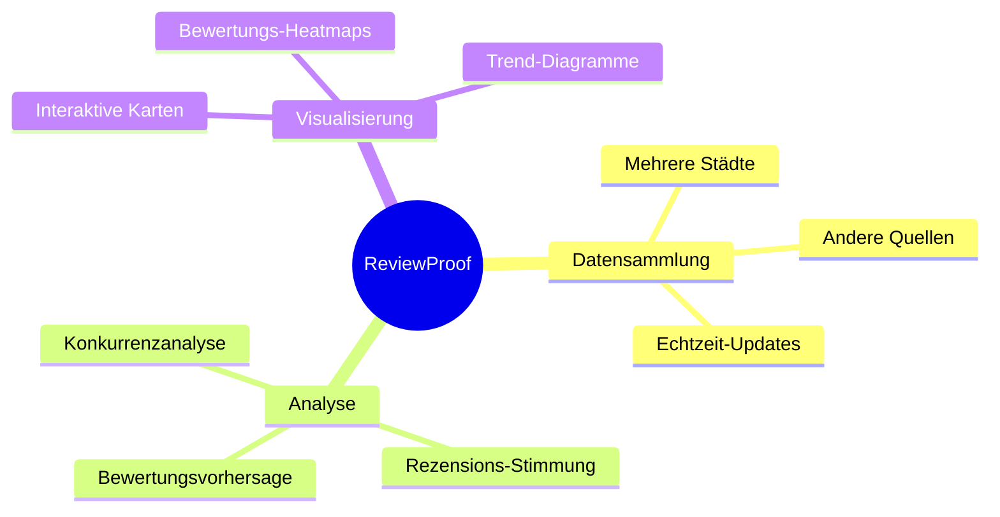

## Fazit

Dieses Projekt demonstriert einen praktischen Ansatz zur automatisierten medizinischen Datensammlung aus Web-Suchergebnissen:

1. **Textbasierte Extraktion** ist robuster als CSS-Selektoren für dynamische Webseiten
2. **Strenge Validierung** gewährleistet hohe Datenqualität, auch wenn es weniger Einträge bedeutet
3. **Modulares Design** ermöglicht einfache Wartung und Erweiterung
4. **Automatisierte Bereinigung** erkennt schlechte Einträge, die durch die anfängliche Filterung rutschen

Der Scraper erfasst erfolgreich validierte medizinische Praktiker-Daten aus Bielefeld, wobei 100% der Einträge Bewertungen und Rezensionsanzahlen enthalten. Die Architektur ist für Erweiterbarkeit auf andere Städte und Datenquellen ausgelegt.

---

*Dokumentversion: 1.0*  
*Zuletzt aktualisiert: 11. Mai 2026*