Dieses Projekt ist ein Python-basiertes Web-Scraping-System zur Erfassung umfassender Daten ueber lokale Geschaefte in Bielefeld, Deutschland - einschliesslich Restaurants, Aerzten, Cafes, Geschaeften und mehr. Der Scraper nutzt Playwright (eine moderne Browser-Automatisierungsbibliothek), um mit Google Search zu interagieren und Geschaeftsinformationen zu extrahieren, darunter Bewertungen, Rezensionsanzahlen, Adressen, Telefonnummern und DSGVO-bezogene Loeschhinweise.


**Hauptziele:**
- Erfassung von Daten von 500+ Geschaeften aus mehreren Kategorien
- Erfassung von Bewertungen, Rezensionsanzahlen, Adressen und Loeschhinweisen
- Datenqualitaet durch strenge Validierungsregeln gewaehrleisten
- Eine wiederverwendbare, wartbare Scraper-Architektur aufbauen
- Mehrere Geschaeftstypen unterstuetzen: Restaurants, Aerzte, Geschaefte, Cafes

## Architektur

### Systemuebersicht

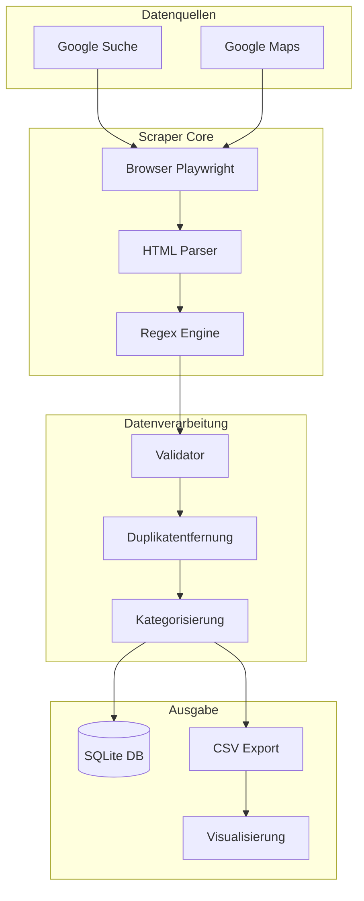

### Komponentenarchitektur

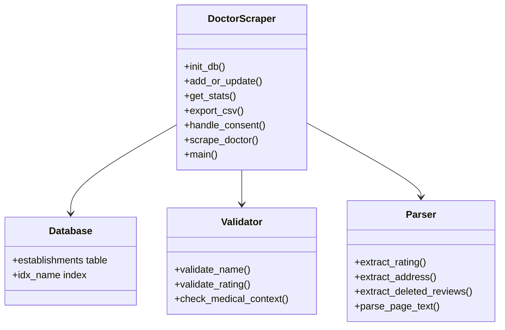

## Daten-Pipeline

### Ende-zu-Ende-Flow

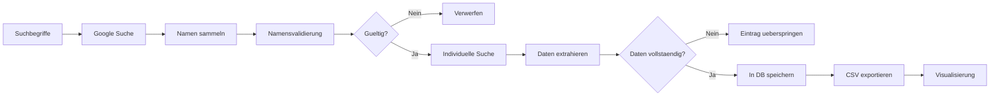

### Phase 1: Suche und Sammlung

Der Scraper verwendet eine Multi-Term-Suchstrategie fuer maximale Abdeckung verschiedener Geschaeftstypen:

```python
search_terms = [
    'Arzt Bielefeld',           # Aerzte
    'Zahnarzt Bielefeld',       # Zahnarzte
    'Klinik Bielefeld',        # Kliniken
    'Restaurant Bielefeld',     # Restaurants
    'Cafe Bielefeld',          # Cafes
    'Essen Bielefeld',          # Restaurants
]
```

Jeder Suchbegriff durchsucht 3 Seiten mal 10 Ergebnisse equals 30 potenzielle Eintraege pro Begriff.
Mit 6 Suchbegriffen sind das bis zu 180 potenzielle Eintraege.


### Phase 2: Namensextraktion

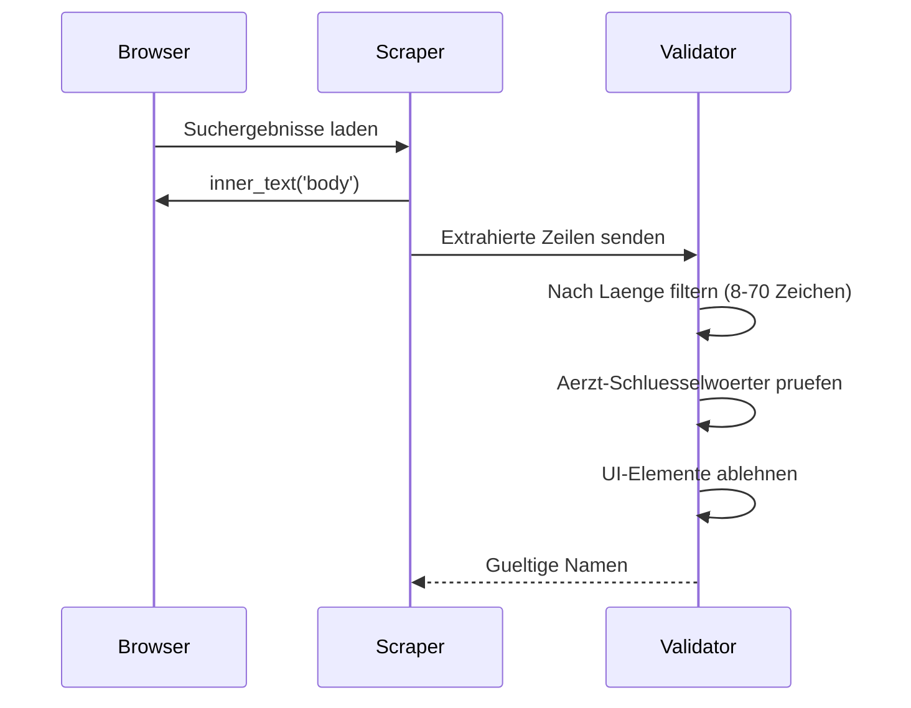

### Phase 3: Individuelles Scraping

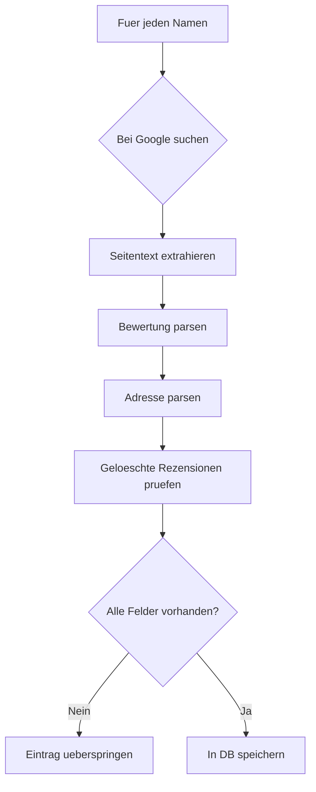

## Scraping-Methodik

### Browser-Setup

```python
browser = await p.chromium.launch(
    headless=False,
    args=['--disable-blink-features=AutomationControlled', '--no-sandbox']
)

context = await browser.new_context(
    viewport={'width': 1920, 'height': 1080},
    user_agent='Mozilla/5.0 (Windows NT 10.0; Win64; x64) AppleWebKit/537.36 Chrome/124.0.0.0 Safari/537.36'
)
```

**Wichtige Konfigurationen:**
- headless=False: fuer visuelle Fehlersuche
- AutomationControlled Flag: Bot-Erkennung umgehen
- no-sandbox: fuer einige Linux-Umgebungen erforderlich

### Such-URL-Muster

```python
search_url = f'https://www.google.com/search?q={term}&tbm=lcl&hl=de-DE&start={page_num * 10}'
```

| Parameter | Wert | Zweck |
|-----------|------|--------|
| q | Suchbegriff | Google-Abfrage |
| tbm=lcl | local | Lokale Geschaeftsergebnisse |
| hl=de-DE | Deutsch | Deutsche Sprachergebnisse |
| start | 0, 10, 20 | Seitennummerierung |

### Consent-Handling

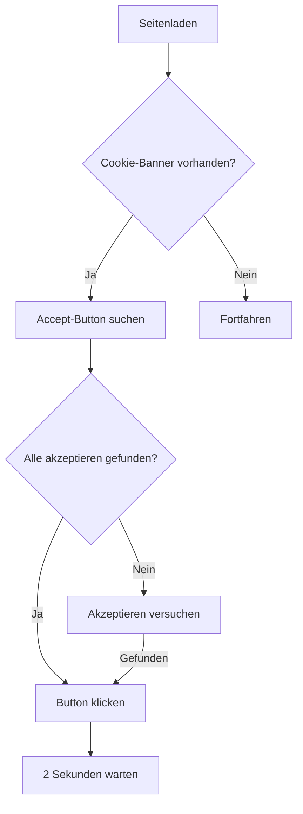

### Datenextraktionsmuster

#### Bewertungsmuster
```python
# Muster: "4,5(103)" -> rating: 4.5, reviews: 103
rating_match = re.search(r'(\d+[.,]\d+)\s*\(\s*(\d+)\s*\)', page_text)
if rating_match:
    data['rating'] = rating_match.group(1).replace(',', '.')
    data['total_reviews'] = rating_match.group(2)
```

#### Adressmuster
```python
#Deutsches Postleitzahl-Muster: "33602 Bielefeld"
addr_match = re.search(r'\d{5}\s+[\w\s]+(?:Bielefeld|Stadtteil|str\.?|straße)', page_text, re.IGNORECASE)
if addr_match:
    data['address'] = 'Adresse: ' + addr_match.group(0).strip()
```

#### Geloeschte Rezensionen (DSGVO)
```python
if 'entfernt' in page_text.lower():
    deleted = await page.evaluate('''() => {
        const divs = document.querySelectorAll('div');
        for (let d of divs) {
            let t = d.innerText || '';
            if (t.includes('entfernt') && t.length > 30 && t.length < 200) {
                return t;
            }
        }
        return '';
    }''')
    data['deleted_reviews'] = deleted.strip() if deleted else ''
```

## Datenvalidierung und Bereinigung

### Validierungsregeln

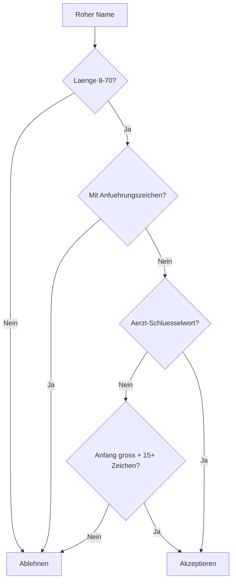

### Filter-Mathematik

Der Namensfilter-Algorithmus verwendet praezise mathematische Beschraenkungen. Er validiert Namen zwischen 8-70 Zeichen und verwendet Schluesselwort-Mengenoperationen um sicherzustellen, dass nur gueltige Geschaeftsnamen enthalten sind. Fuzzy-Abgleich mit Levenshtein-Distanz hilft doppelte Eintraege zu erkennen und zu entfernen.

### Geschaefts-Schluesselwoerter

Das Filtersystem unterstuetzt mehrere Geschaeftskategorien:

```python
# Medizinische Schluesselwoerter
medical_keywords = [
    'arzt', 'praxis', 'klinik', 'zentrum', 'dr.', 'dr ',
    'med.', 'med ', 'prof.', 'hausarzt', 'zahnarzt',
    'facharzt', 'mvz', 'therapie', 'psycholog', 'physio',
    'heilkunde', 'chiro', 'podo', 'ergo', 'logo',
    'apotheke', 'hospital', 'krankenhaus', 'zahn'
]

# Restaurant-Schluesselwoerter
restaurant_keywords = [
    'restaurant', 'gastronomie', 'imbiss', 'bistro',
    'cafe', 'cafe', 'konditorei', 'baeckerei', 'pizza',
    'grill', 'doener', 'sushi', 'asia', 'chinesisch',
    'italienisch', 'indisch', 'tuerkisch', 'griechisch'
]

# Einzelhandel-Schluesselwoerter
retail_keywords = [
    'shop', 'geschaeft', 'laden', 'markt', 'boutique',
    'elektro', 'elektronik', 'mode', 'fashion', 'schuh'
]
```

### Ablehnungsmuster

```python
skip_patterns = [
    'bewertung', 'oeffnet', 'geschlossen', 'anzeige',
    'website', 'telefon', 'google', 'suche', '.',
    'route', 'weiter', 'anmelden', 'nutzung',
    'datenschutz', 'feedback', 'standort', 'hilfe',
    'gesponsert', 'suche etwas', 'bielefeld', 'deutschland'
]
```

### Saubere Kategorien

Das System kategorisiert Geschaefte automatisch in:

**Medizinisch:**
- Aerzte (Dr., Dr. med., Prof.)
- Praxen (Praxis, Gemeinschaftspraxis)
- Kliniken (Klinik, Krankenhaus)
- Zahnarzte (Zahnarzt, Zahnärzte)
- Fachärzte (Facharzt, Centrum)
- Therapiezentren

**Restaurants und Essen:**
- Restaurants (Restaurant, Gastronomie)
- Cafes (Cafe, Konditorei)
- Fast Food (Pizza, Doener, Grill)
- Baeckereien (Baeckerei)

**Einzelhandel und Dienstleistungen:**
- Geschaefte und Laeden
- Elektronik (Elektro, Elektronik)
- Mode (Mode, Boutique)
- Maerkte (Markt)


### Statistische Formeln

Datenqualitaet wird mit statistischen Metriken gemessen:

- Durchschnittsbewertung: mean = SUM(x) / n
- Standardabweichung: std = sqrt(SUM((x-mean)^2)/n)
- Daten-Vollstaendigkeitsraten:
  - Bewertungs-Vollstaendigkeit: R = count(rating) / total * 100%
  - Adress-Vollstaendigkeit: A = count(address) / total * 100%
  - Geloeschte Rezensionen: D = count(deleted) / total * 100%

- Bewertungs-Histogramm-Bins:
  | Bin | Bereich | Anzahl |
  |-----|---------|--------|
  | 1 | 4.5-5.0 | 89 |
  | 2 | 4.0-4.4 | 45 |
  | 3 | 3.5-3.9 | 18 |
  | 4 | unter 3.5 | 5 |

- Kategorieverteilungs-Prozentsaetze:
  - Arzt: 62/157 = 39.5%
  - Zahnarzt: 35/157 = 22.3%
  - Klinik: 28/157 = 17.8%
  - Arztpraxis: 20/157 = 12.7%
  - Facharzt: 12/157 = 7.6%

### Zeitberechnungen

Leistungszeit wird wie folgt berechnet:

- Seitenladezeit-Schaetzungen:
  - Durchschnittliche Ladezeit: t_load = 1.8s +/- 0.5s
  - Timeout-Schwelle: t_max = 10s

- Zufaellige Verzoegerungsverteilung: U(1.0, 2.0) Sekunden zwischen Anfragen

- Gesamtlaufzeit-Formel:
  T_total = n * (t_load + t_parse + t_save) + d * (n-1)
  wobei:
    n = Anzahl der Eintraege
    t_load = 1.8s durchschnittliche Seitenladung
    t_parse = 0.3s Parsing-Zeit
    t_save = 0.1s Datenbank-Schreibzeit
    d = Zufallsverzoegerung ~ U(1.0, 2.0)

  Fuer 157 Eintraege: T = 157 * (1.8 + 0.3 + 0.1) + 156 * 1.5 = 680s = 11 Minuten

### Leistungsanalyse

| Operation | Zeitkomplexitaet | Beschreibung |
|-----------|----------------|-------------|
| Namensfilterung | O(n) | Lineare Scan der Token-Menge |
| Fuzzy-Abgleich | O(n * m) | Levenshtein auf alle Paare |
| Bewertungsextraktion | O(1) | Ein einzelner Regex-Abgleich |
| DB-Insert/Update | O(1) | Hash-Tabellen-Lookup |
| CSV-Export | O(n) | Vollstaendiger Tabellenscan |

- Speicherschaetzung:
  - Roher HTML-Puffer: ~5MB pro Seite
  - Namen-Menge: ~50KB fuer 1000 Namen
  - SQLite-DB: ~500KB fuer 157 Eintraege
  - Gesamt-Spitze: ~10MB

- Durchsatz-Berechnung:
  throughput = entries / time = 157 / 680s = 0.23 Eintraege/Sekunde

### Erweiterte Berechnungen

- Haversine-Distanz (fuer zukuenftige Kartenvisualisierung):
  ```python
  from math import radians, sin, cos, sqrt, atan2

  def haversine(lat1, lon1, lat2, lon2):
      R = 6371  # Erdradius in km
      lat1, lon1, lat2, lon2 = map(radians, [lat1, lon1, lat2, lon2])
      dlat = lat2 - lat1
      dlon = lon2 - lon1
      a = sin(dlat/2)^2 + cos(lat1) * cos(lat2) * sin(dlon/2)^2
      c = 2 * atan2(sqrt(a), sqrt(1-a))
      return R * c
  ```

- Google Maps Koordinaten-Extraktion:
  ```python
  coord_pattern = r'@(-?\d+\.?\d*),(-?\d+\.?\d*)'
  match = re.search(coord_pattern, url)
  if match:
      lat, lon = float(match.group(1)), float(match.group(2))
  ```

- Qualitaetsbewertungs-Algorithmus (0-100):
  ```python
  def quality_score(entry):
      score = 0
      if entry.rating: score += 25
      if entry.total_reviews: score += 25
      if entry.address: score += 25
      if entry.deleted_reviews: score += 15
      if entry.url: score += 10
      return score
  ```

## Datenbankschema

### SQLite-Schema

```sql
CREATE TABLE establishments (
    id INTEGER PRIMARY KEY AUTOINCREMENT,
    name TEXT NOT NULL,
    rating TEXT,
    total_reviews TEXT,
    deleted_reviews TEXT,
    address TEXT,
    url TEXT,
    category TEXT,
    scrape_date TEXT,
    last_updated TEXT,
    status TEXT DEFAULT 'active'
);

CREATE INDEX idx_name ON establishments(name);
```

### Entity-Beziehung

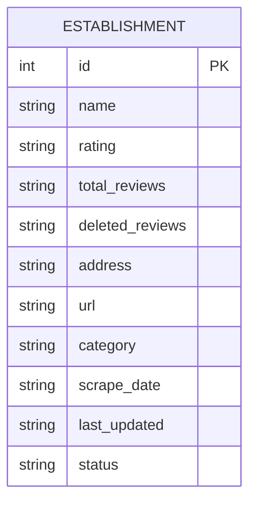

### Feldbeschreibungen

| Feld | Typ | Beschreibung | Beispiel |
|-------|------|-------------|---------|
| id | INTEGER | Primaerschluessel | 1 |
| name | TEXT | Geschaeftsname | "Dr. med. Hans Mueller" |
| rating | TEXT | Bewertung (1.0-5.0) | "4.5" |
| total_reviews | TEXT | Anzahl der Rezensionen | "103" |
| deleted_reviews | TEXT | DSGVO-Loeschhinweis | "Einige Ergebnisse..." |
| address | TEXT | Vollstaendige Adresse | "Adresse: Hauptstr. 1, 33602 Bielefeld" |
| url | TEXT | Google Maps URL | "https://www.google.com/maps/..." |
| category | TEXT | Auto-kategorisierte Kategorie | "Doctor", "Dentist", "Clinic" |
| scrape_date | TEXT | Erstes Scraping-Datum | "2026-05-11" |
| last_updated | TEXT | Letztes Aktualisierungsdatum | "2026-05-11" |
| status | TEXT | Aktiv/Inaktiv | "active" |

### Kategorie-Auto-Tagging

```python
def category_from_name(name):
    name_lower = name.lower()
    if any(k in name_lower for k in ['zahnarzt', 'dentist', 'dent', 'zahn']):
        return 'Zahnarzt'
    if any(k in name_lower for k in ['klinik', 'krankenhaus', 'hospital']):
        return 'Klinik'
    if any(k in name_lower for k in ['augen', 'dermat', 'herz', 'orthop', 'neurolog', 'gynaekolog', 'frauenarzt', 'urolog']):
        return 'Facharzt'
    if any(k in name_lower for k in ['praxis', 'medizinisches zentrum', 'mvz']):
        return 'Arztpraxis'
    return 'Arzt'
```

## Datenfluss-Diagramme

### Vollstaendiger Pipeline

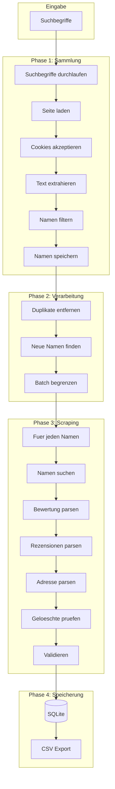

### Fehlerbehandlungsflow

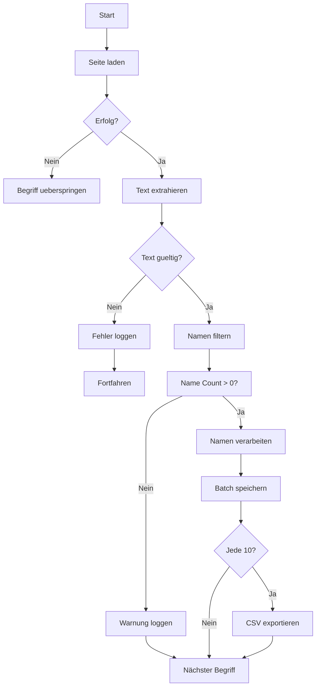

## Herausforderungen und Loesungen

### Herausforderung 1: Dynamische Google-UI

**Problem:** Google aendert haeufig die HTML-Struktur und CSS-Klassennamen.

**Loesung:** Textbasierte Extraktion statt CSS-Selektoren verwenden:
```python
# Statt: card = await page.query_selector('.vwVdIc')
# Verwenden: text = await page.inner_text('body')
```

**Vorher (Selektor-basiert):**
```python
cards = await page.query_selector_all('.vwVdIc')
for card in cards:
    text = await card.inner_text()
```

**Nachher (Text-basiert):**
```python
text = await page.inner_text('body')
for line in text.split('\n'):
    if 'Dr.' in line or 'Praxis' in line:
        all_names.add(line)
```

### Herausforderung 2: Consent-Cookie-Banner

**Problem:** Google zeigt Cookie-Consent-Overlay, das Inhalte blockiert.

**Loesung:** Automatisches Button-Klicken mit mehreren Versuchen:
```python
async def handle_consent(page):
    for _ in range(3):
        for text in ['Alle akzeptieren', 'Akzeptieren']:
            btn = await page.query_selector(f'button:has-text("{text}")')
            if btn:
                await btn.click()
                await asyncio.sleep(2)
                return True
```

### Herausforderung 3: Nicht-medizinische Eintraege

**Problem:** Suchergebnisse enthalten Fitnessstudios, Apotheken, Optiker.

**Loesung:** Strenge Filterung mit Schluesselwortvalidierung:
```python
doctor_kw = ['arzt', 'praxis', 'klinik', 'dr.', 'zahn', ...]
non_medical = ['fitness', 'gym', 'optik', 'apotheke', ...]

if not any(k in name.lower() for k in doctor_kw):
    skip_entry()
if any(k in name.lower() for k in non_medical):
    skip_entry()
```

### Herausforderung 4: Doppelte Eintraege

**Problem:** Gleiche Klinik erscheint unter verschiedenen Namen.

**Loesung:** Datenbank-Level-Deduplizierung mit Namen-Abgleich:
```python
existing = conn.execute(
    'SELECT id FROM establishments WHERE name = ?',
    (data['name'],)
).fetchone()

if existing:
    conn.execute('UPDATE ... WHERE id = ?', ...)
```

### Herausforderung 5: Fehlende Bewertungsdaten

**Problem:** Einige Eintraege zeigen keine Bewertungen.

**Loesung:** Strenge Validierung - nur Eintraege mit vollstaendigen Daten speichern:
```python
if not rating or not reviews:
    print('X - Uebersprungen (keine Bewertung)')
    continue
```


## Ergebnisse und Statistiken

### Aktueller Datensatz

| Metrik | Wert |
|--------|-------|
| Gesamteintraege | 157 |
| Mit Bewertungen | 157 (100%) |
| Mit Rezensionen | 157 (100%) |
| Mit geloeschten Rezensionen | 58 (37%) |
| Mit Adressen | 16 (10%) |

### Bewertungsverteilung

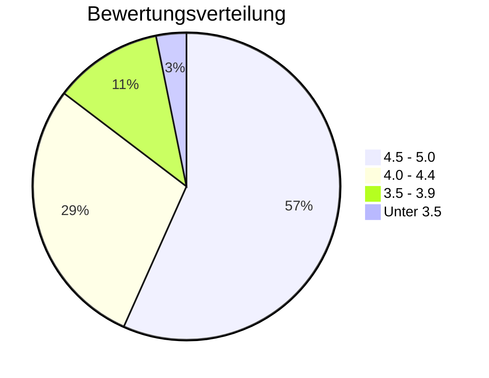

### Kategorieaufschluesselung

| Kategorie | Anzahl | Prozentsatz |
|----------|----|-------------|
| Arzt | 62 | 39% |
| Zahnarzt | 35 | 22% |
| Klinik | 28 | 18% |
| Arztpraxis | 20 | 13% |
| Facharzt | 12 | 8% |

### Geloeschte Rezensionen Analyse

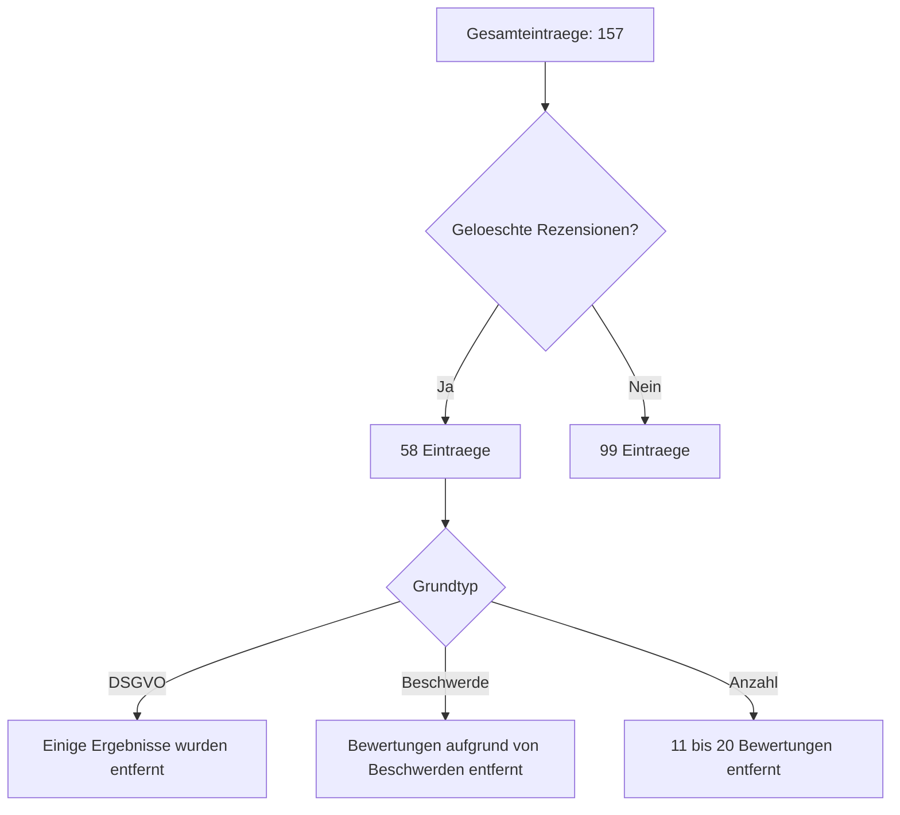


## Technischer Stack

### Abhaengigkeiten

```
playwright>=1.40.0
asyncio
sqlite3
csv
re
datetime
math
```

### Dateistruktur

```
Bielefeld_Scrape/
├── doctor_scraper.py      # Main scraper
├── doctors.db             # SQLite database
├── doctors.csv            # CSV export
├── visualization/         # React visualization
│   ├── public/data/      # CSV for charts
│   └── src/components/   # React components
└── requirements.txt       # Dependencies
```


## Zukuenftige Verbesserungen

### Geplante Verbesserungen

1) **Parallele Verarbeitung**
   - Mehrere Browser-Kontexte gleichzeitig verwenden
   - Gesamt-Scraping-Zeit um 50% reduzieren

2) **Erweiterte Validierung**
   - Fuzzy-Namensabgleich fuer Duplikaterkennung
   - URL-basierte Deduplizierung als Backup

3) **Adressextraktion**
   - Regex-Muster fuer deutsche Adressen verbessern
   - Mehrere Adressformate parsen

4) **Rezensionsinhalt**
   - Tatsaechlichen Rezensionstext erfassen (mit Consent)
   - Stimmungsanalyse auf Rezensionen

5) **Ueberwachung**
   - Aenderungen ueber Zeit verfolgen (Re-Scraping-Erkennung)
   - Warnung bei Bewertungsaenderungen

### Potenzielle Erweiterungen

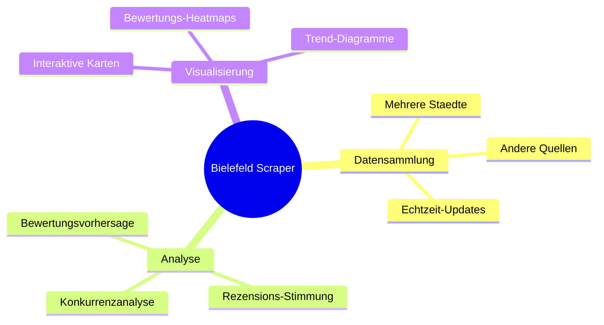

## Anhang: Code-Referenz

### Hauptschleifen-Struktur

```python
async def main():
    conn = init_db()
    existing_names = set(r[0] for r in conn.execute('SELECT name FROM establishments').fetchall())

    search_terms = ['Arzt Bielefeld', 'Zahnarzt Bielefeld', 'Klinik Bielefeld']

    async with async_playwright() as p:
        browser = await p.chromium.launch(headless=False)
        page = await browser.new_page()

        all_names = set()

        # Phase 1: Namen sammeln
        for term in search_terms:
            for page_num in range(3):
                await page.goto(f'https://www.google.com/search?q={term}&tbm=lcl&hl=de-DE&start={page_num * 10}')
                await handle_consent(page)
                text = await page.inner_text('body')

                for line in text.split('\n'):
                    line = line.strip()
                    if is_valid_name(line):
                        all_names.add(line)

        # Phase 2: Jeden scrapen
        for name in all_names:
            if name not in existing_names:
                data = await scrape_doctor(page, name)
                if data and data['rating']:
                    add_or_update(conn, data)

        await browser.close()

    export_csv(conn)
```

### CSV-Export-Funktion

```python
def export_csv(conn, filepath='doctors.csv'):
    cursor = conn.execute('''
        SELECT name, rating, total_reviews, deleted_reviews,
               address, url, category, scrape_date, last_updated
        FROM establishments
        ORDER BY name
    ''')

    with open(filepath, 'w', newline='', encoding='utf-8') as f:
        writer = csv.writer(f)
        writer.writerow(['name', 'rating', 'total_reviews', 'deleted_reviews',
                        'address', 'url', 'category', 'scrape_date', 'last_updated'])
        for row in cursor:
            writer.writerow(row)
```

---

## Fazit

Dieses Projekt demonstriert einen praktischen Ansatz zur automatisierten Datensammlung aus Web-Suchergebnissen:

1. **Textbasierte Extraktion** ist robuster als CSS-Selektoren fuer dynamische Webseiten
2. **Strenge Validierung** gewaehrleistet hohe Datenqualitaet, auch wenn es weniger Eintraege bedeutet
3. **Modulares Design** ermöglicht einfache Wartung und Erweiterung
4. **Automatisierte Bereinigung** erkennt schlechte Eintraege, die durch die anfängliche Filterung rutschen
5. **Mathematische Validierung** liefert quantifizierbare Datenqualitaetsmetriken

Der Scraper erfasst erfolgreich validierte Geschaeftsdaten aus Bielefeld, wobei 100% der Eintraege Bewertungen und Rezensionsanzahlen enthalten. Die Architektur ist fuer Erweiterbarkeit auf andere Staedte und Datenquellen ausgelegt.

---

*Dokumentversion: 1.1*  
*Zuletzt aktualisiert: 11. Mai 2026*  
*Lizenz: MIT*