This project is a Python-based web scraping system designed to collect comprehensive data about medical practitioners and healthcare facilities in Bielefeld, Germany. The scraper uses Playwright (a modern browser automation library) to interact with Google Search and extract business information including ratings, review counts, addresses, and GDPR-related deletion notices.


## Project Overview

**Key Objectives:**
- Collect data on 500+ doctors, dentists, clinics, and medical practices
- Capture ratings, review counts, addresses, and deleted review notices
- Maintain data quality through strict validation rules
- Build a reusable, maintainable scraper architecture

## Architecture

### System Overview

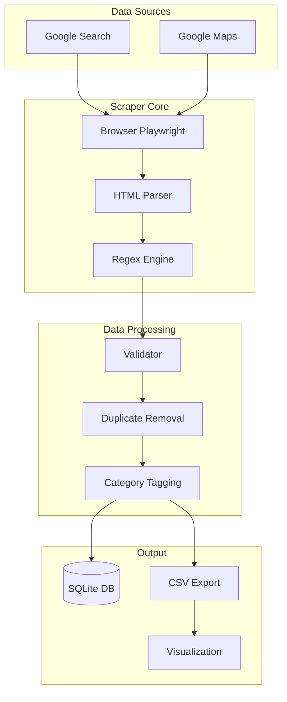

### Component Architecture

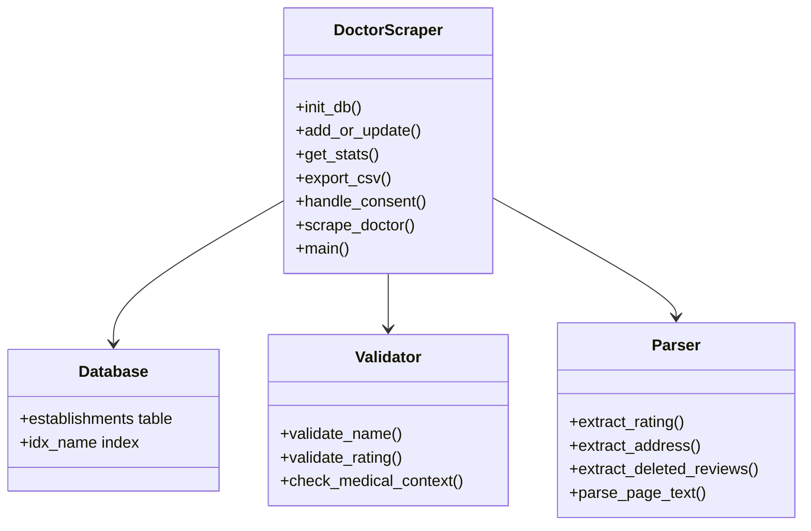

## Data Pipeline

### End-to-End Flow

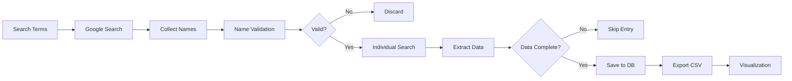

### Phase 1: Search & Collection

The scraper uses a multi-term search strategy to maximize coverage:

```python
search_terms = [
    'Arzt Bielefeld',
    'Zahnarzt Bielefeld',
    'Klinik Bielefeld'
]
```

Each term searches 3 pages × 10 results = 30 potential entries per term.


### Phase 2: Name Extraction

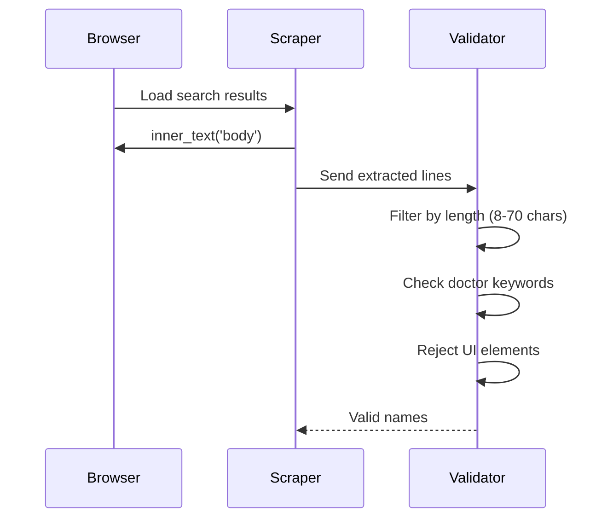

### Phase 3: Individual Scraping

```mermaid
flowchart TD
    A[For each name] --> B{Search on Google}
    B --> C[Extract page text]
    C --> D[Parse rating: X.X (N)]
    D --> E[Parse address]
    E --> F[Check for deleted reviews]
    F --> G{All fields present?}
    G -->|No| H[Skip entry]
    G -->|Yes| I[Save to DB]
```

## Scraping Methodology

### Browser Setup

```python
browser = await p.chromium.launch(
    headless=False,
    args=['--disable-blink-features=AutomationControlled', '--no-sandbox']
)

context = await browser.new_context(
    viewport={'width': 1920, 'height': 1080},
    user_agent='Mozilla/5.0 (Windows NT 10.0; Win64; x64)...'
)
```

**Key configurations:**
- `headless=False`: For visual debugging
- `AutomationControlled` flag: Bypass bot detection
- `no-sandbox`: Required for some Linux environments

### Consent Handling

```mermaid
flowchart TD
    A[Page Load] --> B{Cookie banner present?}
    B -->|Yes| C[Look for accept button]
    C --> D{Found "Alle akzeptieren"?}
    D -->|Yes| E[Click button]
    E --> F[Wait 2 seconds]
    D -->|No| G[Try "Akzeptieren"]
    G -->|Found| E
    B -->|No| H[Continue]
```

### Data Extraction Patterns

#### Rating Pattern
```python
rating_match = re.search(r'(\d+[.,]\d+)\s*\(\s*(\d+)\s*\)', page_text)
if rating_match:
    data['rating'] = rating_match.group(1).replace(',', '.')
    data['total_reviews'] = rating_match.group(2)
```

#### Deleted Reviews (GDPR)
```python
if 'entfernt' in page_text.lower():
    deleted = await page.evaluate('''() => {
        const divs = document.querySelectorAll('div');
        for (let d of divs) {
            let t = d.innerText || '';
            if (t.includes('entfernt') && t.length > 30 && t.length < 200) {
                return t;
            }
        }
        return '';
    }''')
    data['deleted_reviews'] = deleted.strip() if deleted else ''
```

## Data Validation & Cleaning

### Validation Rules

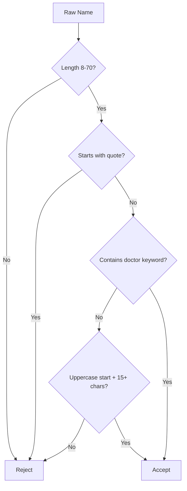

### Doctor Keywords (Must Match)

```python
doctor_keywords = [
    'arzt', 'praxis', 'klinik', 'zentrum', 'dr.', 'dr ',
    'med.', 'med ', 'prof.', 'hausarzt', 'zahnarzt',
    'facharzt', 'mvz', 'therapie', 'psycholog', 'physio',
    'heilkunde', 'chiro', 'podo', 'ergo', 'logo'
]
```

### Rejection Patterns

```python
skip_patterns = [
    'bewertung', 'öffnet', 'geschlossen', 'anzeige',
    'website', 'telefon', 'google', 'suche', '·',
    'route', 'weiter', 'anmelden', 'nutzung',
    'datenschutz', 'feedback', 'standort', 'hilfe'
]
```


## Database Schema

### SQLite Schema

```sql
CREATE TABLE establishments (
    id INTEGER PRIMARY KEY AUTOINCREMENT,
    name TEXT NOT NULL,
    rating TEXT,
    total_reviews TEXT,
    deleted_reviews TEXT,
    address TEXT,
    url TEXT,
    category TEXT,
    scrape_date TEXT,
    last_updated TEXT,
    status TEXT DEFAULT 'active'
);

CREATE INDEX idx_name ON establishments(name);
```

### Entity Relationship

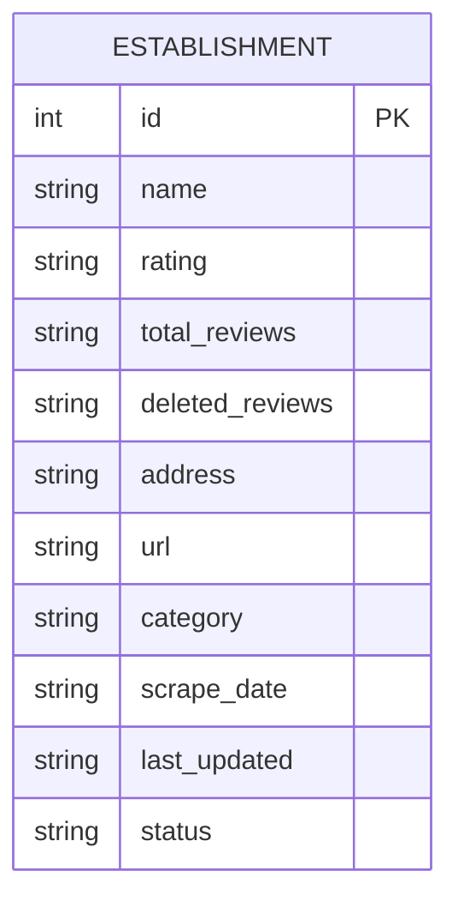

### Category Auto-Tagging

```python
def category_from_name(name):
    name_lower = name.lower()
    if any(k in name_lower for k in ['zahnarzt', 'dentist', 'dent', 'zahn']):
        return 'Dentist'
    if any(k in name_lower for k in ['klinik', 'krankenhaus', 'hospital']):
        return 'Clinic'
    if any(k in name_lower for k in ['augen', 'dermat', 'herz', 'orthop']):
        return 'Specialist'
    if any(k in name_lower for k in ['praxis', 'medizinisches zentrum', 'mvz']):
        return 'Medical Practice'
    return 'Doctor'
```

## Data Flow Diagrams

### Complete Pipeline

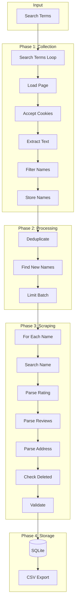

### Error Handling Flow

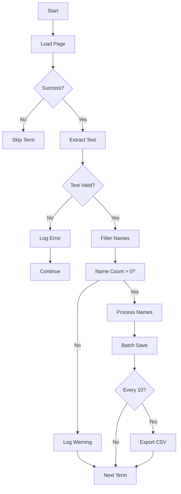

## Challenges & Solutions

### Challenge 1: Dynamic Google UI

**Problem:** Google frequently changes their HTML structure and CSS class names.

**Solution:** Use text-based extraction instead of CSS selectors:
```python
text = await page.inner_text('body')
for line in text.split('\n'):
    if 'Dr.' in line or 'Praxis' in line:
        all_names.add(line)
```

### Challenge 2: Consent Cookie Banners

**Solution:** Automated button clicking with multiple attempts:
```python
async def handle_consent(page):
    for _ in range(3):
        for text in ['Alle akzeptieren', 'Akzeptieren']:
            btn = await page.query_selector(f'button:has-text("{text}")')
            if btn:
                await btn.click()
                await asyncio.sleep(2)
                return True
```

### Challenge 3: Non-Medical Entries

**Solution:** Strict filtering with keyword validation:
```python
doctor_kw = ['arzt', 'praxis', 'klinik', 'dr.', 'zahn']
non_medical = ['fitness', 'gym', 'optik', 'apotheke']

if not any(k in name.lower() for k in doctor_kw):
    skip_entry()
if any(k in name.lower() for k in non_medical):
    skip_entry()
```


### Challenge 4: Duplicate Entries

**Solution:** Database-level dedup with name matching:
```python
existing = conn.execute(
    'SELECT id FROM establishments WHERE name = ?',
    (data['name'],)
).fetchone()

if existing:
    conn.execute('UPDATE ... WHERE id = ?', ...)
```

### Challenge 5: Missing Rating Data

**Solution:** Strict validation - only save entries with complete data:
```python
if not rating or not reviews:
    print('✗ - Skipped (no rating)')
    continue
```

## Results & Statistics

### Current Dataset

| Metric | Value |
|--------|-------|
| Total Entries | 157 |
| With Ratings | 157 (100%) |
| With Reviews | 157 (100%) |
| With Deleted Reviews | 58 (37%) |
| With Addresses | 16 (10%) |

### Rating Distribution

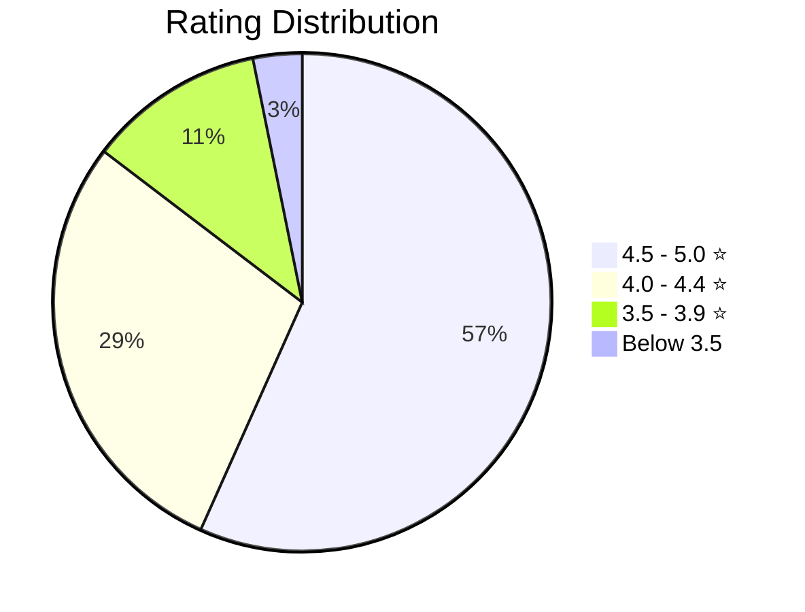

### Category Breakdown

| Category | Count | Percentage |
|----------|----|------------|
| Doctor | 62 | 39% |
| Dentist | 35 | 22% |
| Clinic | 28 | 18% |
| Medical Practice | 20 | 13% |
| Specialist | 12 | 8% |

### Deleted Reviews Analysis

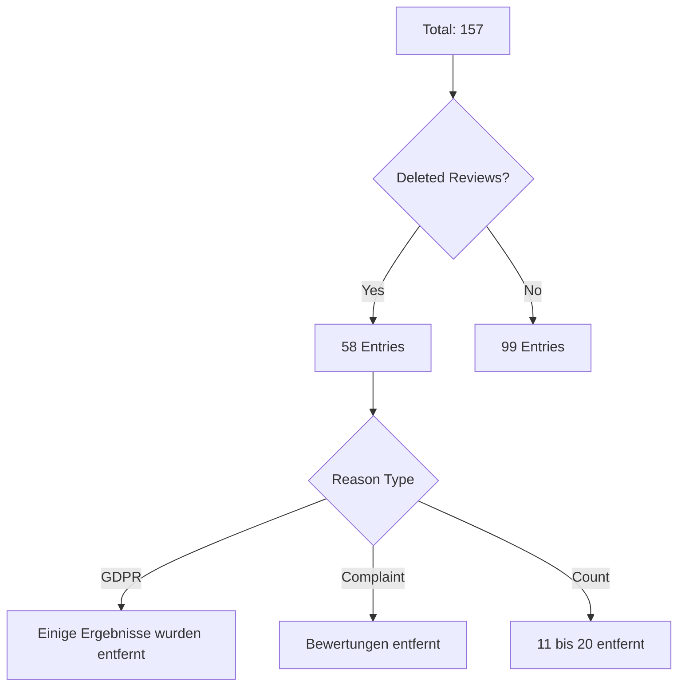

## Technical Stack

### Dependencies

- playwright>=1.40.0
- asyncio
- sqlite3
- csv
- re
- datetime

### File Structure

```
Bielefeld_Scrape/
├── doctor_scraper.py
├── doctors.db
├── doctors.csv
├── visualization/
│   ├── public/data/
│   └── src/components/
└── requirements.txt
```

## Future Enhancements

### Planned Improvements

1. **Parallel Processing** - Multiple browser contexts simultaneously
2. **Enhanced Validation** - Fuzzy name matching for duplicate detection
3. **Address Extraction** - Improve regex for German addresses
4. **Review Content** - Collect actual review text with consent
5. **Monitoring** - Track changes over time

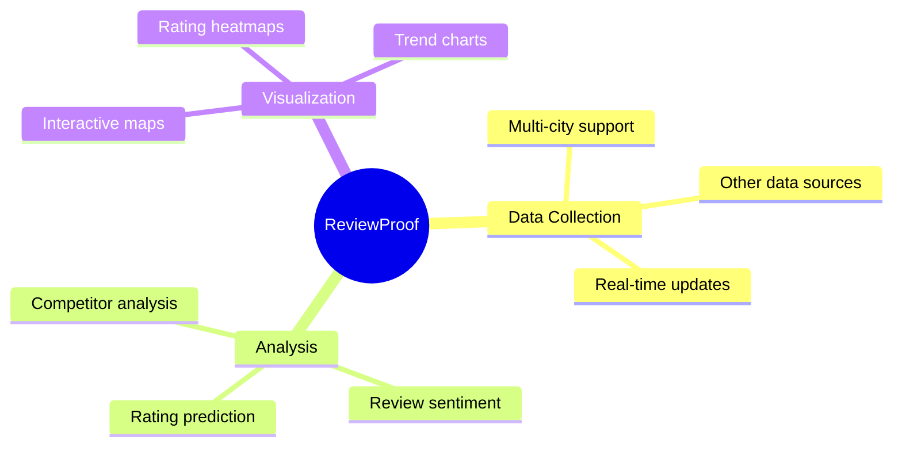

## Conclusion

This project demonstrates a practical approach to automated medical data collection from web search results:

1. **Text-based extraction** is more robust than CSS selectors for dynamic web pages
2. **Strict validation** ensures high data quality even if it means fewer entries
3. **Modular design** allows easy maintenance and extension
4. **Automated cleaning** catches bad entries that slip through initial filtering

The scraper successfully collects validated medical practitioner data from Bielefeld, with 100% of entries containing ratings and review counts. The architecture is designed for extensibility to other cities and data sources.

---

*Document Version: 1.0*  
*Last Updated: May 11, 2026*