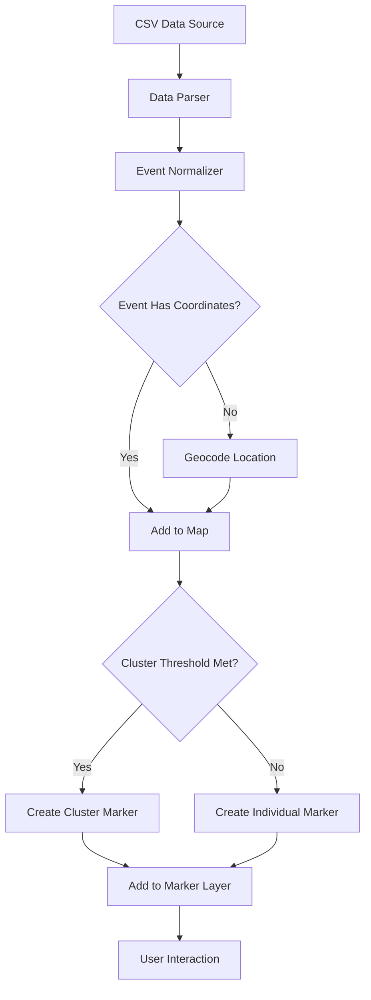
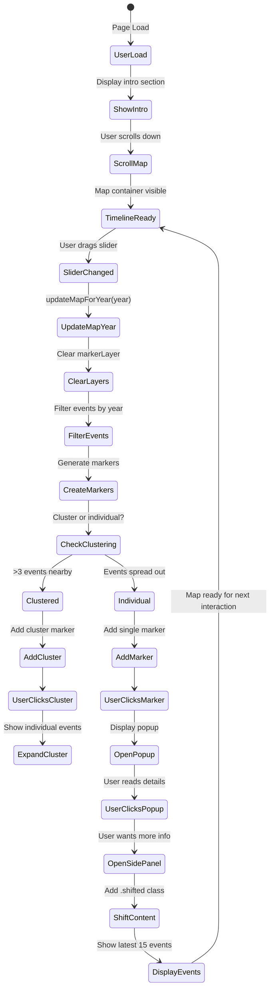
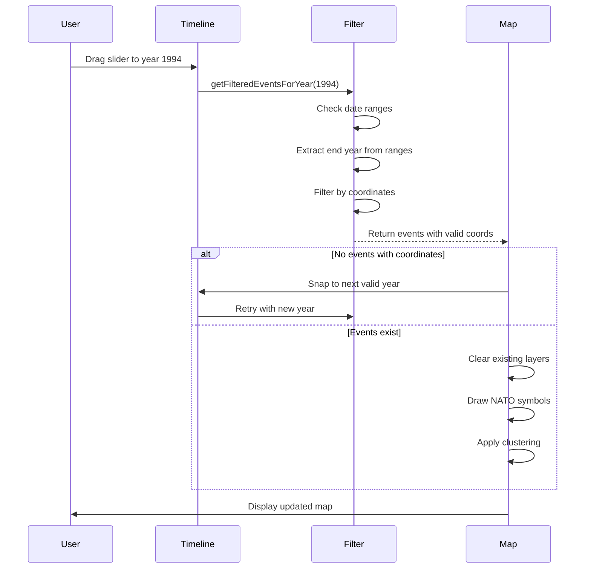
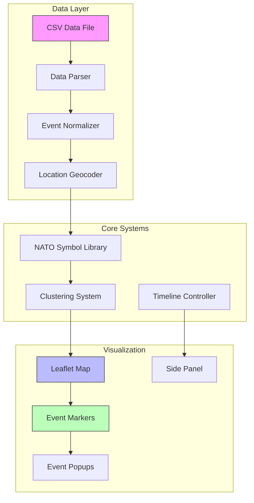

# 2026-Conflict: Israel-Hamas Conflict Timeline

## Project Overview

**2026-Conflict** is an interactive web application that visualizes the timeline of the Israel-Hamas conflict from 1900 to 2025. Built with vanilla JavaScript, Leaflet.js, and SCSS, this project provides an immersive way to explore historical events, military movements, and territorial changes through an interactive map interface.

The motivation behind this project stems from a desire to make complex historical data accessible and understandable. Rather than presenting static lists or tables of events, this visualization places each event on a geographic context, allowing users to see the spatial relationships between conflicts, military operations, and territorial shifts over more than a century.

## Technical Foundation

### Technology Stack

The project was built using a carefully selected technology stack that prioritizes performance, maintainability, and simplicity:

**Core Technologies:**
- Vanilla JavaScript (ES6+) - No frameworks, pure DOM manipulation
- Leaflet.js - Lightweight mapping library for interactive地图
- SCSS - Modular styling with design tokens
- Vite - Modern build tool with hot module replacement
- HTML5 - Semantic markup

**Design Philosophy:**
The application follows a Swiss Design approach, emphasizing cleanliness, readability, and functionality. The interface uses a black and white color scheme with NATO-standard military symbology for event representation. This aesthetic choice ensures the map remains uncluttered while still conveying critical information through standardized military symbols.

The decision to use vanilla JavaScript rather than a framework like React was deliberate. The project did not require the complexity of a component-based architecture, and vanilla JS offered better performance and smaller bundle sizes. Each script loads in a specific order to maintain proper dependencies between the symbol system, flag rendering, clustering, and the main application logic.

### Architecture Decisions

The application follows a layered architecture that separates concerns effectively:

**Layer Structure:**
1. **Data Layer** - CSV parsing and event normalization
2. **Symbol Layer** - NATO military symbology generation
3. **Visualization Layer** - Leaflet map rendering with markers
4. **Interaction Layer** - Event listeners and timeline controls
5. **Presentation Layer** - SCSS styling and responsive design

The clustering system was a critical architectural decision. With potentially hundreds of events in close geographic proximity, displaying each marker individually would create an unusable map. The clustering system groups nearby events, showing a count badge for large clusters and spiral-offset markers for smaller groups.

### Event Lifecycle

### Timeline Slider Flow

### Architecture Overview

## Development Phases

### Phase One: Foundation and Data

The initial phase focused on establishing the data pipeline and map foundation. The first challenge was converting raw CSV data from the Hamas attack dataset into a format suitable for visualization. This required writing a robust parser that could handle various date formats, including single years like "1994" and ranges like "2008-2009".

The date parsing logic had to account for multiple scenarios:
- Single year entries
- Year ranges where the end year should be used for placement
- Invalid or malformed date strings
- BCE dates and future projections

A significant challenge emerged with geographic data. The CSV contained region names rather than coordinates, requiring the creation of a comprehensive location mapping system. This geocoding approach maps region names like "West Bank", "Gaza Strip", "Tel Aviv" to their approximate latitude and longitude coordinates.

### Phase Two: Visualization System

With data flowing correctly, the focus shifted to visualization. The map uses CartoDB's light tile layer, providing a clean white background that allows military symbols to stand out clearly. The coordinate system focuses on Israel and Palestine with a default center at [31.5, 35.0] and zoom level 7.

The NATO symbology system was implemented to show affiliation and military classification:
- **Friendly (Israeli-aligned)**: Blue (#0066CC)
- **Hostile (Hamas)**: Red (#CC0000)
- **Neutral**: Green (#00AA00)
- **Unknown**: Orange (#FFAA00)

Each event marker includes detailed information in its popup: date, title, description, casualties, military classification, and territorial control data. The popup styling follows the dark theme with semi-transparent backgrounds and subtle borders.

### Phase Three: Timeline and Interaction

The timeline slider was implemented to navigate through years from 1900 to 2025. Users can drag the slider or use play/pause buttons to animate through time automatically. The slider includes smart snapping that only stops on years containing events with valid coordinates, preventing empty map states.

The side panel provides a complementary view, showing the latest 15 events for the current timeline position. Events are color-coded by category (military, political, social) and sorted by date. Clicking an event in the side panel centers the map on its location.

### Phase Four: Performance Optimization

As the dataset grew, performance became a concern. Several optimization strategies were implemented:

**Layer Management:**
Every time the map updates (zoom change, timeline scrub), all existing layers must be cleared before redrawing. This prevents marker ghosting and duplicate entries. The clearLayers() pattern is applied to markerLayer, flagLayer, movementLayer, and territoryLayer.

**Caching System:**
A PerformanceOptimizer class was created to cache frequently accessed data:
- Symbol cache: Stores generated NATO symbols
- Cluster cache: Groups events by geographic proximity
- Debounce timer: Prevents excessive map updates during rapid interaction

**Clustering Logic:**
The clustering system uses a threshold-based approach:
- Single events display as individual NATO symbols
- Small clusters (2-9 events) use spiral offset positioning
- Large clusters (10+ events) display as count badges

### Phase Five: Modernization

Recent work focused on code modernization and design system improvements:

**SCSS Migration:**
Inline styles from JavaScript are being migrated to SCSS modules. Design tokens were established in _variables.scss for colors, spacing, and breakpoints. This ensures consistency and makes global style changes straightforward.

**Event Detection:**
The nation detection logic was improved to prevent false positives. Simple string matching was replaced with contextual analysis that checks for specific phrases like "United Nations" rather than just the letters "UN".

**Z-Index Management:**
CSS rules were added to ensure proper layering:
- Hover states raise z-index to 2000
- Flag overlays stay behind markers (z-index: -1)
- Popups remain above all other elements

## Challenges and Solutions

### Challenge One: Marker Overlap

**Problem:** Dense clusters of events created overlapping markers that were difficult to click.

**Solution:** A hierarchical spiral offset system was implemented. Rather than using random positioning or a fixed 3-position spiral, events now distribute based on priority scoring (casualties, impact level, recency). The base spacing was increased from 0.008° to 0.025° (~2.5km at zoom 7), and zoom-aware scaling adjusts spacing based on current zoom level.

### Challenge Two: Empty Timeline Years

**Problem:** The slider would snap to years without coordinate data, displaying empty maps.

**Solution:** A getYearsWithCoordinates() function was created to filter the timeline. The slider now only stops on years that actually have events with valid geographic coordinates.

### Challenge Three: Legend Space

**Problem:** The map legend took valuable screen space, especially on smaller devices.

**Solution:** A toggle system was implemented with two buttons:
1. A floating toggle button to show/hide the legend
2. A close button within the legend itself
The toggle uses a window.legendVisible flag to track state and properly manages button visibility.

### Challenge Four: Flag Duplication

**Problem:** Flags were rendering both as embedded elements in markers AND as a separate layer.

**Solution:** A conditional check was added. Separate flag layers only draw when NOT using enhanced markers, preventing duplicate flag rendering.

## Current State

The project is now in a stable, production-ready state with these features:

**Core Functionality:**
- Interactive Leaflet map with NATO symbology
- Timeline slider with year navigation (1900-2025)
- Event clustering for high-density areas
- Side panel with latest 15 events
- Popups with detailed event information

**Technical Features:**
- Responsive design (desktop, tablet, mobile)
- Performance optimization with caching
- Dark/light theme support
- PWA-ready structure

**Data:**
- 66+ historical events
- 50+ geocoded locations
- Military movement visualization
- Territory control zones

The project builds successfully with Vite and deploys to Vercel. The latest deployment is available at the project's production URL, where users can explore the full timeline of events with full interactivity.

## Future Enhancements

Several areas remain for potential improvement:

1. **Data Expansion**: Adding more events from additional sources
2. **Animation**: Smooth transitions between timeline years
3. **Filtering**: Category-based event filtering
4. **Mobile Optimization**: Touch gesture improvements
5. **Accessibility**: Screen reader support and keyboard navigation

The architecture supports these extensions while maintaining the performance characteristics that make the current implementation responsive and reliable.