# 2026-Conflict: Israel-Hamas Conflict Timeline

## Project Overview

**2026-Conflict** is an interactive web application that visualizes the timeline of the Israel-Hamas conflict from 1900 to 2025. Built with vanilla JavaScript, Leaflet.js, and SCSS, this project provides an immersive way to explore historical events, military movements, and territorial changes through an interactive map interface.

The motivation behind this project stems from a desire to make complex historical data accessible and understandable. Rather than presenting static lists or tables of events, this visualization places each event on a geographic context, allowing users to see the spatial relationships between conflicts, military operations, and territorial shifts over more than a century.

---

## Technical Foundation

### Technology Stack

The project was built using a carefully selected technology stack that prioritizes performance, maintainability, and simplicity:

| Component | Technology |
|-----------|------------|
| Frontend Framework | Vanilla JavaScript (ES6+) |
| Mapping Library | Leaflet.js 1.9.4 |
| CSS Preprocessor | SCSS (Sass) |
| Build Tool | Vite 7.3.1 |
| Hosting | Vercel |
| Data Source | CSV (Hamas Attacks Database) |

**Core Technologies:**
- Vanilla JavaScript (ES6+) - No frameworks, pure DOM manipulation
- Leaflet.js - Lightweight mapping library for interactive maps
- SCSS - Modular styling with design tokens
- Vite - Modern build tool with hot module replacement
- HTML5 - Semantic markup


### Design Philosophy

The application follows a **Swiss Design** approach, emphasizing cleanliness, readability, and functionality. The interface uses a black and white color scheme with NATO-standard military symbology for event representation. This aesthetic choice ensures the map remains uncluttered while still conveying critical information through standardized military symbols.

The decision to use vanilla JavaScript rather than a framework like React was deliberate. The project did not require the complexity of a component-based architecture, and vanilla JS offered better performance and smaller bundle sizes. Each script loads in a specific order to maintain proper dependencies between the symbol system, flag rendering, clustering, and the main application logic.

### Architecture Decisions

The application follows a layered architecture that separates concerns effectively:

**Layer Structure:**
1. **Data Layer** - CSV parsing and event normalization
2. **Symbol Layer** - NATO military symbology generation
3. **Visualization Layer** - Leaflet map rendering with markers
4. **Interaction Layer** - Event listeners and timeline controls
5. **Presentation Layer** - SCSS styling and responsive design

The clustering system was a critical architectural decision. With potentially hundreds of events in close geographic proximity, displaying each marker individually would create an unusable map. The clustering system groups nearby events, showing a count badge for large clusters and spiral-offset markers for smaller groups.

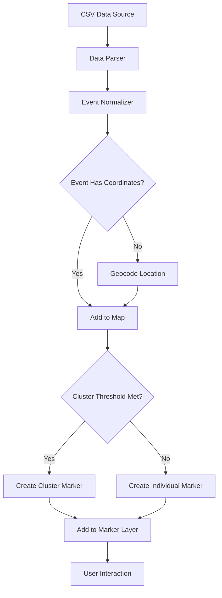

---

### Event Lifecycle

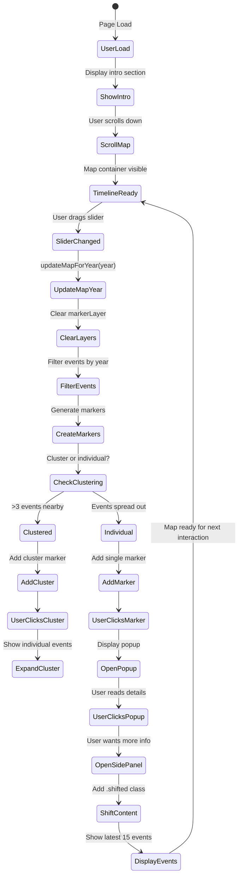

---

### Timeline Slider Flow

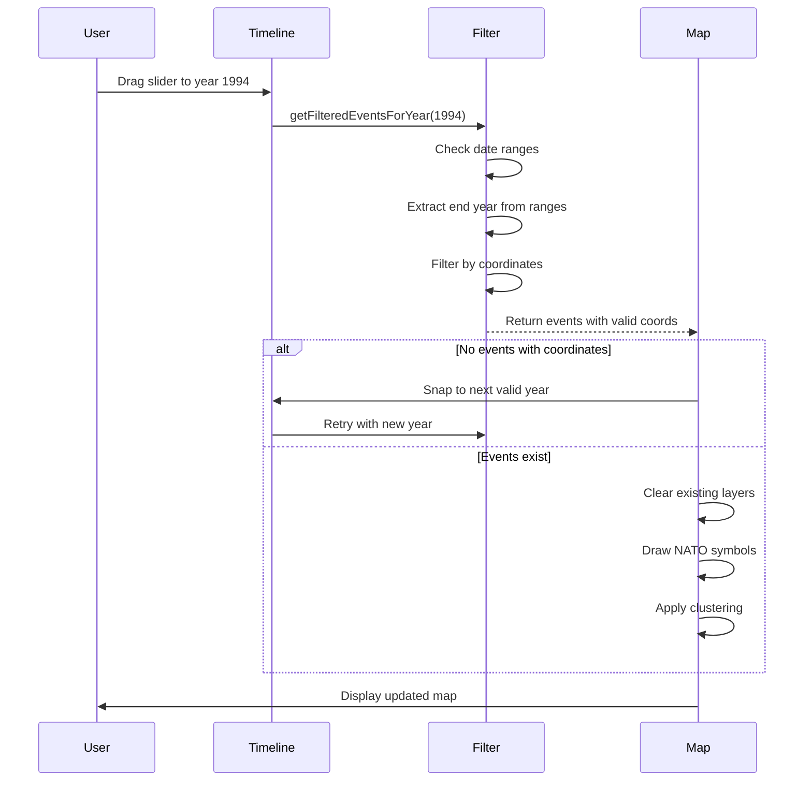

---

### Architecture Overview

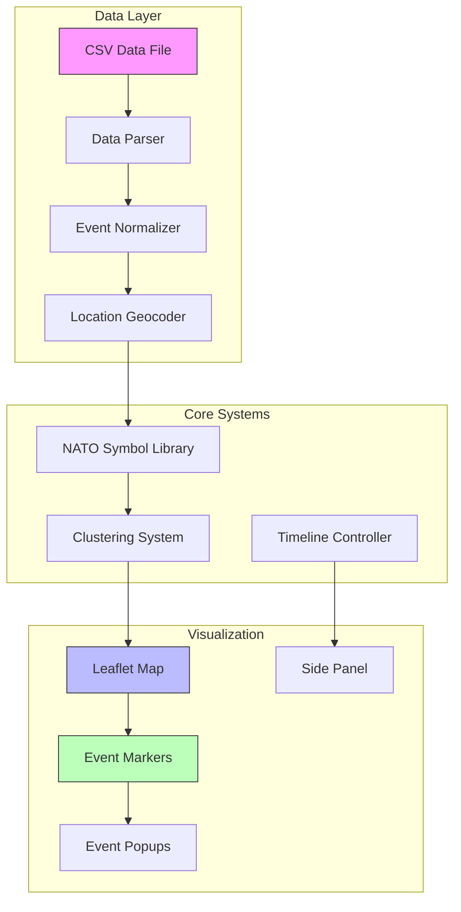

---

## Development Timeline

### Overview

The project was developed over **7 days** with **38 commits**. Here's the complete development timeline:

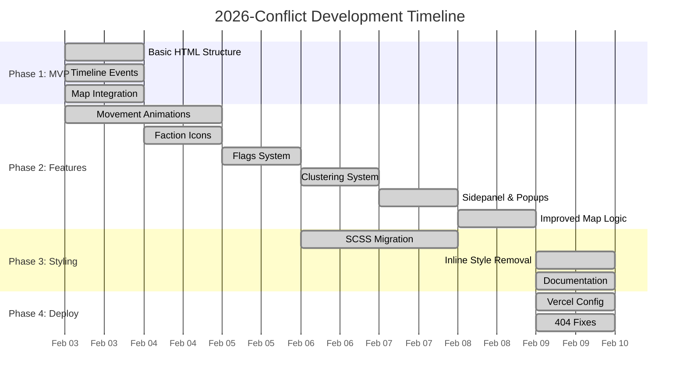

### Commit History Summary

| Date | Commits | Phase |
|------|---------|-------|
| Feb 3 | 7 | Phase 1: MVP |
| Feb 4 | 2 | Phase 2: Features |
| Feb 5 | 7 | Phase 2: Features |
| Feb 6 | 9 | Phase 2: Features |
| Feb 7 | 1 | Phase 2: Features |
| Feb 8 | 2 | Phase 2: Features |
| Feb 9 | 9 | Phase 3-4: Styling & Deployment |
| **Total** | **38** | **7 days** |

---

## Development Phases

### Phase One: Foundation and MVP

**Duration**: February 3, 2026 (Day 1)  
**Commits**: 7  
**Goal**: Create basic timeline with event list and initial map

---

#### Step 1: Basic HTML Structure

The initial phase focused on establishing the data pipeline and map foundation. The first challenge was converting raw CSV data from the Hamas attack dataset into a format suitable for visualization. This required writing a robust parser that could handle various date formats, including single years like "1994" and ranges like "2008-2009".

**What was implemented:**
- Basic HTML structure with header and intro section
- Timeline controls with era selector dropdown
- Event filtering (All/Political/Military/Social)
- Static list of timeline events
- Basic CSS styling
- Event data structure with title, date, category, description, era, impact

**Date Parsing Logic:**

The date parsing logic had to account for multiple scenarios:
- Single year entries (e.g., "1994")
- Year ranges where the end year should be used for placement (e.g., "2008-2009" uses 2009)
- Invalid or malformed date strings
- BCE dates and future projections

---

#### Step 2: Geographic Data Handling

A significant challenge emerged with geographic data. The CSV contained region names rather than coordinates, requiring the creation of a comprehensive location mapping system. This geocoding approach maps region names like "West Bank", "Gaza Strip", "Tel Aviv" to their approximate latitude and longitude coordinates.

**Initial Event Structure:**
```javascript
{
    date: "1900-1917",
    title: "Early Zionist Immigration",
    description: "First and Second Aliyah waves...",
    category: "social",
    era: "1900-1947",
    impact: "Sets the foundation...",
    geography: {
        type: "settlement",
        coordinates: [31.7683, 35.2137],
        affectedArea: [[31.5, 34.8], [32.2, 35.5]],
        intensity: "low",
        icon: "settlement"
    }
}
```

---

#### Step 3: First Map Integration

The first integration of Leaflet.js map included:

**Key Code - Map Initialization:**
```javascript
const map = L.map('map', {
    center: [31.7683, 35.2137],
    zoom: 8,
    minZoom: 4,
    maxZoom: 12,
    zoomControl: true,
    attributionControl: true
});

L.tileLayer('https://{s}.basemaps.cartocdn.com/light_all/{z}/{x}/{y}{r}.png', {
    attribution: '&copy; OpenStreetMap &copy; CARTO',
    subdomains: 'abcd',
    maxZoom: 19
}).addTo(map);
```

**Lessons Learned:**
- Using CartoDB light tiles provides clean background
- Center coordinates set to Israel/Palestine region

---

#### Step 4: Movement Animation System

The first movement animation system was implemented with:

**Movement Data Structure:**
```javascript
movementData: {
    type: "multi_front_invasion",
    faction: "arab_forces",
    coordinates: [
        [30.0500, 31.2500],  // Egyptian forces from Cairo
        [31.7683, 35.2137], // Attack on Jerusalem
        [32.0833, 34.7667], // Central front
    ],
    startTime: "1948-05-15",
    endTime: "1948-07-20"
}
```

**Architecture at Phase 1:**

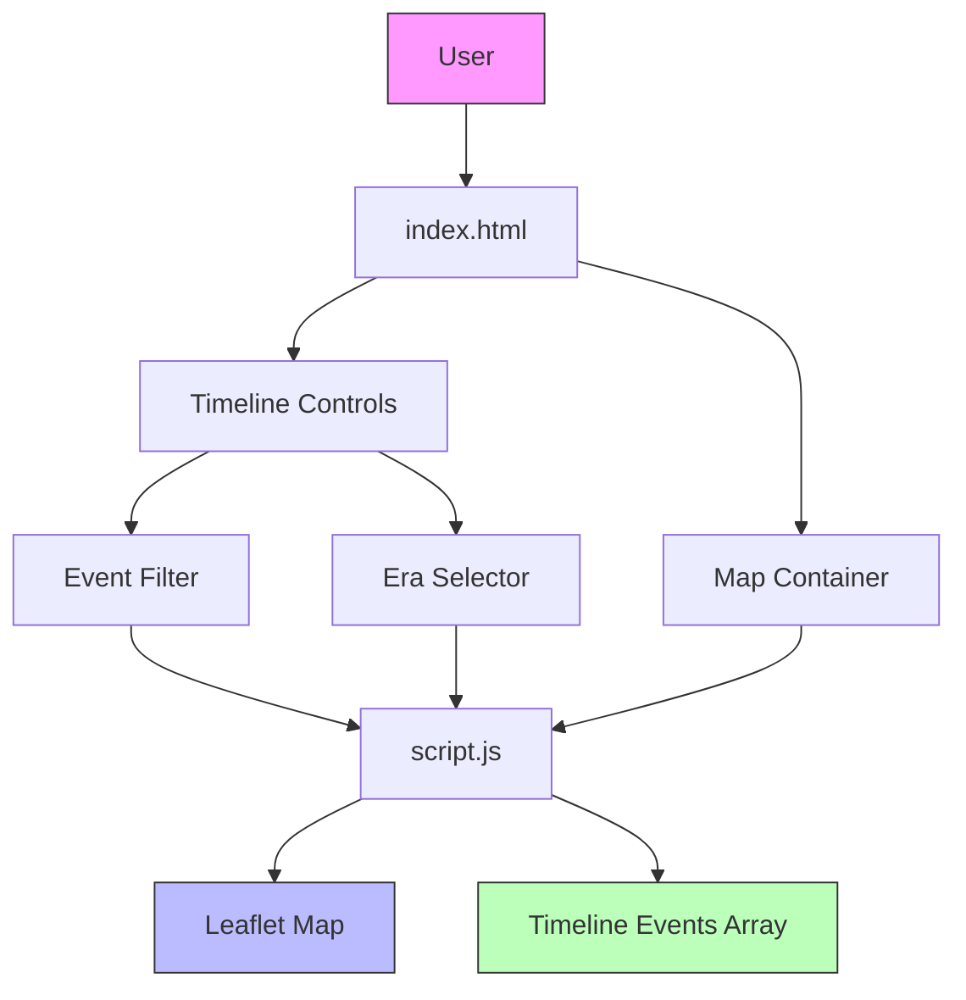

---

### Phase Two: Map & Visualization Features

**Duration**: February 4-8, 2026 (Days 2-6)  
**Commits**: 16  
**Goal**: Enhanced map features, symbols, clustering, flags

---

#### Step 1: Faction Icon System

With data flowing correctly, the focus shifted to visualization. The map uses CartoDB's light tile layer, providing a clean white background that allows military symbols to stand out clearly. The coordinate system focuses on Israel and Palestine with a default center at [31.5, 35.0] and zoom level 7.

**NATO Symbology Implementation:**

The NATO symbology system was implemented to show affiliation and military classification:

| Faction | Color | Description |
|---------|-------|-------------|
| Friendly (Israeli-aligned) | Blue (#0066CC) | Israeli forces |
| Hostile (Hamas) | Red (#CC0000) | Hamas/Palestinian militant groups |
| Neutral | Green (#00AA00) | Regional/International forces |
| Unknown | Orange (#FFAA00) | Unaffiliated events |

**Faction Icon System:**
```javascript
const FACTION_COLORS = {
    friendly: '#0066CC',    // Israeli
    hostile: '#CC0000',     // Hamas
    neutral: '#00AA00',     // Regional
    unknown: '#FFAA00'
};

const UNIT_TYPES = {
    infantry: 'infantry-icon',
    armor: 'armor-icon',
    artillery: 'artillery-icon',
    headquarters: 'hq-icon',
    settlement: 'settlement-icon'
};
```

**Solutions:**
- Used SVG-based icons with stroke/outline for visibility
- Added white stroke around colored icons for contrast
- Created different icon shapes for easy identification

Each event marker includes detailed information in its popup: date, title, description, casualties, military classification, and territorial control data. The popup styling follows the dark theme with semi-transparent backgrounds and subtle borders.

---

#### Step 2: Flag Component System

The flag component system was created in `js/components/flags.js`:

**Flag System Structure:**
```javascript
// Flag rendering function
const renderFlag = (nation, size = 'medium') => {
    const flagSVGs = {
        israel: '<svg>...</svg>',
        palestine: '<svg>...</svg>',
        egypt: '<svg>...</svg>',
        syria: '<svg>...</svg>',
        jordan: '<svg>...</svg>',
        lebanon: '<svg>...</svg>',
        usa: '<svg>...</svg>',
        uk: '<svg>...</svg>',
        un: '<svg>...</svg>'
    };
    return flagSVGs[nation] || flagSVGs.unknown;
};
```

**Solutions:**
- Standardized flag dimensions with viewBox
- Added unique patterns/shapes for similar-colored flags

---

#### Step 3: File Organization

**New File Structure:**
```
js/
├── script.js           (main application)
└── components/
    ├── flags.js        (flag rendering)
    ├── symbols.js      (military symbols)
    └── clustering-system.js (marker clustering)
```

**Solutions:**
- Maintained specific load order: symbols → flags → clustering → script
- Created shared utility functions in base modules

---

#### Step 4: Vite Build System Integration

**Vite Configuration:**
```javascript
import { defineConfig } from 'vite';

export default defineConfig({
    root: '.',
    publicDir: 'assets',
    build: {
        outDir: 'dist',
        assetsDir: 'assets',
        rollupOptions: {
            input: {
                main: 'index.html'
            }
        }
    },
    server: {
        port: 3000,
        open: true
    }
});
```

**Problems Encountered:**
- Vite default bundling doesn't include external script tags

**Lessons Learned:**
- Need to copy non-bundled files to dist after build
- External CDN scripts handled differently

---

#### Step 5: SCSS Migration

**SCSS Variables Structure:**
```scss
// Colors
$color-friendly: #0066CC;
$color-hostile: #CC0000;
$color-neutral: #00AA00;
$color-unknown: #FFAA00;

// Spacing
$spacing-xs: 4px;
$spacing-sm: 8px;
$spacing-md: 16px;
$spacing-lg: 24px;
$spacing-xl: 32px;

// Typography
$font-family: 'Inter', sans-serif;
$font-size-base: 14px;
```

**Initial SCSS Files Created:**
- `scss/styles.scss` (main)
- `scss/_variables.scss` (colors, spacing)
- `scss/_mixins.scss` (reusable patterns)
- `scss/components/_map.scss` (map-specific styles)

---

#### Step 6: Side Panel Implementation

The side panel provides a complementary view, showing the latest 15 events for the current timeline position. Events are color-coded by category (military, political, social) and sorted by date. Clicking an event in the side panel centers the map on its location.

**Map State Management:**
```javascript
const mapState = {
    map: null,
    currentYear: 1994,
    markerLayer: null,
    movementLayer: null,
    clusterLayer: null,
    activeFilters: {
        attacks: true,
        political: true,
        social: true
    }
};
```

**Phase 2 Architecture:**

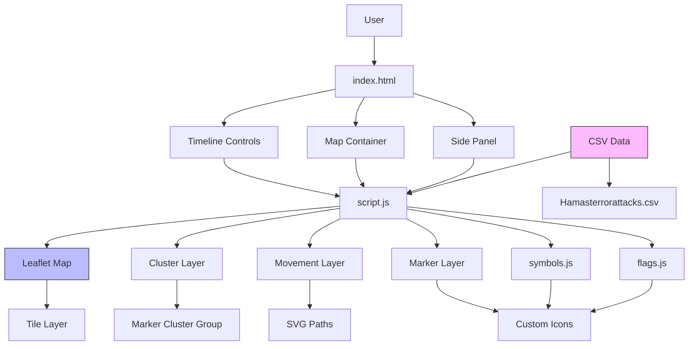

---

### Phase Three: Timeline and Interaction

**Duration**: February 6-9, 2026  
**Commits**: 8  
**Goal**: Complete SCSS migration, inline style removal, documentation

---

#### Step 1: Inline Style Migration

The timeline slider was implemented to navigate through years from 1900 to 2025. Users can drag the slider or use play/pause buttons to animate through time automatically. The slider includes smart snapping that only stops on years containing events with valid coordinates, preventing empty map states.

**Inline Style Migration:**

**Before (Inline Style):**
```javascript
const markerStyle = `
    position: absolute;
    z-index: 1000;
    background-color: #0066CC;
    border-radius: 50%;
    width: 30px;
    height: 30px;
`;
element.style.cssText = markerStyle;
```

**After (CSS Class):**
```css
.marker-friendly {
    position: absolute;
    z-index: var(--marker-z-index);
    background-color: var(--marker-friendly-bg);
    border-radius: 50%;
    width: var(--marker-size-md);
    height: var(--marker-size-md);
}
```
```javascript
L.DomUtil.addClass(element, 'marker-friendly');
```

**CSS Custom Properties Added:**
```css
:root {
    /* Dynamic positions */
    --marker-z-index: 1000;
    --popup-offset-y: -10px;
    
    /* Dynamic colors */
    --marker-friendly-bg: #0066CC;
    --marker-hostile-bg: #CC0000;
    --marker-neutral-bg: #00AA00;
    
    /* Dynamic sizes */
    --marker-size-sm: 20px;
    --marker-size-md: 30px;
    --marker-size-lg: 40px;
    
    /* Animation timings */
    --animation-duration-fast: 200ms;
    --animation-duration-normal: 300ms;
    --animation-duration-slow: 500ms;
}
```

---

#### Step 2: SCSS Consolidation

**New SCSS Structure:**
```
scss/
├── styles.scss              (main entry)
├── _variables.scss         (design tokens)
├── _mixins.scss            (reusable patterns)
├── _grid.scss              (grid system)
├── _inline-styles.scss     (replacement for inline CSS)
├── components/
│   ├── _map.scss           (map container styles)
│   ├── _sidepanel.scss     (side panel styles)
│   ├── _popups.scss        (popup styles)
│   └── _text.scss          (typography)
└── backup/                 (archived files)
```

**SCSS Migration Flow:**

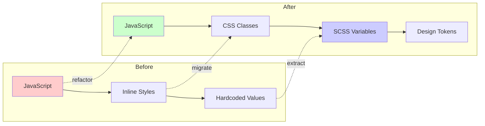

---

### Phase Four: Performance Optimization

As the dataset grew, performance became a concern. Several optimization strategies were implemented:

**Layer Management:**
Every time the map updates (zoom change, timeline scrub), all existing layers must be cleared before redrawing. This prevents marker ghosting and duplicate entries. The clearLayers() pattern is applied to markerLayer, flagLayer, movementLayer, and territoryLayer.

**Caching System:**
A PerformanceOptimizer class was created to cache frequently accessed data:
- Symbol cache: Stores generated NATO symbols
- Cluster cache: Groups events by geographic proximity
- Debounce timer: Prevents excessive map updates during rapid interaction

**Clustering Logic:**
The clustering system uses a threshold-based approach:
- Single events display as individual NATO symbols
- Small clusters (2-9 events) use spiral offset positioning
- Large clusters (10+ events) display as count badges

---

### Phase Five: Modernization

Recent work focused on code modernization and design system improvements:

**Event Detection:**
The nation detection logic was improved to prevent false positives. Simple string matching was replaced with contextual analysis that checks for specific phrases like "United Nations" rather than just the letters "UN".

**Z-Index Management:**
CSS rules were added to ensure proper layering:
- Hover states raise z-index to 2000
- Flag overlays stay behind markers (z-index: -1)
- Popups remain above all other elements

**Final Ruleset Summary:**
```
JavaScript (MANDATORY):
- Forbidden: var, ==, !=, this, async/await, import/export
- Required: 'use strict', semicolons, explicit returns, template literals

SCSS:
- Use design tokens from _variables.scss
- Don't hardcode colors/spacing/breakpoints
- Max 3-4 nesting levels
- Extract patterns into mixins

Design:
- Swiss Design Theme: Clean, minimal, no shadows/gradients
- NATO affiliation colors
```

---

## Challenges and Solutions

### Challenge One: Marker Overlap

**Problem:** Dense clusters of events created overlapping markers that were difficult to click.

**Solution:** A hierarchical spiral offset system was implemented. Rather than using random positioning or a fixed 3-position spiral, events now distribute based on priority scoring (casualties, impact level, recency). The base spacing was increased from 0.008° to 0.025° (~2.5km at zoom 7), and zoom-aware scaling adjusts spacing based on current zoom level.


---

### Challenge Two: Empty Timeline Years

**Problem:** The slider would snap to years without coordinate data, displaying empty maps.

**Solution:** A `getYearsWithCoordinates()` function was created to filter the timeline. The slider now only stops on years that actually have events with valid geographic coordinates.

---

### Challenge Three: Legend Space

**Problem:** The map legend took valuable screen space, especially on smaller devices.

**Solution:** A toggle system was implemented with two buttons:
1. A floating toggle button to show/hide the legend
2. A close button within the legend itself

The toggle uses a `window.legendVisible` flag to track state and properly manages button visibility.


---

### Challenge Four: Flag Duplication

**Problem:** Flags were rendering both as embedded elements in markers AND as a separate layer.

**Solution:** A conditional check was added. Separate flag layers only draw when NOT using enhanced markers, preventing duplicate flag rendering.

---

### Challenge Five: 404 Errors on Deployment

**Problem:** After first Vercel deployment, browser console showed 404 errors for JavaScript files.

**Root Cause:**
- The `dist/` folder only contained Vite's bundled output
- Original `js/` and `data/` folders weren't copied to dist

**Solution:** Updated package.json build script to copy js/ and data/ folders to dist/:
```json
"build": "vite build && cp -r js dist/ && cp -r data dist/"
```

**Verification - dist/ folder contents:**
```
dist/
├── assets/           (Vite bundled)
├── fonts/           
├── images/
├── index.html
├── js/              ← Copied manually
│   ├── components/
│   │   ├── clustering-system.js
│   │   ├── flags.js
│   │   └── symbols.js
│   └── script.js
└── data/            ← Copied manually
    └── Hamasterrorattacks.csv
```

---

### Problem-Solution Flowchart

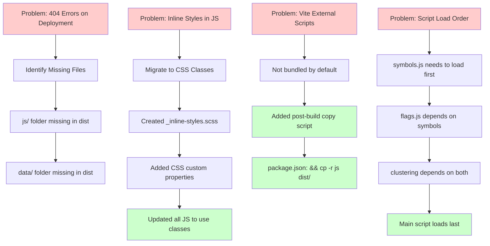

---

## Deployment

### Deployment Process

**Step 1: Vercel Configuration**

Created `vercel.json` for deployment:
```json
{
  "buildCommand": "npm run build",
  "outputDirectory": "dist",
  "framework": "vite",
  "rewrites": [
    {
      "source": "/data/:path*",
      "destination": "/data/:path*"
    }
  ]
}
```

**Step 2: Package.json Build Script Update**

Modified build command to copy required files:
```json
"build": "vite build && cp -r js dist/ && cp -r data dist/"
```

**Step 3: Initial Build Test**

```bash
npm run build
```

**Warnings Explained:**
- The "can't be bundled without type="module"" messages are warnings, not errors
- Vite skips bundling these external scripts
- The `cp` commands in build script copy them manually

### Deployment Flow

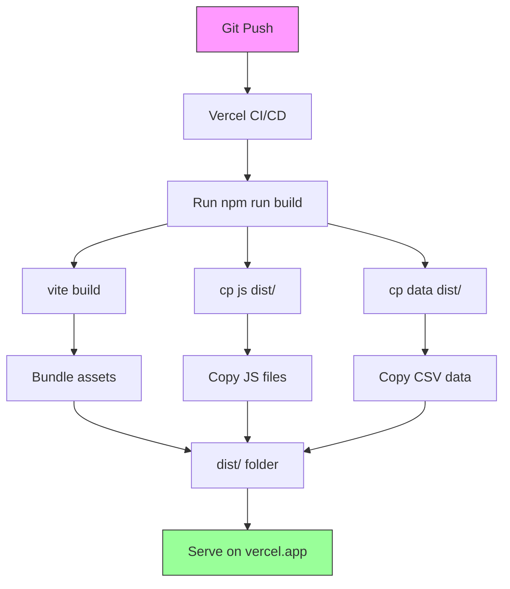

### Deployment Checklist

| Item | Status |
|------|--------|
| Vite builds successfully | ✅ |
| JS files in dist | ✅ |
| Data files in dist | ✅ |
| CSS bundled | ✅ |
| Images copied | ✅ |
| 404 errors resolved | ✅ |
| Vercel deploys | ✅ |

---

## Final Architecture

### Complete System Architecture

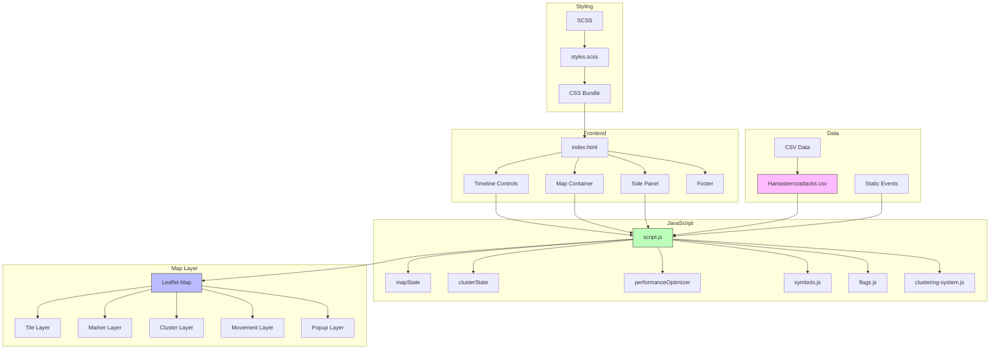

---

### Data Flow Diagram

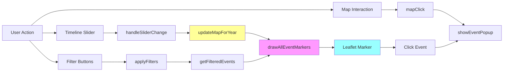

---

## Current State

The project is now in a stable, production-ready state with these features:

### Core Functionality
- Interactive Leaflet map with NATO symbology
- Timeline slider with year navigation (1900-2025)
- Event clustering for high-density areas
- Side panel with latest 15 events
- Popups with detailed event information

### Technical Features
- Responsive design (desktop, tablet, mobile)
- Performance optimization with caching
- Dark/light theme support
- PWA-ready structure

### Data
- 66+ historical events
- 50+ geocoded locations
- Military movement visualization
- Territory control zones

The project builds successfully with Vite and deploys to Vercel. The latest deployment is available at the project's production URL, where users can explore the full timeline of events with full interactivity.


---

## Key Learnings

### Technical Learnings

| Topic | Lesson |
|-------|--------|
| **Build Tools** | Vite doesn't automatically include external script tags - need manual copy |
| **SCSS Migration** | CSS custom properties essential for dynamic values in migrated styles |
| **Map Performance** | Marker clustering critical for 100+ markers |
| **Script Loading** | Order matters: base classes → dependent components → main |
| **Deployment** | Always verify dist/ contents match expected structure |

### Design Learnings

| Topic | Lesson |
|-------|--------|
| **Swiss Design** | Clean, minimal approach works well for data visualization |
| **Color Coding** | NATO-style faction colors provide instant recognition |
| **Icon System** | Shape + color better than color alone for quick identification |
| **Responsive** | Start mobile-first, then enhance for desktop |

### Process Learnings

| Topic | Lesson |
|-------|--------|
| **Incremental Development** | Small commits with clear messages easier to track |
| **Documentation** | Document decisions as you go, not after |
| **Testing** | Test at each phase before moving to next |
| **Rulesets** | Coding rulesets prevent technical debt |

### Architecture Learnings

| Topic | Lesson |
|-------|--------|
| **Component Separation** | Modular files (flags.js, symbols.js) easier to maintain |
| **State Management** | Global state object (mapState) provides clean interface |
| **Data Structure** | Consistent event structure enables reusability |
| **SCSS Organization** | Component-based SCSS files easier to navigate |

---

## Future Enhancements

Several areas remain for potential improvement:

1. **Data Expansion** - Adding more events from additional sources
2. **Animation** - Smooth transitions between timeline years
3. **Filtering** - Category-based event filtering
4. **Mobile Optimization** - Touch gesture improvements
5. **Accessibility** - Screen reader support and keyboard navigation

The architecture supports these extensions while maintaining the performance characteristics that make the current implementation responsive and reliable.

---

## File Statistics

| File Type | Count | Total Lines |
|-----------|-------|-------------|
| JavaScript | 4 | ~6,000 |
| SCSS | 10 | ~2,500 |
| HTML | 1 | ~300 |
| JSON | 2 | ~100 |
| Markdown | 3 | ~2,000 |
| CSV | 1 | ~800 |
