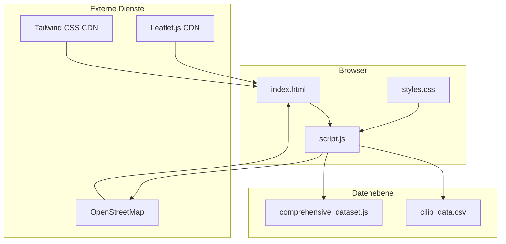
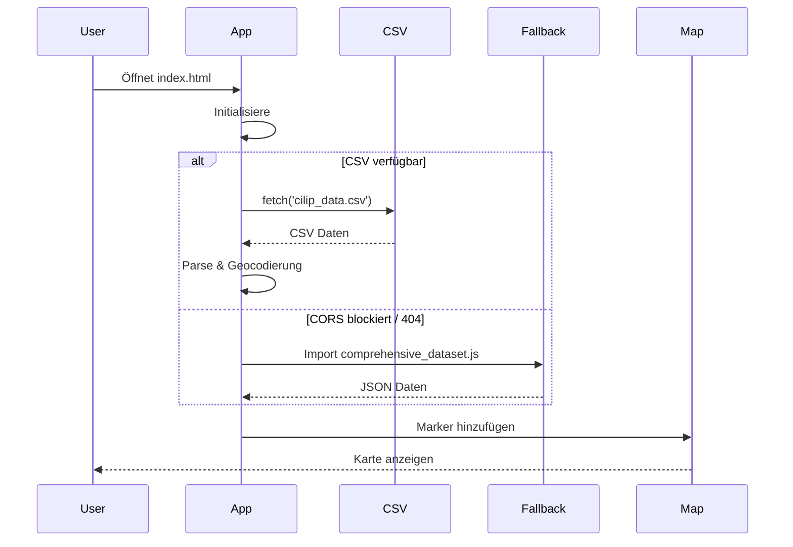
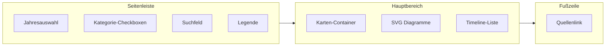
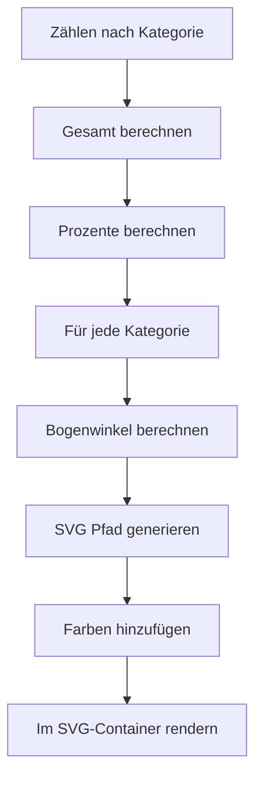

# Polizeischüsse Deutschland

## Projektübersicht

**Polizeischüsse Deutschland** ist eine interaktive Webanwendung, die über 529 dokumentierte Vorfälle von Polizei-Schusswaffeneinsätzen in Deutschland von 1976 bis 2025 visualisiert. Die Daten werden von CILIP (Bürgerrechte & Polizei) gesammelt, einer Organisation, die diese Vorfälle seit 1976 dokumentiert.

Dieses Projekt macht die Daten durch eine intuitive Oberfläche mit Karten, Diagrammen undSuchfunktionen zugänglich.

---

## Motivation

Offizielle Statistiken zu Polizeischüssen in Deutschland sind unvollständig und oft schwer zugänglich. CILIP leistet seit fast 50 Jahren wichtige Arbeit bei der Dokumentation dieser Vorfälle, aber ihre Daten waren nur in verstreuten Berichten und PDFs verfügbar.

Das Ziel dieses Projekts war:
1. Die CILIP-Daten in ein verwendbares Format aggregieren
2. Vorfälle auf einer interaktiven Karte visualisieren
3. Filter- und Suchfunktionen bereitstellen
4. Die Daten für Journalisten, Forscher und die Öffentlichkeit zugänglich machen

---

## Systemarchitektur

### Client-seitiges Design

Die Anwendung läuft vollständig im Browser ohne benötigten Backend. Dies war beabsichtigt - es hält die Bereitstellung einfach und stellt sicher, dass die Anwendung funktioniert, selbst wenn die Datenquelle offline geht.



### Fallback-Mechanismus

Die Anwendung implementiert einen robusten Fallback-Mechanismus, um sicherzustellen, dass die Karte immer funktioniert:



---

## Daten-Pipeline

### CSV-Struktur

Die primäre Datenquelle ist eine CSV-Datei mit 21 Spalten:

| Spalte | Beschreibung |
|--------|-------------|
| Fall | Aktenzeichen |
| Name | Name des Opfers |
| Geschlecht | Geschlecht |
| Alter | Alter |
| Datum | Datum |
| Ort | Stadt |
| Bundesland | Bundesland |
| Schussort | Ortstyp |
| Szenarium | Szenario |
| Quellen | Quellen |
| Waffen | Waffentyp |
| ... | Weitere Felder |

### Geocodierungsprozess

Standorte werden mit der Nominatim API von OpenStreetMap geokodiert:

```javascript
async function geocodeLocation(city, state) {
    const query = `${city}, ${state}, Germany`;
    const response = await fetch(
        `https://nominatim.openstreetmap.org/search?format=json&q=${encodeURIComponent(query)}`
    );
    const data = await response.json();
    
    if (data.length > 0) {
        return {
            lat: parseFloat(data[0].lat),
            lon: parseFloat(data[0].lon)
        };
    }
    return null;
}
```

### Datenqualität

| Metrik | Wert |
|--------|-------|
| Vorfälle insgesamt | 529 |
| Zeitraum | 1976-2025 |
| Geokodiert | ~85% |
| Kategorien | tödlich, verletzt, Warnschuss |

---

## Frontend-Implementierung

### Layout



### Leaflet-Karten-Setup

```javascript
const map = L.map('map', {
    center: [51.1657, 10.4515],
    zoom: 6,
    minZoom: 5,
    maxZoom: 15
});

L.tileLayer('https://{s}.basemaps.cartocdn.com/light_all/{z}/{x}/{y}{r}.png', {
    attribution: '© OpenStreetMap contributors',
    maxZoom: 19
}).addTo(map);
```

### Marker-Clustering

Für dichte städtische Gebiete werden Marker geclustert:

```javascript
const clusterGroup = L.markerClusterGroup({
    chunkedLoading: true,
    maxClusterRadius: 50,
    spiderfyOnMaxZoom: true,
    showCoverageOnHover: false
});
```

---

## SVG-Diagramme

### Kategorie-Tortendiagramm



### SVG-Pfad-Generierung

```javascript
function createArcPath(cx, cy, radius, startAngle, endAngle) {
    const start = polarToCartesian(cx, cy, radius, endAngle);
    const end = polarToCartesian(cx, cy, radius, startAngle);
    const largeArcFlag = endAngle - startAngle <= 180 ? 0 : 1;
    
    return [
        'M', cx, cy,
        'L', start.x, start.y,
        'A', radius, radius, 0, largeArcFlag, 1, end.x, end.y,
        'Z'
    ].join(' ');
}
```

---

## Hauptfunktionen

### 1. Dynamische Filterung

```javascript
function getFilteredData() {
    const yearFilter = document.getElementById('yearFilter').value;
    const showFatal = document.getElementById('fatalShots').checked;
    const showInjured = document.getElementById('injuringShots').checked;
    const showWarning = document.getElementById('warningShots').checked;
    const searchQuery = document.getElementById('searchInput').value.toLowerCase();
    
    return allIncidents.filter(incident => {
        const matchesYear = yearFilter === 'all' || incident.date.startsWith(yearFilter);
        
        const matchesCategory = 
            (showFatal && incident.category === 'fatal') ||
            (showInjured && incident.category === 'injured') ||
            (showWarning && incident.category === 'warning');
        
        const matchesSearch = 
            incident.city.toLowerCase().includes(searchQuery) ||
            incident.state.toLowerCase().includes(searchQuery) ||
            incident.description?.toLowerCase().includes(searchQuery);
        
        return matchesYear && matchesCategory && matchesSearch;
    });
}
```

### 2. Echtzeit-Statistiken

Vier Tortendiagramme werden dynamisch aktualisiert:
- Kategorien (tödlich/verletzt/Warnschuss)
- Waffen (Schusswaffe/Messer/sonstige)
- Orte (Innenbereich/Außenbereich/unbekannt)
- Bewaffnungsstatus

### 3. Timeline-Ansicht

Klickbare Vorfallsliste, die Kartenmarker fokussiert:

```javascript
function renderTimeline(incidents) {
    const sorted = incidents.sort((a, b) => new Date(b.date) - new Date(a.date));
    
    sorted.forEach(incident => {
        const item = document.createElement('div');
        item.className = 'timeline-item';
        item.innerHTML = `
            <span class="date">${formatDate(incident.date)}</span>
            <span class="location">${incident.city}</span>
            <span class="category category-${incident.category}"></span>
        `;
        item.onclick = () => focusMarker(incident.id);
    });
}
```

---

## Screenshots

### Kartenübersicht


Vollständige Anwendung mit Seitenleisten-Steuerung und interaktiver Karte.

### Karte mit Popup


Einzelne Vorfalldetails-Popup bei Marker-Klick.

### Statistik-Diagramme


SVG-gerenderte Tortendiagramme mit Vorfalls Kategorien, Waffen und Standorten.

---

## Technologie-Stack

| Komponente | Technologie |
|-----------|------------|
| HTML5 | Semantisches Markup |
| Tailwind CSS | Styling (CDN) |
| Vanilla JavaScript | Logik |
| Leaflet.js | Karten |
| MarkerCluster | Clustering |
| OpenStreetMap | Kartenkacheln |
| SVG | Diagramm-Rendering |

---

## Datenqualität & Einschränkungen

### Bekannte Probleme

1. **Unvollständige Daten**: Der Datensatz repräsentiert wahrscheinlich nicht alle tatsächlichen Vorfälle - viele Fälle bleiben undokumentiert
2. **Quellen-Bias**: Daten kommen hauptsächlich aus Medienberichten, die außergewöhnliche Fälle bevorzugen können
3. **Geocodierung**: Einige Standorte haben ungefähre Koordinaten aufgrund unpräziser Standortdaten
4. **Kategorisierung**: Klassifikation der Vorfälle (tödlich/verletzt/Warnschuss) kann sich im Laufe der Zeit geändert haben

### Einschränkungen

- Keine Vollständigkeitsgarantie
- Daten beginnen 1976 (Lücken in frühen Jahren)
- Einige Vorfälle缺乏 präzise Standortdaten

---

## Entwicklungsprozess

### Phase 1: Datensammlung

1. CILIP-Website nach Vorfalldaten gescraped
2. Manuelle Dateneingabe aus PDF-Berichten
3. Geocodierung mit Nominatim API

### Phase 2: Kernentwicklung

1. Leaflet-Karte mit OpenStreetMap-Kacheln eingerichtet
2. Marker-Rendering mit Clustering implementiert
3. Popup-Details für jeden Vorfall hinzugefügt

### Phase 3: Funktionen

1. Dynamische Filterung gebaut (Jahr, Kategorie)
2. SVG-Tortendiagramme erstellt
3. Suchfunktion hinzugefügt
4. Timeline-Ansicht implementiert

### Phase 4: Verfeinerung

1. Responsives Design
2. Fallback-Datenmechanismus
3. Dokumentation

---

## Zukünftige Verbesserungen

- [ ] Dunkelmodus-Umschalter
- [ ] Mobile PWA
- [ ] Heatmap-Overlay
- [ ] PDF-Export
- [ ] Timeline-Animation
- [ ] API-Integration für Echtzeit-Updates

---

## Erkenntnisse

1. **Client-seitige Architektur**: Sie einfach zu halten ohne Backend machte die Bereitstellung trivial und das Vercel-Hosting nahtlos.

2. **Fallbacks sind wichtig**: Externe Datenquellen können ausfallen - habe immer einen Backup-Plan mit eingebetteten Daten.

3. **SVG für Diagramme**: Eigene Diagramm-Rendering zu bauen ist mehr Arbeit, gibt aber volle Kontrolle über das Styling.

4. **Offene Daten Herausforderungen**: Mit realen Daten zu arbeiten erfordert das Handhaben von fehlenden Werten, Inkonsistenzen und variierender Qualität.

---

## Fazit

Dieses Projekt demonstriert, wie offene Daten und moderne Webtechnologien komplexe Informationen zugänglich machen können. Durch die Kombination von Leaflet.js für Kartierung und benutzerdefinierten SVG-Diagrammen haben wir ein Tool erstellt, das Forschern, Journalisten und Bürgern hilft,Fast 50 Jahre Polizei-Schusswaffenvorfälle in Deutschland zu erkunden.

Der Code ist Open Source auf GitHub verfügbar. Beiträge sind willkommen!

---

## Links

- Live Demo: [police-shootings-germany.vercel.app](https://police-shootings-germany.vercel.app/)
- Repository: [GitHub](https://github.com/ModernAmusements/Police-Shootings-Germany)
- Dataset: [Kaggle](https://www.kaggle.com/datasets/nathanamusement/german-police-shootings-1976-2026)
- Datenquelle: [CILIP](https://cilip.de/schuesse/)

*Erstellt mit Leaflet.js, SVG und Vanilla JavaScript*