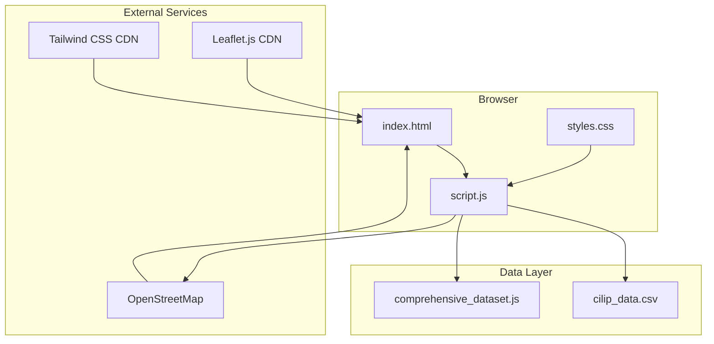
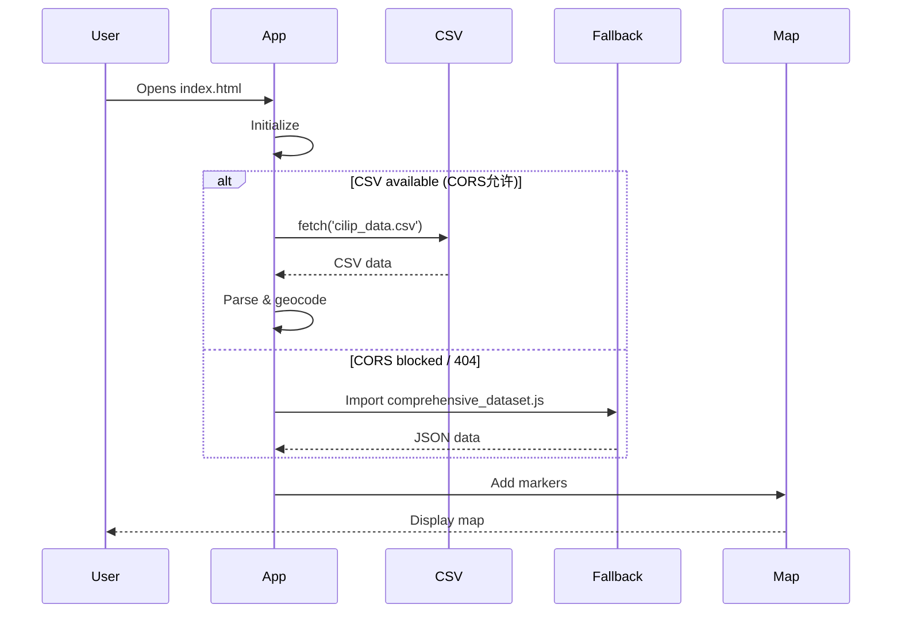
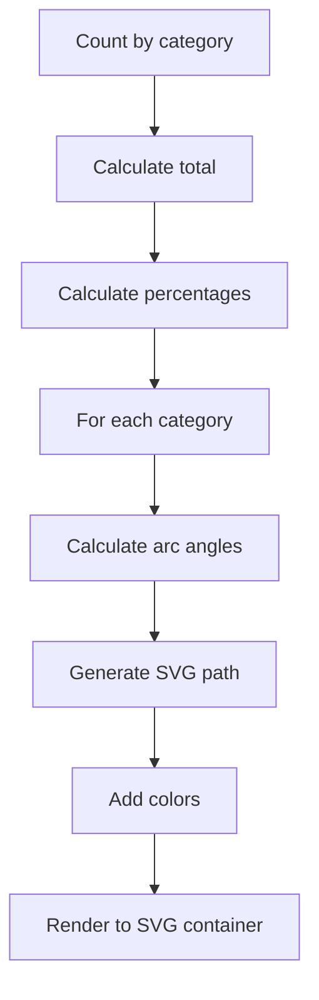

# Police Shootings Germany

## Project Overview

**Police Shootings Germany** is an interactive web application that visualizes over 529 documented incidents of police firearm deployments in Germany from 1976 to 2025. The data is collected by CILIP (Bürgerrechte & Polizei), an organization that has been documenting these incidents since 1976.

This project makes the data accessible to the public through an intuitive interface with maps, charts, and search capabilities.

---

## Motivation

Official statistics on police shootings in Germany are incomplete and often difficult to access. CILIP has been doing the important work of documenting these incidents for nearly 50 years, but their data was only available in scattered reports and PDFs.

The goal of this project was to:
1. Aggregate the CILIP data into a usable format
2. Visualize incidents on an interactive map
3. Provide filtering and search capabilities
4. Make the data accessible to journalists, researchers, and the public

---

## System Architecture

### Client-Side Design

The application runs entirely in the browser with no backend required. This was intentional - it keeps deployment simple and ensures the application works even if the data source goes offline.



### Fallback Mechanism

The application implements a robust fallback mechanism to ensure the map always works:



---

## Data Pipeline

### CSV Structure

The primary data source is a CSV file with 21 columns:

| Column | Description |
|--------|-------------|
| Fall | Case number |
| Name | Victim name |
| Geschlecht | Gender |
| Alter | Age |
| Datum | Date |
| Ort | City |
| Bundesland | Federal state |
| Schussort | Location type |
| Szenarium | Scenario |
| Quellen | Sources |
| Waffen | Weapon type |
| ... | More fields |

### Geocoding Process

Locations are geocoded using OpenStreetMap's Nominatim API:

```javascript
async function geocodeLocation(city, state) {
    const query = `${city}, ${state}, Germany`;
    const response = await fetch(
        `https://nominatim.openstreetmap.org/search?format=json&q=${encodeURIComponent(query)}`
    );
    const data = await response.json();
    
    if (data.length > 0) {
        return {
            lat: parseFloat(data[0].lat),
            lon: parseFloat(data[0].lon)
        };
    }
    return null;
}
```

### Data Quality

| Metric | Value |
|--------|-------|
| Total incidents | 529 |
| Date range | 1976-2025 |
| Geocoded | ~85% |
| Categories | fatal, injured, warning |

---

## Frontend Implementation

### Layout


### Leaflet Map Setup

```javascript
const map = L.map('map', {
    center: [51.1657, 10.4515],
    zoom: 6,
    minZoom: 5,
    maxZoom: 15
});

L.tileLayer('https://{s}.basemaps.cartocdn.com/light_all/{z}/{x}/{y}{r}.png', {
    attribution: '© OpenStreetMap contributors',
    maxZoom: 19
}).addTo(map);
```

### Marker Clustering

For dense urban areas, markers are clustered:

```javascript
const clusterGroup = L.markerClusterGroup({
    chunkedLoading: true,
    maxClusterRadius: 50,
    spiderfyOnMaxZoom: true,
    showCoverageOnHover: false
});
```

---

## SVG Charts

### Category Pie Chart



### SVG Path Generation

```javascript
function createArcPath(cx, cy, radius, startAngle, endAngle) {
    const start = polarToCartesian(cx, cy, radius, endAngle);
    const end = polarToCartesian(cx, cy, radius, startAngle);
    const largeArcFlag = endAngle - startAngle <= 180 ? 0 : 1;
    
    return [
        'M', cx, cy,
        'L', start.x, start.y,
        'A', radius, radius, 0, largeArcFlag, 1, end.x, end.y,
        'Z'
    ].join(' ');
}
```

---

## Key Features

### 1. Dynamic Filtering

```javascript
function getFilteredData() {
    const yearFilter = document.getElementById('yearFilter').value;
    const showFatal = document.getElementById('fatalShots').checked;
    const showInjured = document.getElementById('injuringShots').checked;
    const showWarning = document.getElementById('warningShots').checked;
    const searchQuery = document.getElementById('searchInput').value.toLowerCase();
    
    return allIncidents.filter(incident => {
        const matchesYear = yearFilter === 'all' || incident.date.startsWith(yearFilter);
        
        const matchesCategory = 
            (showFatal && incident.category === 'fatal') ||
            (showInjured && incident.category === 'injured') ||
            (showWarning && incident.category === 'warning');
        
        const matchesSearch = 
            incident.city.toLowerCase().includes(searchQuery) ||
            incident.state.toLowerCase().includes(searchQuery) ||
            incident.description?.toLowerCase().includes(searchQuery);
        
        return matchesYear && matchesCategory && matchesSearch;
    });
}
```

### 2. Real-time Statistics

Four pie charts update dynamically:
- Categories (fatal/injured/warning)
- Weapons (firearm/knife/other)
- Locations (indoor/outdoor/unknown)
- Armed status

### 3. Timeline View

Clickable incident list that focuses map markers:

```javascript
function renderTimeline(incidents) {
    const sorted = incidents.sort((a, b) => new Date(b.date) - new Date(a.date));
    
    sorted.forEach(incident => {
        const item = document.createElement('div');
        item.className = 'timeline-item';
        item.innerHTML = `
            <span class="date">${formatDate(incident.date)}</span>
            <span class="location">${incident.city}</span>
            <span class="category category-${incident.category}"></span>
        `;
        item.onclick = () => focusMarker(incident.id);
    });
}
```

---

## Screenshots

### Map Overview


Full application view with sidebar controls and interactive map.

### Map with Popup


Individual incident details popup on marker click.

### Statistics Charts


SVG-rendered pie charts showing incident categories, weapons, and locations.

---

## Technology Stack

| Component | Technology |
|-----------|------------|
| HTML5 | Semantic markup |
| Tailwind CSS | Styling (CDN) |
| Vanilla JavaScript | Logic |
| Leaflet.js | Maps |
| MarkerCluster | Clustering |
| OpenStreetMap | Map tiles |
| SVG | Chart rendering |

---

## Data Quality & Limitations

### Known Issues

1. **Incomplete data**: The dataset likely underrepresents actual incidents - many cases go unreported
2. **Source bias**: Data comes primarily from media reports, which may favor sensational cases
3. **Geocoding**: Some locations have approximate coordinates due to imprecise location data
4. **Categorization**: Classification of incidents (fatal/injured/warning) may have changed over time

### Limitations

- No guarantee of completeness
- Data starts from 1976 (gaps in early years)
- Some incidents lack precise location data

---

## Development Process

### Phase 1: Data Collection

1. Scraped CILIP website for incident data
2. Manual data entry from PDF reports
3. Geocoding using Nominatim API

### Phase 2: Core Development

1. Set up Leaflet map with OpenStreetMap tiles
2. Implemented marker rendering with clustering
3. Added popup details for each incident

### Phase 3: Features

1. Built dynamic filtering (year, category)
2. Created SVG pie charts
3. Added search functionality
4. Implemented timeline view

### Phase 4: Polish

1. Responsive design
2. Fallback data mechanism
3. Documentation

---

## Future Improvements

- [ ] Dark mode toggle
- [ ] Mobile PWA
- [ ] Heat map overlay
- [ ] PDF export
- [ ] Timeline animation
- [ ] API integration for real-time updates

---

## Lessons Learned

1. **Client-side architecture**: Keeping it simple with no backend made deployment trivial and Vercel hosting seamless.

2. **Fallbacks matter**: External data sources can fail - always have a backup plan with embedded data.

3. **SVG for charts**: Building your own chart rendering is more work but gives full control over styling.

4. **Open data challenges**: Working with real-world data requires handling missing values, inconsistencies, and varying quality.

---

## Conclusion

This project demonstrates how open data and modern web technologies can make complex information accessible. By combining Leaflet.js for mapping and custom SVG charts, we created a tool that helps researchers, journalists, and citizens explore nearly 50 years of police firearm incidents in Germany.

The code is open source and available on GitHub. Contributions are welcome!

---

## Links

- Live Demo: [police-shootings-germany.vercel.app](https://police-shootings-germany.vercel.app/)
- Repository: [GitHub](https://github.com/ModernAmusements/Police-Shootings-Germany)
- Dataset: [Kaggle](https://www.kaggle.com/datasets/nathanamusement/german-police-shootings-1976-2026)
- Data Source: [CILIP](https://cilip.de/schuesse/)

*Built with Leaflet.js, SVG, and vanilla JavaScript*