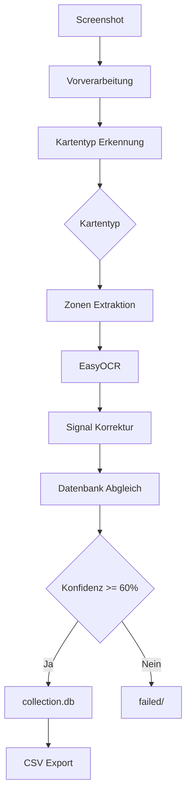

# Pokemon TCG Karten-Extraktor

## Projekt-Übersicht

**Pokemon TCG Karten-Extraktor** ist eine Python-basierte Desktop-Anwendung, die Pokemon TCG Pocket Karten automatisch extrahiert und verwaltet mit **OCR**, **Web-Scraping** und **SQLite**. Einfach einen Screenshot von jeder Karte im Spiel machen, und das System identifiziert sie automatisch, extrahiert die Daten und fügt sie zur Sammlungsdatenbank hinzu.

Die Motivation entstand aus der manuellen Katalogisierung von Hunderten von Karten - ein mühseliger Prozess, der Minuten pro Karte dauerte. Dieses Tool reduziert es auf Sekunden.

---

## Systemarchitektur

### Datenfluss



### Komponenten-Übersicht

| Komponente | Zweck |
|-----------|---------|
| `vorverarbeitung/` | Bildzuschnitt, Kontrastverbesserung |
| `extraktion/` | Erkennen von Pokemon/Trainer/Energy Karten |
| `ocr_engine/` | EasyOCR + Tesseract für Textextraktion |
| `api/local_lookup.py` | Multi-Signal Kartenabgleich |
| `database.py` | SQLite Sammlungsspeicher |

---

## Hauptfunktionen

### 1. Automatische Karten-Erkennung

Das System erkennt Kartentyp (Pokemon/Trainer/Energy) durch Analyse deutscher Keywords:

```python
pokemon_keywords = {"KP", "ENTWICKELT", "ENTWICKELT SICH", "BASIS", "PHASE"}
trainer_keywords = {"TRAINER", "ARTIKEL", "UNTERSTÜTZUNG", "STADION"}
```

### 2. OCR Signal Korrektur

EasyOCR liest manchmal KP-Werte falsch. Das System korrigiert häufige Fehler:

```python
# "502" -> "50", "802" -> "80"
def correct_hp(hp_str):
    match = re.match(r'^(\d)0?2$', hp_str)
    if match:
        return match.group(1) + "0"
    return hp_str
```

### 3. Multi-Signal Abgleich

| Strategie | Konfidenz | Wann verwendet |
|----------|----------|--------------|
| Name + Set | 95% | Exakter deutscher Name + Set-ID |
| Name + KP | 85% | Fuzzy Name + KP Übereinstimmung |
| KP + Angriff + Set | 85% | KP + Angriff + Set Kombination |
| KP + Schwäche + Set | 80% | KP + Schwäche + Set Kombination |
| Nur KP | 60% | Notlösung - nur KP |

### 4. Datenbank Scraping

Kartendaten von pokewiki.de gescraped:

- **2540 einzigartige Karten** in 17 Sets
- **124 einzigartige Fähigkeiten** mit Effektbeschreibungen
- **4509 Bild-URLs**

---

## Ergebnisse

- **Extraktionszeit**: ~3-5 Sekunden pro Karte
- **Erfolgsrate**: ~85% bei 60%+ Konfidenz
- **Datenabdeckung**: Alle 2540 deutschen Karten mit Bildern

---

## Screenshots

### Sammlungs-Übersicht


Zeigt die complete Sammlung mit Filterung nach Set, Seltenheit und Kartentyp.

### Karten-Detailansicht


Zeigt alle Kartendaten einschließlich Fähigkeiten, Angriffe, Schwäche und Rückzugskosten.

### Nach Set filtern


Filtern nach spezifischen Sets (A1, A2, PROMO, etc.).

### Name Filter


Schnelle Fuzzy-Suche nach Kartenname.

### Mobile Übersicht


Mobile-freundliche Übersicht aller Karten.

### Alle Sets Ansicht


Complete Ansicht aller gesammelten Sets mit Statistiken.

---

## Technologie-Stack

| Komponente | Technologie |
|-----------|-----------|
| Sprache | Python 3.10+ |
| OCR | EasyOCR + Tesseract |
| Datenbank | SQLite |
| Scraping | BeautifulSoup + Requests |
| Bildverarbeitung | OpenCV |

---

## Zukünftige Arbeit

- [ ] Bildbasiertes Matching mit Karten-Art hinzufügen
- [ ] Mobile App für Kamera-Erfassung implementieren
- [ ] Duplikaterkennung aus verschiedenen Sets hinzufügen
- [ ] Web-Interface für Sammlungs-Durchsuchung bauen

---

## Gelernte Lektionen

1. **Nachbearbeitung ist essentiell**: OCR ist nie perfekt. Baue robuste Korrekturlogik für häufige Fehlermodi.

2. **Scraping ist iterativ**: Erster Durchgang holt selten alles. Plane mehrere Durchgänge, um Lücken zu füllen.

3. **Konfidenz-Bewertung ist subjektiv**: 60% Schwellenwert funktioniert, aber einige Fehlpositive rutschen durch.

4. **Deutscher Text ist knifflig**: Sonderzeichen (ü, ö, ä) und zusammengesetzte Wörter verursachen Abgleichprobleme. Normalisieren vor dem Vergleichen.

---

## Fazit

Den Bau dieses Karten-Extraktors hat mir viel über OCR-Pipelines, Web-Scraping im großen Maßstab und Multi-Signal-Abgleichalgorithmen beigebracht. Die wichtigste Erkenntnis: **Beginne einfach, iteriere bei Fehlern**.

*Erstellt mit Python, EasyOCR, SQLite und jeder menge deutscher Kartendaten.*