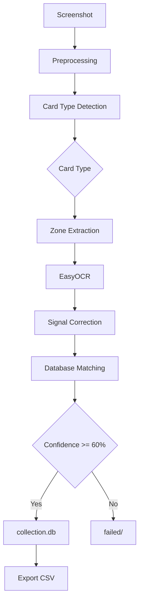

# Pokemon TCG Card Extractor

## Project Overview

**Pokemon TCG Card Extractor** is a Python-based desktop application that automatically extracts and manages Pokemon TCG Pocket cards using **OCR**, **web scraping**, and **SQLite**. Simply take a screenshot of any card in the game, and the system will automatically identify it, extract its data, and add it to your collection database.

The motivation came from manually cataloging hundreds of cards - a tedious process that took minutes per card. This tool reduces it to seconds.

---

## System Architecture

### Data Flow



### Component Breakdown

| Component | Purpose |
|-----------|---------|
| `preprocessing/` | Image cropping, contrast enhancement |
| `extraction/` | Detect Pokemon/Trainer/Energy card types |
| `ocr_engine/` | EasyOCR + Tesseract for text extraction |
| `api/local_lookup.py` | Multi-signal card matching |
| `database.py` | SQLite collection storage |

---

## Key Features

### 1. Automatic Card Detection

The system detects card type (Pokemon/Trainer/Energy) by analyzing German keywords:

```python
pokemon_keywords = {"KP", "ENTWICKELT", "ENTWICKELT SICH", "BASIS", "PHASE"}
trainer_keywords = {"TRAINER", "ARTIKEL", "UNTERSTÜTZUNG", "STADION"}
```

### 2. OCR Signal Correction

EasyOCR sometimes misreads HP values. The system corrects common errors:

```python
# "502" -> "50", "802" -> "80"
def correct_hp(hp_str):
    match = re.match(r'^(\d)0?2$', hp_str)
    if match:
        return match.group(1) + "0"
    return hp_str
```

### 3. Multi-Signal Matching

| Strategy | Confidence | When Used |
|----------|------------|-----------|
| Name + Set | 95% | Exact German name + set ID |
| Name + HP | 85% | Fuzzy name + HP match |
| HP + Attack + Set | 85% | HP + attack + set combo |
| HP + Weakness + Set | 80% | HP + weakness + set combo |
| HP only | 60% | Last resort - just HP match |

### 4. Database Scraping

Scraped card data from pokewiki.de:

- **2540 unique cards** across 17 sets
- **124 unique abilities** with effect descriptions
- **4509 image URLs**

---

## Results

- **Extraction time**: ~3-5 seconds per card
- **Success rate**: ~85% at 60%+ confidence
- **Data coverage**: All 2540 German cards with images

---

## Screenshots

### Collection Overview


Shows the complete collection with filtering by set, rarity, and card type.

### Card Detail View


Displays all card data including abilities, attacks, weakness, and retreat cost.

### Filter by Set


Filter cards by specific sets (A1, A2, PROMO, etc.).

### Name Filter


Quick fuzzy search by card name.

### Mobile Overview


Mobile-friendly overview of all cards.

### All Sets View


Complete view of all collected sets with statistics.

---

## Technology Stack

| Component | Technology |
|-----------|------------|
| Language | Python 3.10+ |
| OCR | EasyOCR + Tesseract |
| Database | SQLite |
| Scraping | BeautifulSoup + Requests |
| Image Processing | OpenCV |

---

## Future Work

- [ ] Add image-based matching using card art
- [ ] Implement mobile app for camera capture
- [ ] Add duplicate detection from different sets
- [ ] Build web interface for collection browsing

---

## Lessons Learned

1. **Post-processing is essential**: OCR is never perfect. Build robust correction logic for common failure modes.

2. **Scraping is iterative**: First pass rarely gets everything. Plan for multiple passes to fill gaps.

3. **Confidence scoring is subjective**: 60% threshold works, but some false positives slip through.

4. **German text is tricky**: Special characters (ü, ö, ä) and compound words cause matching issues. Normalize before comparing.

---

## Conclusion

Building this card extractor taught me a lot about OCR pipelines, web scraping at scale, and multi-signal matching algorithms. The key takeaway: **start simple, iterate on failures**.

*Built with Python, EasyOCR, SQLite, and lots of German card data.*